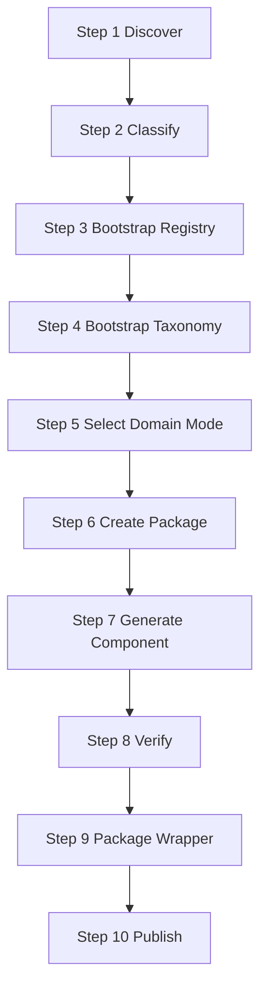
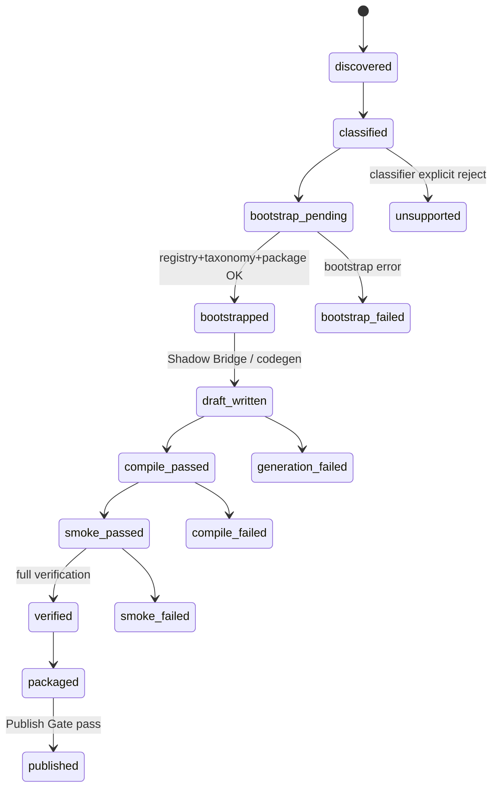

# Gencode V3 Auto-Bootstrap SOP

> **文件版本**：Gencode V3 SOP **v1.7**（Auto-Bootstrap Amendment）  
> **生效日期**：2026-06-23  
> **Supersedes**：Gencode V3 SOP v1.6 中「未知 skill = unsupported」「MVP Taxonomy Gate 阻擋生成」「skill-specific allowlist 作為生成入口」之隱含流程  
> **權威地位**：本文件為 **Auto-Bootstrap、Bootstrap Gate、Publish Gate、component 狀態機、錯誤分類** 之唯一權威來源。  
> **配套總規**：[SOP_Gencode_AgentSkillV3_Specification.md](./系統SOP/Gencode_AgentSkillV3整合/SOP_Gencode_AgentSkillV3_Specification.md)、[SOP_Gencode_AgentSkillV3_PipelineFlow.md](./系統SOP/Gencode_AgentSkillV3整合/SOP_Gencode_AgentSkillV3_PipelineFlow.md)  
> **上位法規**：[Gencode與AgentSkillV2整合總體設計_v0.3.md](./系統SOP/Gencode_AgentSkillV2整合/Gencode與AgentSkillV2整合總體設計_v0.3.md)（Layer 1–6 原則繼承）  
> **實作狀態**：本輪 **僅文件**；所列 Auto-Bootstrap 行為為 **SOP 目標**，程式尚未全面對齊（見 §12）。

---

## 0. 文件目的與適用範圍

本文件修正 Gencode V3 對「全新 skill 第一次生成」的責任邊界。

**舊隱含流程（廢止）**：

```text
skill 不在 registry / taxonomy / MVP allowlist
  → 跳過 V3 Shadow Bridge
  → 標記 unsupported_task_type
  → 要求人工先登錄才可生成
```

**新目標流程**：

```text
教材例題
  → 自動辨識 skill
  → Auto-Bootstrap（draft registry / taxonomy / package / component）
  → 生成、驗證、包裝
  → verified component 才可發布至學生端
```

**適用範圍**：

- 高職／國中 Gencode V3 微元件管線
- Admin 後台「產生／重構出題程式」
- `gencode_closed_loop` Phase 1–3
- `run_gencode_phase2_v3_shadow_bridge` 及等價入口

**不適用**：

- B4 adaptive deterministic allowlist（執行期灰度；見 §8）
- RAG `skill_id:family_id` 身份規則（AGENTS.md §9，不變）

---

## 1. 核心原則

### 1.1 未知技能不是不支援

下列情況 **不得** 判定為 `unsupported_task_type`：

| 情境 | 正確分類 |
|------|----------|
| skill 尚未存在於 registry | `bootstrap_pending` / `REGISTRY_BOOTSTRAP_FAILED` |
| skill 尚未存在於 taxonomy | `bootstrap_pending` / `TAXONOMY_BOOTSTRAP_FAILED` |
| 尚無專用 domain function | `bootstrap_pending`；應嘗試 generic adapter |
| 尚無 V3 package | `bootstrap_pending` |
| 尚無 component | `discovered` / `classified` |
| 尚無 wrapper | `bootstrapped` / `draft_written` 之前正常態 |
| Shadow Bridge 尚未執行 | `SHADOW_BRIDGE_NOT_EXECUTED`（pipeline defect） |
| 尚未建立 tracker | `bootstrap_pending` |

以上皆屬 **新技能發現**、**bootstrap pending**、**bootstrap failed** 或 **pipeline failed**，不是教材題本質無法生成。

### 1.2 新 skill 必須自動建立

全新 skill 第一次執行時，系統 **必須** 自動進入 Auto-Bootstrap。  
**不可** 要求人工先加入白名單、registry 或 taxonomy 才可開始生成 component。

### 1.3 Gate 必須分層

#### Bootstrap Gate（生成入口）

**只檢查**生成所需的最低條件：

- `skill_id` 存在（可來自 `textbook_examples.skill_id`）
- `example_id` / `textbook_example_id` 存在
- 教材題可讀取（題幹、答案欄位基本可解析）
- AI runtime 可用（Phase 1 分類／Phase 2 codegen 所需）
- 輸入資料基本完整（非空 skill、非空 example 列）

**Bootstrap Gate 不得要求**：

- registry 已 `verified`
- taxonomy 已 `verified`
- specialized domain 已存在
- wrapper 已存在
- skill 已在 MVP allowlist
- `gencode_component_tracker` 已有紀錄

#### Publish Gate（學生端發布）

**只有發布前** 才嚴格檢查：

- component 已 `verified`
- compile 通過
- runtime smoke 通過
- integrity 通過
- answer contract 正確
- variation audit 通過
- wrapper 可執行
- 無阻擋項（`required_core_components` 等）

未通過 Publish Gate 的內容 **不可** 進學生端，但 **仍可** 建立 draft component、寫入 tracker、留在 dry-run 或 `agent_skills_v3/` draft 目錄。

### 1.4 不變原則（保留並強調）

1. 每一筆教材例題都是獨立且重要的最小生成單位。
2. 每題對應獨立 `component_id`：`src_{textbook_example_id}`。
3. 不得把多題教材壓縮成一支泛化 generator。
4. 不得用 AI 自由創題取代教材例題同構生成。
5. 單題失敗不得阻斷其他題。
6. 只有 `verified` component 可被包裝與發布。
7. 不得將 draft 或 failed component 偽裝為 published。
8. 不得因缺少 metadata 就跳過生成。
9. 新技能建立必須是系統能力，不是人工前置作業。

---

## 2. Auto-Bootstrap 正式流程（10 Steps）



### Step 1 — Discover

系統取得：

- `skill_id`
- textbook examples
- curriculum / grade / volume / chapter / section

**初始狀態**：`discovered`

### Step 2 — Classify

每一筆教材例題 **獨立** 執行 semantic classification，產生：

- `task_type`
- `problem_type_id`
- `render_mode` / `presentation_mode`
- `answer_type`
- `mathematical_family`
- `required_domain_capabilities`
- parameterization strategy

**狀態**：`classified`

### Step 3 — Bootstrap Registry

若 registry 不存在，自動建立 **draft** entry：

```text
registry_status = draft
source = auto_bootstrap
review_required = true
```

**不得** 因此停止生成。

### Step 4 — Bootstrap Taxonomy

若 taxonomy 不存在，依 normalized classification 自動建立 **draft** taxonomy：

```text
taxonomy_status = ai_inferred
source_example_ids = [...]
inferred problem family / capabilities
review_required = true
```

**不得** 把 taxonomy 缺失判定為 `unsupported_task_type`。

### Step 5 — Select Domain Mode

依序選擇（fail-open 至下一層，**不得** 因缺 specialized domain 而停止整個 skill）：

1. **verified specialized domain**（`taxonomy_registry.fixed_domain_key` 已存在且 operation 在白名單）
2. **compatible existing domain**（同數學家族、可映射 operation）
3. **generic structured domain adapter**（§7；draft component 必要備援）

沒有 specialized domain 時，**必須** 使用 generic fallback，**不得** 停止整個流程。

> **與 Skill-Fixed Domain Authority 的關係**：Auto-Bootstrap 允許以 **draft `fixed_domain_key`**（含 `generic.structured`）啟動生成；**verified 發布** 仍須通過 Publish Gate 與 §1.6 語意門檻。禁止的是「跨 Domain 偷換已 verified 的 routing」，不是「新 skill 不能用 generic adapter 起步」。

### Step 6 — Create Package

自動建立：

```text
agent_skills_v3/{skill_id}/
  manifest / skill.json（draft）
  components/src_{example_id}/
```

每一筆教材例題都是獨立最小生成單位。

### Step 7 — Generate Component

每個 component 獨立建立：

- induced spec
- `generate.py`
- `metadata.py` / `get_hint.py`
- `tests/` smoke evidence
- tracker record

**單題失敗不得阻斷其他題。**

### Step 8 — Verify

依序執行：

- syntax / compile
- runtime smoke
- output contract
- answer correctness
- choices consistency
- localization
- integrity
- variation audit

### Step 9 — Package Wrapper

只包裝 **verified** components。wrapper 必須：

- 能列出 verified component
- 能決定出題順序與比例（`ORDER_WEIGHT`）
- 能 dispatch `generate` / `check` / `get_hint`
- **不引用** failed component

### Step 10 — Publish

只有 verified component 可進入學生端。允許 **partial publish**；UI 必須清楚顯示：

| 欄位 | 說明 |
|------|------|
| `total_examples` | 教材例題總數 |
| `verified` | 通過驗證數 |
| `failed` | 生成／驗證失敗數 |
| `unsupported` | 教材本質無法程式生成數（§4） |
| `packaged` | 已納入 wrapper 數 |
| `published` | 已對學生端可見數 |

---

## 3. Component 狀態機

### 3.1 正式狀態一覽

| 狀態 | 語意 |
|------|------|
| `discovered` | 已從教材庫發現 skill／例題，尚未分類 |
| `classified` | 已完成 semantic classification |
| `bootstrap_pending` | 等待或進行 registry／taxonomy／package 引導 |
| `bootstrapped` | draft registry／taxonomy／package 骨架已建立 |
| `draft_written` | component 檔案已寫入（含 dry-run） |
| `compile_passed` | 靜態編譯／AST 通過 |
| `smoke_passed` | runtime smoke 通過 |
| `verified` | 通過 Publish 前之完整驗證鏈 |
| `packaged` | 已納入 wrapper manifest |
| `published` | 學生端可出題 |
| `bootstrap_failed` | registry／taxonomy／package 引導失敗 |
| `generation_failed` | codegen 失敗 |
| `compile_failed` | 編譯失敗 |
| `smoke_failed` | smoke 失敗 |
| `verification_failed` | 契約／語意驗證失敗 |
| `unsupported` | 教材題本質無法由目前系統生成（§3.2） |

### 3.2 `unsupported` 的合法使用範圍

`unsupported` **只能** 用於教材題 **本質** 無法由目前系統生成，例如：

- 缺少必要圖片且無法取得
- 題目答案不可確定
- 題目依賴外部即時資料
- 題目無法合理參數化
- classifier **明確判定** 不適合程式生成（附 `UNSUPPORTED_TASK_TYPE` 與理由）

**不得以** 下列理由標記 `unsupported`：

- metadata 尚未建立
- registry／taxonomy 尚未人工審核
- Shadow Bridge 未執行
- skill 不在 MVP allowlist
- 尚無 specialized domain（應走 generic adapter）

### 3.3 狀態轉移（摘要）



---

## 4. 錯誤分類

| 錯誤碼 | 語意 | 與 unsupported 的關係 |
|--------|------|------------------------|
| `REGISTRY_BOOTSTRAP_FAILED` | draft registry 建立失敗 | **不是** unsupported |
| `TAXONOMY_BOOTSTRAP_FAILED` | draft taxonomy 建立失敗 | **不是** unsupported |
| `DOMAIN_ADAPTER_SELECTION_FAILED` | 三層 domain 選擇皆失敗 | **不是** unsupported（應再嘗試 generic） |
| `SHADOW_BRIDGE_NOT_EXECUTED` | 管線未進入 V3 shadow bridge | **pipeline defect**；**禁止** 轉為 `UNSUPPORTED_TASK_TYPE` |
| `SHADOW_BRIDGE_FAILED` | shadow bridge 執行但失敗 | **不是** unsupported |
| `SCAFFOLD_FAILED` | scaffold／目錄建立失敗 | **不是** unsupported |
| `GENERATION_FAILED` | AI codegen 失敗 | **不是** unsupported |
| `COMPILE_FAILED` | 編譯／AST 失敗 | **不是** unsupported |
| `SMOKE_FAILED` | runtime smoke 失敗 | **不是** unsupported |
| `VERIFICATION_FAILED` | 契約／語意驗證失敗 | **不是** unsupported |
| `UNSUPPORTED_TASK_TYPE` | 教材本質無法生成 | **唯一** 可對學生端標「不支援」的終態 |

### 4.1 `SHADOW_BRIDGE_NOT_EXECUTED` 剛性規定

當管線因下列原因 **未執行** Shadow Bridge 時：

- skill 不在 MVP taxonomy YAML
- skill 不在 `taxonomy_registry`
- `allow_non_mvp_skill=False` 且未走 Auto-Bootstrap
- Phase 2 回傳非 `V3_SHADOW_BRIDGE` 狀態

系統 **必須** 回報 `SHADOW_BRIDGE_NOT_EXECUTED`（或等價 `bootstrap_pending`），**不得** 對外呈現為 `unsupported_task_type: ValueError: v3_shadow_bridge_not_executed`。

---

## 5. 廢止白名單依賴（生成入口）

| 規則 | 說明 |
|------|------|
| skill-specific allowlist **不得** 作為生成入口條件 | 含 `k12_component_taxonomy.yaml` MVP 六單元閘門 |
| 新 skill **不需要** 人工加入白名單才可建立 component | Auto-Bootstrap 自動建立 draft 結構 |
| allowlist **若保留** | 僅用於風險控制、灰度發布、舊系統相容 |
| allowlist **不得** 阻止 Auto-Bootstrap | 最多影響 `published` 旗標，不阻擋 `draft_written` |
| **禁止** 硬編碼 `skill_id` 決定是否執行 Shadow Bridge | 改由 Bootstrap Gate 判斷 |

### 5.1 廢止條款對照（v1.6 → v1.7）

| 舊規則（廢止） | 新規則 |
|----------------|--------|
| §1.4.1：不在 MVP 六單元 → `human_approval_required` 且不予 Phase 2 | MVP 僅標記 `review_required`；**仍進** Auto-Bootstrap |
| `skill_not_in_v3_mvp_scope` 阻擋 admin dryrun | 改為 Bootstrap Gate；缺項自動 bootstrap |
| `legacy_skill_not_in_mvp_scope` → 跳過 shadow bridge | 改為執行 Auto-Bootstrap shadow bridge |
| `v3_shadow_bridge_not_executed` → `unsupported_task_type` | 改報 `SHADOW_BRIDGE_NOT_EXECUTED` |

---

## 6. Generic Domain Fallback

新技能的 **必要備援**。當無 verified specialized domain 時 **必須** 使用。

**至少應能處理**：

- 整數、分數、小數、百分比
- 代數式
- 選擇題、填充題、計算題
- 表格資料
- 基本統計、基本機率

**定位**：

| 項目 | 規定 |
|------|------|
| 允許 | 建立 **draft** component |
| 必須 | 經 smoke 與 verification 才可 `verified` |
| 不代表 | 已建立 verified specialized domain |
| 後續 | 可升級為 specialized domain；升級後 `needs_regeneration` |

**建議 registry key**：`generic.structured`（或專案等價 token）；`review_required=true` 直至 specialized domain 驗證通過。

---

## 7. 案例研究：`vh_數學B4_FrequencyDistributionTableConstruction`

> 本節僅說明流程，**不得** 成為 skill-specific 硬編碼規則。

### 7.1 錯誤行為（v1.6 及現行程式傾向）

```text
新 skill 不在既有 registry / taxonomy / MVP allowlist
  → run_gencode_phase2_v3_shadow_bridge 回傳 legacy_skill_not_in_mvp_scope
  → Shadow Bridge 不執行
  → admin / phase2 報 unsupported_task_type 或 v3_shadow_bridge_not_executed
  → 四題教材例題（example_id 3822–3825）全部被標 unsupported
```

### 7.2 正確行為（v1.7 SOP 目標）

```text
新 skill 被發現（discovered）
  → 四題各自 classified（統計／次數分配／全距等）
  → 自動建立 draft registry + draft taxonomy（source=auto_bootstrap）
  → 選擇 statistics domain 或 generic.structured adapter
  → 建立 agent_skills_v3/vh_數學B4_FrequencyDistributionTableConstruction/
  → 建立 src_3822、src_3823、src_3824、src_3825 四個獨立 component
  → 各自生成、驗證；單題失敗不阻斷姊妹題
  → 僅 verified component 進 wrapper 與 Publish Gate
```

---

## 8. CHANGELOG（v1.7）

| 日期 | 變更 |
|------|------|
| 2026-06-23 | 新增 Auto-Bootstrap 十步流程 |
| 2026-06-23 | 將 Gate 分為 Bootstrap Gate 與 Publish Gate |
| 2026-06-23 | 廢止「未知 skill = unsupported」 |
| 2026-06-23 | 禁止 skill-specific allowlist 阻擋生成 |
| 2026-06-23 | 新增 draft registry / draft taxonomy 規範 |
| 2026-06-23 | 新增 generic domain fallback 必要備援 |
| 2026-06-23 | 修正 Shadow Bridge 未執行之錯誤分類 |
| 2026-06-23 | 新增完整 component 狀態機與錯誤碼表 |

**受影響模組（尚待程式實作）**：

| 模組 | 預期變更 |
|------|----------|
| `core/gencode/pipeline_orchestrator.py` | `run_gencode_phase2_v3_shadow_bridge` 對未知 skill 走 Auto-Bootstrap，移除 MVP 硬阻擋 |
| `core/gencode/services/admin_gencode_action_service.py` | 廢止 `skill_not_in_v3_mvp_scope` 生成阻擋；修正 `v3_shadow_bridge_not_executed` → `SHADOW_BRIDGE_NOT_EXECUTED` 映射 |
| `core/registry/taxonomy_registry.py` | 支援 draft registry entry（`auto_bootstrap`） |
| `configs/gencode_taxonomy/k12_component_taxonomy.yaml` | MVP 改為 `review_hint` 非 `generation_blocker` |
| `core/domain/` | 實作或接線 `generic.structured` adapter |
| `core/gencode/services/component_tracker_service.py` | 擴充 `gencode_status` 狀態值 |
| `core/gencode/skill_wrapper_compiler.py` | Publish Gate 與 partial publish UI 計數 |
| Admin UI / gencode 後台 | 顯示 bootstrap／verified／failed／unsupported 分列 |

---

## 9. 與既有 V3 規範的銜接

下列 v1.6 條款 **仍然有效**，Auto-Bootstrap **不推翻**：

- 一題一 component（`src_{textbook_example_id}`）
- Skill-Fixed Domain Authority（**verified 發布** 時）
- `generate.py` 搬運工、Full Matrix Dictionary
- Partial Publish、`required_core_components`
- `gencode_component_tracker` 影子表
- DB／`practice.py` 學生端零侵入（draft 不發布則無學生端影響）

---

*Gencode V3 Auto-Bootstrap SOP v1.7 · 文件專用修訂 · 2026-06-23*
