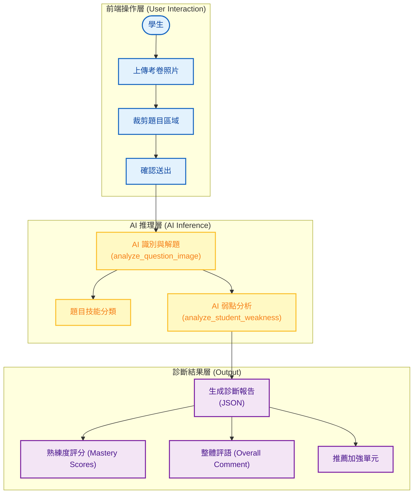

# 智學AIGC賦能平台 系統分析：AI智能考卷診斷系統 (AI Exam Diagnosis System)

**文件資訊**
* **版本**：1.0
* **日期**：2026-01-29
* **文件狀態**：初稿
* **負責人**：System Architect
* **相關檔案**：`core/exam_analyzer.py`, `templates/exam_upload.html`

---

## 1. 系統概述 (System Overview)

### 1.1 模組描述
本模組 **AI Exam Diagnosis** 是針對學生上傳實體考卷照片後，進行自動化批改與學習診斷的核心功能。
不同於傳統的題庫練習，此模組能處理「非結構化」的圖像資料，透過 Multimodal AI (Gemini) 進行 OCR 識別、手寫字跡分析與自動評分，最終生成一份結構化的「弱點診斷報告」。

### 1.2 核心目標
1.  **數位化與賦能**：將紙本考卷轉化為數位數據，打破實體與數位的界線。
2.  **精準診斷**：利用 AI 質性分析，從學生的錯誤中區分「概念錯誤」與「粗心計算錯誤」。
3.  **自動化回饋**：即時提供詳細的評語與建議單元，縮短回饋週期。
4.  **適性化推薦**：根據診斷結果，智慧推薦各別單元的熟練度調整與優先複習順序。

---

## 2. 系統架構與流程圖 (System Architecture)

本模組位於使用者互動層與 AI 推理層之間，串聯了圖像輸入與學習歷程資料庫。

---

## 3. 核心功能詳解 (Key Features)

### 3.1 圖像轉測驗 (Image to Quiz)
*   **功能**：學生上傳一張題目圖片，AI 自動識別文字並理解題意。
*   **應用場景**：學生遇到不會的題目，拍下來上傳，系統自動將其轉化為數位化的測驗格式，並提供標準答案與解題步驟。
*   **輸出欄位**：
    *   `question_text`: 識別出的題目文本 (含 LaTeX)。
    *   `correct_answer`: AI 計算出的正確答案。
    *   `predicted_topic`: 題目所屬的數學概念。

### 3.2 弱點診斷報告 (Weakness Diagnosis)
*   **功能**：根據累積的錯題記錄，AI 生成深度學習分析。
*   **分析維度**：
    *   **概念錯誤 (Concept Error)**：權重較高，代表基礎不穩，建議扣分幅度大 (30-50分)。
    *   **計算錯誤 (Calculation Error)**：權重較低，代表細節疏忽，建議輕微扣分 (5-15分)。
*   **智慧評分**：提供各單元的「熟練度分數 (0-100)」。
*   **行動建議**：明確指出「建議優先加強的單元」。

---

## 4. 技術實作 (Technical Implementation)

### 4.1 核心分析引擎 (`core/exam_analyzer.py` & `core/ai_analyzer.py`)

#### `exam_analyzer.analyze_exam_image`
*   **功能**：考卷診斷的主入口函數。
*   **流程**：
    1.  **路徑扁平化** (`get_flattened_unit_paths`)：從資料庫中提取完整的課程結構 (年級/章節/單元)，供 AI 進行精確匹配。
    2.  **Prompt 建構** (`build_gemini_prompt`)：動態生成包含所有可用單元的 Context，要求 AI 進行單元分類與錯誤分析。
    3.  **Multimodal 呼叫**：將圖片與 Prompt 傳送給 Gemini。

#### `exam_analyzer.save_analysis_result`
*   **功能**：將 AI 分析結果持久化。
*   **資料寫入**：
    *   **ExamAnalysis**：儲存診斷出的錯誤類型、信心度與 AI 評語。
    *   **MistakeNotebook**：若答錯，自動將此題與對應圖片加入錯題本，方便日後複習。

### 4.2 嚴格模式 (Strict Mode Enforcement)
*   **目的**：解決 AI 回應中常見的廢話與格式錯誤。
*   **實作 (`enforce_strict_mode`)**：
    1.  **移除廢話**：自動過濾「你很棒」、「哈囉同學」等贅詞。
    2.  **LaTeX 保護**：對反斜線進行雙重跳脫 (`\\\\`)，防止 JSON 解析失敗。
    3.  **JSON 修復**：使用 `clean_and_parse_json` 處理不夠嚴謹的 JSON 字串。

### 4.3 前端整合 (`templates/exam_upload.html`)
*   **功能**：提供使用者上傳介面與結果展示。
*   **運作流程**：
    1.  **AJAX 上傳**：使用 JavaScript `fetch` API 將圖片 POST 到 `/upload_exam`。
    2.  **結果渲染**：接收後端回傳的 JSON 資料 (`analysis_result`)。
    3.  **動態顯示**：
        *   若成功 (`success: true`)：動態生成 HTML 卡片，顯示「對應單元」、「錯誤類型」與「AI 建議」。
        *   若失敗：顯示錯誤訊息。

---

## 5. 預期效益 (Expected Benefits)

1.  **學習歷程完整化**：補足了線上練習系統無法蒐集「線下考試數據」的缺口。
2.  **減少教師負擔**：自動化的批改與診斷，讓教師從繁瑣的改卷工作中解放，專注於教學策略。
3.  **提升學生後設認知**：讓學生清楚知道自己是「不會」還是「粗心」，從而調整複習方向。
4.  **數據驅動決策**：量化的熟練度分數，為後續的適性化推題系統提供精準的參數依據。
