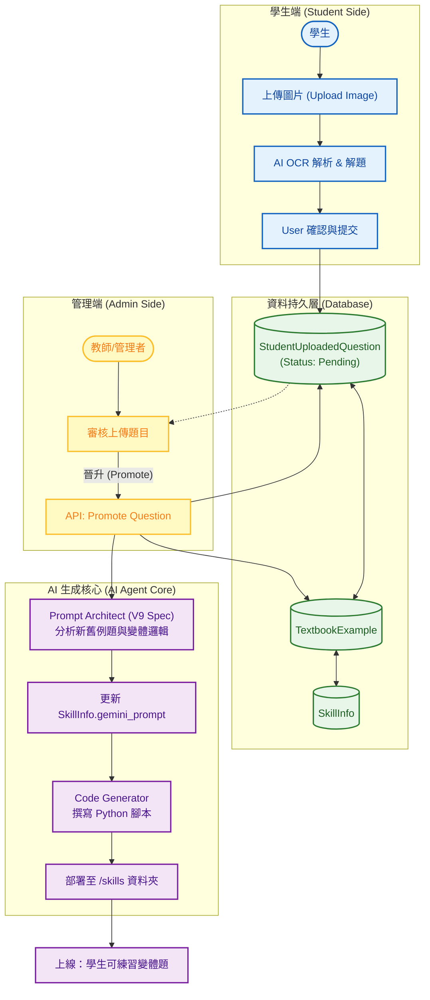

# 智學AIGC賦能平台 系統分析：學生上傳題目與變體生成系統 (Student Upload & Variant Generation)

**文件資訊**
* **版本**：2.0 (整合 Architect 與 Coder 自動化產線)
* **日期**：2026-01-25
* **文件狀態**：正式版
* **負責人**：System Architect
* **相關檔案**：`practice.py`, `core/routes/admin.py`, `models.py`, `core/prompt_architect.py`

---

## 1. 系統概述 (System Overview)

### 1.1 模組描述
本模組 **Student Upload & Variant Generation** 實現了「題目群眾外包 (Crowdsourcing)」與「AI 自動化生產 (Automated Content Generation)」的完美結合。

傳統出題依賴老師手動輸入或匯入，本系統允許學生在練習過程中直接拍攝/上傳遇到的難題。這些題目初步經過 AI 解析 (OCR & Solver) 後，存入待審核區。一旦被教師「晉升 (Promote)」為正式例題，系統將自動觸發 **Prompt Architect** 重構生成規範，並指揮 **Code Generator** 撰寫出具備「隨機變體能力」的 Python 技能程式碼。

### 1.2 核心目標
1.  **題庫擴充自動化**：將學生真實遇到的痛點 (錯題) 直接轉化為系統的永久資產。
2.  **變體生成 (Variant Generation)**：不只是收錄一題，而是透過 AI 分析該題邏輯，自動生成無數題「換數字、換情境」的相似題。
3.  **閉環學習 (Closed-loop Learning)**：學生上傳 -> 老師審核 -> AI 生成 -> 學生再次練習該題型的變體。

---

## 2. 系統架構與流程圖 (System Architecture)

本模組串聯了前端上傳、後台審核、以及最核心的 AI Agent 協作鏈 (Architect + Coder)。

---

## 3. 前端設計說明 (Frontend Design)

### 3.1 學生上傳模態框 (Upload Modal)
*   **功能**：支援拖得圖片或剪貼簿貼上。
*   **互動**：上傳後立即顯示 OCR 結果預覽，允許學生在提交前修正規範 (如修正 LaTeX 格式)。
*   **狀態**：提交後，該題狀態顯示為「審核中 (Pending)」。

### 3.2 管理後台 - 審核列表
*   **位置**：`admin_examples.html` 或專屬審核頁面。
*   **操作**：
    *   **忽略 (Ignore)**：題目品質不佳或重複。
    *   **晉升 (Promote)**：將此題轉正為「教科書例題」。此動作會彈出視窗詢問要歸類到哪個 Skill ID。

---

## 4. 後端處理邏輯 (Backend Logic)

### 4.1 圖片處理與 AI 解析 (`/upload_question_image`)
*   **接收**：Base64 圖片或檔案流。
*   **處理**：呼叫 `core.ai_analyzer.analyze_question_image`。
*   **AI Prompt**：要求 Gemini 回傳 JSON，包含 `original_text` (OCR), `solution_steps`, `final_answer`。

### 4.2 題目晉升 API (`/api/promote_question`)
此為本系統最關鍵的邏輯樞紐，位於 `core/routes/admin.py`。

*   **Logic Flow**:
    1.  **資料遷移**：將 `StudentUploadedQuestion` 的資料複製一份到 `TextbookExample`，source 標記為 `StudentUpload`。
    2.  **狀態更新**：將原上傳紀錄標記為 `Approved`。
    3.  **觸發 Architect (關鍵步驟)**：
        *   呼叫 `core.prompt_architect.generate_v9_spec(skill_id)`。
        *   **Architect 行為**：它會同時讀取舊的教科書例題 (Type A) 與剛晉升的學生題目 (Type B)。
        *   **智慧融合**：Architect 會在 System Prompt 中指示 Coder：「*現在你有兩種類型的例題，請撰寫一個 Python 腳本，使用 `random.choice` 隨機決定生成 Type A 或 Type B 的變體。*」
    4.  **觸發 Coder**：
        *   呼叫 `core.code_generator.auto_generate_skill_code(skill_id)`。
        *   Coder 讀取最新的 Prompt，生成包含新邏輯的 `.py` 檔。

---

## 5. 資料庫 Schema 關聯 (Database Schema)

| Table Name | 描述 | 關鍵欄位 (Columns) |
| :--- | :--- | :--- |
| **StudentUploadedQuestion** | **學生上傳暫存區** | `id`, `image_path`, `ocr_content`, `ai_solution`, `status` (pending/approved/rejected), `student_id` |
| **TextbookExample** | **正式例題庫** | `source_curriculum` (若來自上傳則標記為 "StudentUpload"), `problem_text`, `correct_answer` |
| **SkillInfo** | **技能設定檔** | `gemini_prompt` (儲存 Architect 動態更新後的最新 Prompt) |

---

## 6. 實際操作與驗證 (Operation & Verification)

### 6.1 情境：從上傳到變體生成

1.  **學生動作**：
    *   上傳一張「座標平面上點的平移」圖片 (例如：點 P(3,4) 向下移 2 格)。
    *   系統 OCR 成功，學生確認提交。

2.  **教師動作**：
    *   在後台看到此題，點擊 **[晉升]**。
    *   選擇對應技能 `jh_math_coordinate_translation`。

3.  **系統自動化 (不可見)**：
    *   **Architect** 介入：發現該技能現在有「課本例題」與「學生上傳題」。
    *   **Prompt 更新**：產生指示「需實作邏輯分支，包含座標移動的變體」。
    *   **Coder 執行**：生成新的 `jh_math_coordinate_translation.py`。

4.  **成果**：
    *   其他學生在練習此單元時，不僅會遇到課本題的變體，也會隨機遇到該名學生上傳題目的變體 (例如：點 Q(-1, 2) 向上移 5 格)。
