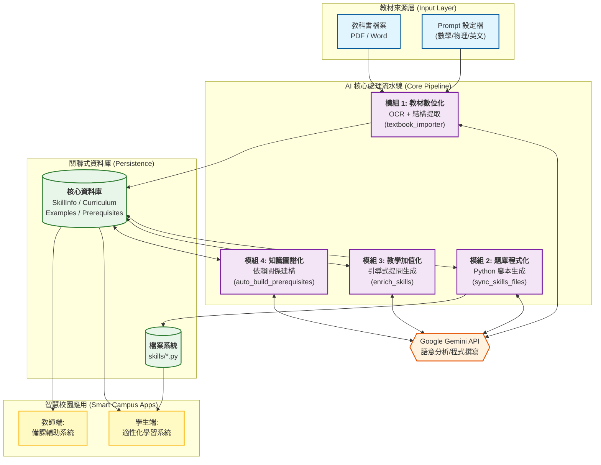
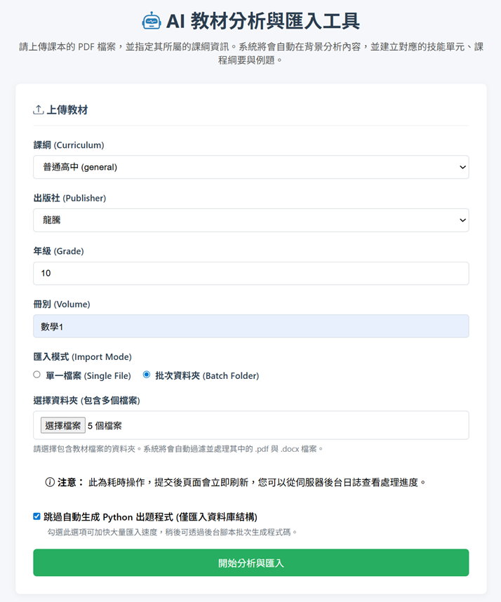
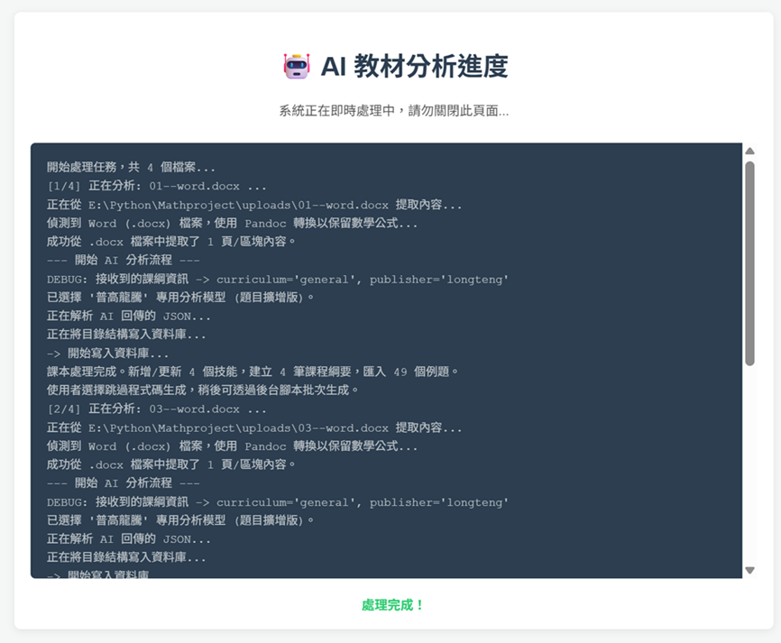

# 智學AIGC賦能平台 競賽提案技術文件：AI 賦能智慧校園——開放式全學科適性學習內容生成平台

**專案名稱**：智學AIGC賦能平台 (Smart-Edu AIGC Platform)
**參賽組別**：高中職 AI 應用類——AI 賦能永續未來
**提案面向**：學習與教學優化、永續與環境關懷
**文件版本**：2.1 (System Integration & Verification)
**日期**：2025-12-22

---

## 1. 執行摘要 (Executive Summary)

### 1.1 提案背景：解決校園痛點
在推動「智慧校園」的過程中，最大的瓶頸往往不是硬體缺乏，而是**「高品質數位教材的匱乏」**。傳統教材數位化需耗費教師大量時間進行人工拆解、輸入題目與標註關聯，導致教學資源難以快速更新，且無法做到真正的適性化學習。

### 1.2 核心解決方案
本團隊開發了一套 **「開放式 AI 內容生成後台」**。系統利用 Generative AI (Google Gemini) 結合 OCR 技術，能自動閱讀教科書 (PDF/Word)，將其轉化為結構化的資料庫與可執行的程式碼。

本系統具備四大核心能力，形成完整的數位內容生態系：
1.  **自動化拆解 (Importer)**：從課本自動提取章節、觀念與例題。
2.  **智慧型出題 (Sync)**：自動生成 Python 演算法題庫，實現無限變題。
3.  **引導式助教 (Enrich)**：自動生成「蘇格拉底式」引導語，教學生釣魚而非給魚吃。
4.  **知識圖譜建構 (Graph)**：自動分析跨學制技能依賴關係，繪製學習地圖。
5.  **上傳考卷學習診斷**：分析學生手寫過的題目，建議應加強練習的單元。

### 1.3 永續與擴充性 (Sustainability & Scalability)
本平台設計為**「學科無關 (Subject-Agnostic)」**架構。目前雖以高中數學為示範，但僅需替換 AI 的 System Prompt，即可擴充至**國小數學、物理、化學、英文**等學科。這不僅大幅降低教材開發的人力成本（SDGs 4 優質教育），更實現了教育資源的永續積累。

---

## 2. 系統總體架構 (System Architecture)

本系統採用「流水線 (Pipeline)」式設計，資料從原始檔案流向資料庫，最終轉化為智慧學習資產。



---

## 3. 關鍵技術模組詳解 (Technical Modules)

### 3.1 模組一：教材數位化引擎 (Textbook Digitizer)
* **核心技術**：非同步管線 (Async Pipeline)、Retry 自動重試、JSON 容錯清洗
* **功能描述**：解決「非結構化數據」轉「結構化數據」的難題，將課本 PDF/Word 轉化為資料庫資產。
* **運作流程**：
    1.  **非同步處理**：前端上傳後立即回應 `202 Accepted`，後端透過 Threading Queue 在背景執行耗時的 OCR 與 AI 分析，避免連線逾時。
    2.  **混合解析**：結合 `PyMuPDF` (提取文字) 與 `PyTesseract` (OCR截圖)，針對 Word 檔更引入 `clean_pandoc_output` 深度清洗 Pandoc 轉換後的 LaTeX 格式雜訊。
    3.  **強韌 AI 分析**：實作 `Exponential Backoff` 指數退避機制，遇 `429 Too Many Requests` 自動重試；並採用多層次 JSON 解析策略，確保資料寫入成功率。

### 3.2 模組二：題庫自動程式化 (Auto-Coding Generator)
* **核心技術**：Code-as-Content、AST 自我修復 (Self-Healing)、Strict Prompting
* **功能描述**：將靜態題目轉化為動態程式碼，實現「題目即程式」。
* **運作流程**：
    1.  **Strict Prompting**：導入 13 點嚴格 Prompt 規則，強制 AI 遵守 LaTeX 雙大括號脫逸 (`{{ }}`) 與 `raw string` 規範。
    2.  **AST 自我修復流水線**：
        *   **預檢**：使用 Python 內建 `ast` 模組預先掃描語法錯誤。
        *   **修復**：針對常見錯誤 (如 `invalid escape sequence`, `single '}'`) 啟動正則表達式自動修復。
        *   **驗證**：修復後進行二次驗證，確保寫入硬碟的程式碼 100% 可執行 (Bug-Free)。

### 3.3 模組三：教學引導增強 (Pedagogical Enrichment)
* **核心技術**：Pedagogical Trilogy (解題三部曲)、SQLite WAL Mode
* **功能描述**：賦予系統「蘇格拉底式」的教學能力，落實「學習優化」。
* **運作流程**：
    1.  **解題三部曲 (Pedagogical Trilogy)**：
        *   **啟動 (Observe)**：引導觀察定義與目標 (e.g., "這題提到的『關鍵字』是什麼意思？")。
        *   **策略 (Method)**：提示解題工具 (e.g., "這種題型是要直接運算，還是先列式？")。
        *   **檢查 (Check)**：反思答案合理性 (e.g., "答案有沒有符合範圍限制？")。
    2.  **高併發穩定性**：啟用 SQLite WAL (Write-Ahead Logging) 模式，確保在多執行緒寫入提示詞時資料庫不鎖死。

### 3.4 模組四：知識圖譜建構 (Knowledge Graph Builder)
* **核心技術**：Context Injection、Token Optimization
* **功能描述**：自動串聯知識點，實現「適性化推薦」。
* **運作流程**：
    1.  **Token 優化**：強制截取與目標順序最接近的 80 個候選技能，在精準度與 API 成本間取得平衡。
    2.  **Context 注入**：不僅提供技能名稱，更注入「標準例題 (Problem)」與「詳解 (Solution)」，讓 AI 透過閱讀解題過程，挖掘出隱性的運算依賴 (例如：解一元二次方程式依賴於配方法)。
    3.  **圖譜建立**：自動寫入 Many-to-Many 關聯表，形成完整的學習地圖。

---

## 4. 系統創新與擴充潛力 (Innovation & Scalability)

本系統的架構是為了**「開放式平台」**而生，具備極強的通用性，完全符合競賽對於「創造力」與「應用價值」的要求：

### 4.1 從數學到全學科 (Cross-Subject Expansion)
目前的後台邏輯是通用的。若要新增學科，僅需在 **模組一** 替換 AI 的 System Prompt，即可擴充：

| 目標學科 | AI Prompt 調整方向 | 預期產出應用 |
| :--- | :--- | :--- |
| **物理/化學** | 強調實驗步驟、單位換算、定律應用 | 自動生成物理變數題、虛擬實驗數據模擬 |
| **英文** | 強調文法結構、單字搭配、閱讀測驗 | 自動生成填空題 (`Cloze`)、改寫句型練習 |
| **程式設計** | 強調語法邏輯、除錯、演算法 | 自動生成除錯題 (`Debug`)、程式填空題 |

### 4.2 支援不同學制 (Grade Scalability)
* **向下相容**：國小數學（強調圖像化、具體物操作）。
* **向上延伸**：大學微積分（強調證明推導、多變數分析）。
* **技高數學**：強調實務應用與專業科目結合（如：電學中的複數運算）。

---

## 5. 競賽效益分析 (Impact Analysis)

### 5.1 對應「學習與教學優化」
* **教師增能**：原本需要數週的題庫建置工作，現在縮短至數小時。教師從瑣碎的「出題機器」轉型為高價值的「課程設計者」。
* **個人化學習**：學生獲得一位 24 小時在線的 AI 助教，系統能根據知識圖譜自動診斷弱點（如：高中數學不好是因為國中配方法沒學好），並提供精準補救。

### 5.2 對應「永續與環境關懷」 (Sustainability)
* **數位轉型 (Commercial Value)**：將傳統教材轉化為 **Code-as-Content** 的永久資產，實現「一次匯入，無限變題，永久使用」。
* **SDGs 貢獻**：大幅減少講義印刷 (SDG 12)，並透過自動化降低優質教育的成本門檻 (SDG 4)。
* **資源累積**：生成的知識圖譜與題庫程式碼不隨教師流動而消失，可建立校園專屬的 **Knowledge Base**。

---

## 6. 系統操作實證 (Proof of Concept)

本節展示系統四個核心模組的實際運作畫面，證明技術成熟度與流程自動化。

### 6.1 前端匯入介面 (Textbook Importer)
管理者可透過直觀的 Web 介面，選擇課綱並上傳整本 PDF 教科書。系統提供課綱、年級、冊次等 Metadata 設定，並支援批次資料夾上傳。

**[Web UI 操作示意圖]**





### 6.2 知識圖譜建構 (Knowledge Graph)
CLI 介面展示 AI 正在自動分析 `auto_build_prerequisites.py` 的執行過程，AI 成功識別出跨學制的依賴關係。

**[CLI 執行輸出]**
```text
(env) server:~$ python scripts/auto_build_prerequisites.py

建立全域技能 Cache... 完成 (共 1520 筆)
處理進度:  20%|███▌              | 5/25 [00:08<00:32, 1.6s/it]

Processing gh_poly_division... 
   Found 2 prerequisites (jh_poly_add, jh_poly_mul).  <-- 跨學制識別成功
Processing gh_complex_num... 
   Found 1 prerequisites (gh_real_num_property).
```

### 6.3 題庫程式化生成 (Code Sync)
展示 `sync_skills_files.py` 如何偵測缺失檔案，並自動生成通過 AST 語法驗證的 Python 代碼。

**[CLI 執行輸出]**
```text
--- 檔案狀態報告 ---
❌ 缺失檔案 (Missing): 3 筆

正在生成 3 個缺失檔案...
Generating: 100%|██████████| 3/3 [00:15<00:00, 5.02s/it]
   - skills/gh_poly_add.py ... ✅ OK (AST Validated)
   - skills/gh_poly_sub.py ... ✅ OK
   - skills/gh_poly_mul.py ... ✅ OK
```

### 6.4 資料庫成果驗證
最終資料庫中自動生成的技能關聯表，清晰呈現了學習路徑與教學引導語。

| 目標技能 | 前置技能 (AI 判斷) | AI 助教引導語 (Prompt) |
| :--- | :--- | :--- |
| **一元二次不等式** | 二次函數圖形、一元二次方程式 | 「試著畫出拋物線，觀察圖形在哪個區間位於 X 軸上方？」 |
| **對數運算** | 指數律、科學記號 | 「回想一下指數律，這兩個對數能合併成同一個底數嗎？」 |

---

**結語**：
本專案不只是一個作業系統，更是**智慧校園的基礎建設**。它運用 AI 技術打通了「教材」與「數據」的壁壘，為未來的適性化教育提供了最堅實的內容生成引擎。
