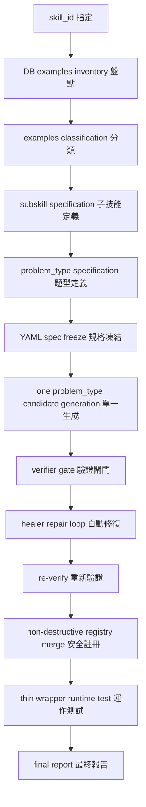

# Gencode 與 Agent Skill v2 整合總體設計 v0.1

## 1. 文件目的
本文件旨在規劃高職數學 B1-B4 教材流水線的總體實作架構與時程。透過將研究線的 Agent Skill 原型轉化為部署線的生產級架構，實現以下目標：
- **規格化 B4 既有成果**：將硬編碼的路由與狀態轉化為可管理的 Registry。
- **建立 B1-B3 流水線**：定義從教材匯入到 `runtime_ready` 的標準自動化流程。
- **Agent Skill v2 升級**：將 Skill 定義從單一檔案提升為包含數學家族、題型規格與驗證邏輯的規格包。
- **最大化 AI 自動化**：利用 LLM 執行盤點、生成與驗證，同時保留必要的人工審閱門檻。

## 2. 核心決策

### 2.1 B4 不重新生成
B4 章節已具備完整的手動開發 Generator 與路由，本計畫不對 B4 執行重新生成。B4 的任務是：
- **補齊 Registry**：將現有 `question_router.py` 中的映射關係匯出為規格檔。
- **統一狀態標記**：明確區分 `runtime_ready`、`manual_review` 與 `future_ai_judged`。
- **標竿參考**：作為 B1-B3 自動化生成的參考實現 (Reference Implementation)。

### 2.2 B1 作為新版流水線 prototype
B1 將作為首個驗證「自動化流水線」的章節，完整跑通以下流程：
> 教材匯入 → 主技能確認 → subskill/problem_type 拆解 → examples_map → gencode candidate → verifier → registry → runtime_ready → practice smoke。

### 2.3 不急著 DB 化
考量到整合初期規格仍有變動可能，目前不修改 `models.py` 或新增資料表。採用 **YAML / JSON Registry** 作為過渡方案，待 B1 至少一章節穩定後，再評估正式 DB Schema。

### 2.4 Agent Skill 升級為 v2
Agent Skill v2 不再是單一的 `skills/{skill_id}.py`，而是由以下組成的規格包：
- **Math Family Core**：定義數學家族通用的領域函數 (Domain Functions) 與 Checker。
- **Curriculum Profile**：定義不同學程 (技高/普高) 的難度與題量偏好。
- **ProblemType Spec**：定義最小生成單位的輸入/輸出契約與 LaTeX 規範。

### 2.5 Edge AI 暫不進第一版正式流程
Edge AI (如 Qwen Coder) 暫列為實驗性質的 Provider。第一階段流水線優先使用穩定度較高的 Cloud 模型 (Gemini/GPT)，確保 B1 Pipeline 邏輯正確。

## 3. 研究成果與部署版的對應

部署版並非放棄研究成果，而是將原型 (Prototype) 轉化為可部署的生產架構 (Production Architecture)。

| 舊版研究成果 | 高職部署版轉化 | 說明 |
|---|---|---|
| Agent Skill / SKILL.md | Agent Skill v2 / problem_type spec | 從單一 Markdown 升級為結構化規格包。 |
| 鷹架 prompt | prompt_gencode + domain allowlist | 將提示詞與領域函數白名單分離，增加生成穩定性。 |
| AST Healer | candidate generator 修復流程 | 保留自動修復語法錯誤的能力。 |
| MCRI | verifier report / runtime_ready gate | 將多樣性檢查轉化為正式的准入閘門。 |
| Code-as-Content | deterministic generator | 維持「代碼即題目」的確定性生成。 |
| AKT / PPO | adaptive practice / routing trace | 將 IRT 路由軌跡化，便於診斷與優化。 |
| Hybrid RAG | 學生補救提示與問答輔助 | 轉化為 RAG 補救引導內容。 |

## 4. 新版資料與規格架構

系統採用以下三層級結構，確保題目生成的精確度與診斷的對齊性：
**Skill (技能) → SubSkill (子技能) → ProblemType (題型) → GeneratorKey → Generator Function → Checker / Validator**

### 4.1 三層架構定義與硬性規則

1. **Skill (技能)**：學生端看到的學習技能與成就能量條（例如 `vh_數學B1_CoordinateSystem`）。
2. **SubSkill (子技能)**：知識診斷與先修技能（Prerequisites）對齊的基準單位（例如 `coordinate_and_distance`）。
3. **ProblemType (題型)**：**Generator 的最小生成與批改單位，絕對不是 Skill**。每個 `problem_type` 均有獨立的 I/O 契約與批改邏輯。

> [!IMPORTANT]
> **系統硬性規則：**
> - **問題類型 (ProblemType) 是最小單位**：`problem_type` 是 generator 的最小獨立生成與驗證單位，而非整個 `skill`。
> - **三層職責對齊**：`skill` 代表學生看到的技能；`subskill` 代表診斷與先修對齊基準；`problem_type` 代表 generator 出題/批改最小實作單位。
> - **嚴禁全量生成**：**不得一次讓 Agent 自由完成整個 Skill 的所有題型**。因為 Skill 範圍過廣，全量生成極易因單一題型失敗而導致連鎖反應，或惡意覆寫已通過驗證（verified）的舊程式碼。
> - **單一題型控制**：**每次只允許單一 `problem_type` 進入 generate / verify / heal 流程**，實施漸進式增量擴展 (Incremental Expansion)。
> - **未 Verified 禁入 Runtime**：未經 Verifier Gate 通過 (Verified) 的 Candidate 絕對不得進入 Runtime 生產路由。
> - **Registry 非破壞性合併**：**failed run 絕對不得刪除或覆蓋既有已驗證 (verified) 的 candidate**。Registry 預設必須以非破壞性方式進行合併（non-destructive merge）。
> - **顯式重建機制**：若需要清空或重新構建 Registry，必須在命令行顯式傳入 rebuild 類參數（如 `--rebuild-registry`），且此參數絕對不能設為預設。
> - **Thin Wrapper 原則**：Wrapper 只能作為 **Thin Adapter (極簡適配器)**，僅負責呼叫、參照轉接與簡單格式化，**絕對不得放置主要的題型產生邏輯**。
> - **例外題型正式記錄**：對於 `manual_review` (人工審閱) 與 `future_ai_judged` (未來 AI 判分) 題型，**必須正式記錄於規格包中，絕對不得強行塞入 deterministic 的自動化生成代碼**。
> - **YAML 優先原則**：所有技能題型規格 (Spec) 必須先寫成 YAML，嚴禁直接動手修改 DB 中的子技能表。

## 5. Single Skill Auto Closed Loop 標準流程

為確保生成安全，每個 `skill_id` 的自動化迭代必須嚴格遵循以下單向閉環流程：

### 5.1 十大 Phase 執行分層

自動化流水線執行時，必須將任務生命週期嚴格切分為以下 10 個 Phase：

* **Phase 0 Scope Freeze**：固化並鎖定當前要處理的 Skill 範圍與實作計畫，非經核准不得變動。
* **Phase 1 DB Examples Inventory**：從資料庫與教材資產庫中，盤點該 Skill 對應的所有課本例題、隨堂練習與自我評量題目。
* **Phase 2 Subskill / ProblemType Classification**：針對盤點出的例題進行分類，劃分出對應的 SubSkill 與 ProblemType，並區分出 `deterministic`、`manual_review` 或 `future_ai_judged` 等類別。
* **Phase 3 YAML Spec Freeze**：將上述結構正式寫入 `subskills.yaml`、`problem_types.yaml`、`examples_map.yaml`，進行版本鎖定，不直接更動 DB 子技能表。
* **Phase 4 One ProblemType Candidate Generate**：針對**單一** `problem_type` 呼叫 Agent 進行 Generator 程式碼生成，嚴禁一次性全量生成。
* **Phase 5 Verifier Gate**：將生成的 Candidate 送入 Verifier 執行 13 項嚴格語法與語意驗證。
* **Phase 6 Healer Repair Loop**：若驗證失敗，啟動 Healer 進行自動化程式碼修復，並限制修復上限次數。
* **Phase 7 Registry Non-destructive Merge**：驗證通過的 Candidate 進行**非破壞性合併**（non-destructive merge），嚴禁直接 destructive overwrite 覆蓋整個 Registry。
* **Phase 8 Thin Wrapper Runtime Test**：將 Verified 代碼透過極簡的 Wrapper 進行出題與批改的 Runtime Smoke 測試。
* **Phase 9 Report / Promotion Decision**：產出執行報告，由人工（教師/開發人員）點擊 Promotion 將狀態改為 `runtime_ready`。

## 6. B1 AbsoluteValue 回歸案例教訓

> [!WARNING]
> **回歸案例痛點分析：**
> 在 `vh_數學B1_AbsoluteValue` 的 Gencode 開發過程中，原本 `absolute_value_numeric_evaluation` 已成功生成且通過 Verified 驗證，Wrapper 能正常動態出題。
> 然而，在後續嘗試以 `full skill expansion` 一次性生成該技能所有子題型時，因其中一個子題型生成失敗，Agent 執行了 Destructive Registry Overwrite，將整個 Registry 檔案毀滅性地覆蓋為空。這導致 Wrapper 找不到已驗證的 Candidate，線上直接退回「此技能尚未開放自動出題」的錯誤。

#### 根本原因：
1. **毀滅性覆蓋 (Destructive Overwrite)**：Registry 機制設計不具備非破壞性合併功能，一旦執行失敗即清空整個 Skill 區域。
2. **任務範圍過大**：違反單一職責原則，試圖一次讓 Agent 完成整個 Skill，導致單點失敗波及全局。
3. **缺少課本對照 (Examples Map)**：未事先做好課本例題的精準映射，導致 AI 隨意發揮。

#### SOP 修正決策：
1. **Registry 預設必須 non-destructive merge**：絕對不得因單次失敗而刪除既有的 verified candidate。
2. **Examples Map 先行**：在開始任何生成前，必須先建立完整的課本例題映射表 (`examples_map.yaml`)，確保題型不偏離課本。
3. **Single ProblemType Incremental Expansion**：每次僅擴充單一 problem_type，嚴禁大雜燴式生成。

## 7. Registry 安全規則與過渡策略

在正式 DB 化前，使用 `configs/` 目錄下的 JSON / YAML 檔案作為動態路由來源。為確保運作安全，必須遵守以下 **Registry 安全規則**：

### 7.1 Registry 安全寫入原則
- **Verified 准入**：只有完全通過 Verifier Gate 驗證的 Candidate 才能更新至 Registry。
- **Fail 隔離與保留**：若某次生成/驗證失敗，只記錄該 `problem_type_id` 的 failed attempt 與錯誤訊息，**絕對不可刪除或覆寫舊有的 verified 紀錄**。
- **Scoped 限定更新**：當使用 `--skill-id` 模式執行時，程式碼必須**僅更新與該 skill 相關的 entry**，嚴禁清空或破壞其他無關 Skill 的 registry 項目。
- **顯式重建機制**：若需要清空或重新構建 Registry，必須在命令行顯式傳入 rebuild 類參數（如 `--rebuild-registry`），且此參數絕對不能設為預設。

### 7.2 Registry 必須保留的關鍵欄位
Registry 必須完整保留以下後端與 Wrapper 調用所需的元數據，不得遺漏：
1. `candidate_path`: 生成的 Python 檔案路徑。
2. `function_name`: 預設調用的產生器函數名稱（通常為 `generate`）。
3. `answer_type`: 答案類型（如 `choice`, `numeric`）。
4. `checker_type`: 批改器類型（如 `integer_checker`）。
5. `skill_id`: 關聯的 Skill ID。
6. `subskill_id`: 關聯的 SubSkill ID。

### 7.3 Status 狀態機
- `candidate`: AI 剛生成，待驗證。
- `generated`: 已生成但尚未通過完整門檻。
- `verified`: 已通過自動化驗證。
- `runtime_ready`: 已通過人工確認，可進入生產路由。
- `failed`: 驗證失敗。
- `manual_review`: 需轉為手寫/人工閱卷，正式記錄於規格包，不硬塞 deterministic。
- `future_ai_judged`: 待未來 AI 視覺模型判分，正式記錄於規格包。
- `deprecated`: 已廢棄。

## 8. 最小人工介入策略

| 類型 | AI 可以做 | 人工只做 (Gatekeeper) | 禁止 AI 自動做 |
|---|---|---|---|
| **教材處理** | 盤點檔案、拆解 ProblemType 草稿 | **確認 ProblemType 是否合理** | 直接覆蓋 Production Generator |
| **生成驗證** | 產生 Candidate、執行 Verifier | **抽查代表性題目** | 直接修改 `question_router.py` |
| **路由狀態** | 匯出 Registry、產出 Audit Report | **決定 Runtime_ready Promotion** | 直接新增 DB Table |
| **品質控制** | 執行 13 項 Gate 檢查 | **決定 Manual_review 題型** | 直接開放學生端 |

## 9. 不適合第一階段自動化的題型
以下題型列為 `manual_review` 或 `future_ai_judged`：
- **圖形/表格題**：涉及複雜繪圖與布局。
- **樹狀圖/列舉題**：涉及多路徑邏輯與手寫。
- **證明/過程題**：需要 AI 視覺判斷推導過程。

## 10. 下一步
下一個實作任務是 **Phase 1**：
**B4-Registry-A：匯出既有 B4 Generator Registry v0.1**

- **目標**：將 B4 現有路由、Allowlist 與驗證狀態整理為結構化 YAML。
- **產出**：`reports/gencode_integration/b4_existing_generator_registry_audit.md`。

---
*文件日期: 2026-05-25*
*版本: v0.1.1 (SOP 經驗更新版)*
