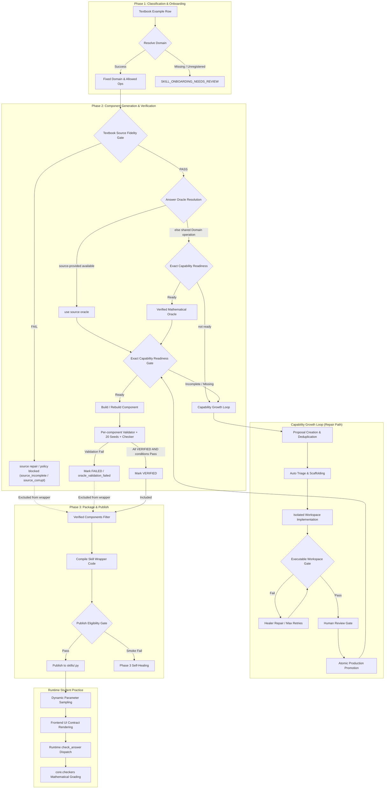

# Gencode × AgentSkillV3 完整執行手冊 (Complete Master SOP)

> **版本**：v1.15-Master  
> **建立日期**：2026-09-11  
> **文件定位**：本文件為 AI Agent、自動化管線與工程師進入 Gencode × AgentSkillV3 體系的第一閱讀入口與唯一端到端完整執行手冊。本手冊將既有規範權威、流程權威、檢核原則與已封板實證案例整合成可直接執行的 Master SOP。

---

## 目錄

- [0. Document Purpose / Authority Map](#0-document-purpose--authority-map)
- [1. Gencode Hard Rules (不可違反鐵律)](#1-gencode-hard-rules-不可違反鐵律)
- [2. Core Mental Model (西堤選餐架構模型)](#2-core-mental-model-西堤選餐架構模型)
- [3. Authority and Data Ownership (權威歸屬與責任矩陣)](#3-authority-and-data-ownership-權威歸屬與責任矩陣)
- [3.1 教材 Word 結構辨識與 Skill Extraction Authority](#31-教材-word-結構辨識與-skill-extraction-authority)
- [4. End-to-End Pipeline (端到端管線與狀態流動)](#4-end-to-end-pipeline-端到端管線與狀態流動)
- [4.1 End-to-End Textbook → Domain → Gencode Production Workflow](#41-end-to-end-textbook--domain--gencode-production-workflow)
- [5. Textbook Example → Component Contract (一題一元件契約)](#5-textbook-example--component-contract-一題一元件契約)
- [6. Source Fidelity & Answer Oracle Gate (來源保真與答案權威閘門)](#6-source-fidelity--answer-oracle-gate-來源保真與答案權威閘門)
- [7. Skill-Fixed Domain / Capability / Operation (領域與能力層次)](#7-skill-fixed-domain--capability--operation-領域與能力層次)
- [8. Generator Responsibility Boundary (生成器責任邊界)](#8-generator-responsibility-boundary-生成器責任邊界)
- [9. Data Presentation / Answer Type / UI Contract (呈現與作答契約)](#9-data-presentation--answer-type--ui-contract-呈現與作答契約)
- [10. Answer Contract / Checker (答案契約與檢核系統)](#10-answer-contract--checker-答案契約與檢核系統)
- [11. Verification & 20-Seed Protocol (驗證與 20-Seed 協定)](#11-verification--20-seed-protocol-驗證與-20-seed-協定)
- [12. Component Lifecycle (元件生命週期)](#12-component-lifecycle-元件生命週期)
- [13. Domain / Capability Lifecycle (領域與能力生命週期)](#13-domain--capability-lifecycle-領域與能力生命週期)
- [14. Phase 3 Package / Partial Publish (封裝與部分發布)](#14-phase-3-package--partial-publish-封裝與部分發布)
- [15. Runtime Contract (執行期契約)](#15-runtime-contract-執行期契約)
- [16. Error Routing Table (錯誤代碼與分流矩陣)](#16-error-routing-table-錯誤代碼與分流矩陣)
- [17. Recovery / Repair Decision Tree (故障排除與修復決策樹)](#17-recovery--repair-decision-tree-故障排除與修復決策樹)
- [18. AI Implementation Contract (AI 實作與回報契約)](#18-ai-implementation-contract-ai-實作與回報契約)
- [19. SOP Compliance Checklist (自我檢核清單)](#19-sop-compliance-checklist-自我檢核清單)
- [20. Final Seal Criteria (章節/單元封板準則)](#20-final-seal-criteria-章節單元封板準則)
- [21. Anti-Patterns (反模式與常見陷阱)](#21-anti-patterns-反模式與常見陷阱)
- [22. B1 Proven Cases (B1 實證案例與修復經驗)](#22-b1-proven-cases-b1-實證案例與修復經驗)
- [23. Known Issues / Technical Debt (已知技術債宣告)](#23-known-issues--technical-debt-已知技術債宣告)
- [24. Current / Planned / Deprecated Matrix (狀態成熟度矩陣)](#24-current--planned--deprecated-matrix-狀態成熟度矩陣)
- [25. Quick Start for Agents (Agent 極速開工手冊)](#25-quick-start-for-agents-agent-極速開工手冊)

---

## 0. Document Purpose / Authority Map

### 0.1 文件定位
本文件（`SOP_Gencode_AgentSkillV3_Complete.md`）整合既有各獨立規範與實務紀錄，作為日常開發、除錯、生成、審核與封板的單一完整行動手冊。任何參與本系統之工程師或 AI Agent，皆須以本手冊作為第一行動指南。

### 0.2 權威層級與衝突裁決 (Authority Hierarchy)
當不同文件之間出現描述差異或衝突時，**嚴禁自行融合或猜測**，必須嚴格依照以下優先權判定：

```text
[層級 1：核心規範權威]
└── SOP_Gencode_AgentSkillV3_Specification.md
    職責：欄位定義、合約契約、Answer Type、Checker 規格、Gate 判斷、錯誤代碼定義。

[層級 2：流程與時序權威]
└── SOP_Gencode_AgentSkillV3_PipelineFlow.md
    職責：端到端時序、Phase 1~3 動線、狀態轉移、自癒修復路徑 (Recovery Path)、隔離邊界。

[層級 3：答案檢核細則]
└── 數學答案檢核原則_v1.12_20260908.md
    職責：Specification §8.4 之實作補充、正規化與等價比對細則、required-form 約束。

[層級 4：實證案例與上線紀錄]
└── B1_3-1_Gencode_重建與上線紀錄_20260907.md / B1_3-2_Gencode_重建與上線紀錄_20260908.md
    職責：已成功驗證之上線案例與迴歸證據，提供具體修復範例，不可覆寫層級 1~2。

[層級 5：已知技術債宣告]
└── KnownIssues_TechnicalDebt.md
    職責：宣告已被識別但暫緩處理之技術債（如特定 local check），明確禁止被視為新開發標準。
```

---

## 1. Gencode Hard Rules (不可違反鐵律)

以下 12 條鐵律為系統絕對剛性邊界，任何 violation 將直接導致 Gate 拒絕，不得有任何例外：

### HARD RULE 1 — 一題一 Component
* 每一道教材題目（`textbook_example_row`）對應唯一元件識別碼：`component_id = src_<textbook_example_id>`。
* 擁有獨立實體目錄：`agent_skills_v3/<skill_id>/components/src_<textbook_example_id>/`。
* 包含獨立的原始碼檔案：`generate.py`、`metadata.py`、`get_hint.py`。
* 擁有獨立的 tracker 紀錄。
* 永遠保持全等式：**`textbook_examples count == components count`**。
* 嚴禁將多題合併為單一 generator 或單一 component。

### HARD RULE 2 — Component 存在性與 Publish 資格分離
* 只要資料庫中存在教材例題，就必須建立對應的 component 目錄與骨架，不可因為題目破損或學生版沒有答案而直接省略。
* **「學生版教材沒有答案」本身不是 component failure，也不得自動導致 `verified = NO`。**
* 僅當 Source Fidelity FAIL、Answer Oracle 不可用／未就緒／驗證失敗，或其他 Gate 未過時：
  * `component exists = YES`
  * `verified = NO`
  * `wrapper inclusion = NO`
  * `publish = NO`
* `blocked`、`missing_ground_truth`、`source_incomplete`、`source_corrupt`、`oracle_unavailable`、`oracle_not_ready`、`oracle_validation_failed` 屬於 **Policy eligibility condition / reason**（資格條件與阻斷原因標籤）。
* 若 production tracker 目前無對應正式 enum：
  * **不得擅自新增 production enum**。
  * **不得在 Master SOP 中擅自指定另一 lifecycle status（例如 `needs_human_review`）作替代映射**（`needs_human_review` / `ready_for_human_review` 在流程中有既有特定 lifecycle 語意，不可挪用）。
  * 政策原因應儲存於 production 現有可用之 `metadata.py`、payload extra 或 error reason 欄位。
  * 若 tracker 強制需要某 Current status，必須依 production code 真實語意判定，並在文件標示：`[Gap: production alignment required]`，不得假裝已有正式 missing_ground_truth lifecycle state。

### HARD RULE 3 — Source Fidelity & Answer Oracle Gate
Gate 定義以 Specification §10.4、§10.5、§10.6 為唯一規範權威。本條為執行摘要。

* `textbook_examples` 主要來源為 **學生版教科書**。學生版正常情況下可能沒有 `correct_answer`、`detailed_solution`、官方答案頁。
* **兩個彼此獨立的 Gate**：
  1. **Textbook Source Fidelity Gate**：證明題幹、數學條件、圖片／表格／公式資產、作答拓撲、`skill_id` 來源可信，且無 parse corruption／關鍵 source loss。本 Gate **不要求**學生版課本必須提供答案。完整學生版隨堂練習 + 無 `correct_answer` + 無 `detailed_solution` 仍可 `source_fidelity = PASS`。
  2. **Answer Oracle Gate**：正式 canonical answer 必須有可信 Answer Oracle。
* 合法 Oracle 分兩類：
  * **Source-provided Oracle**（`oracle_source=source`）：DB `correct_answer`、教材 `detailed_solution`、教師手冊／官方答案、有 provenance 的正式 answer artifact。
  * **Verified Mathematical Oracle**（`oracle_source=domain_operation`）：學生版無答案時，可使用已通過 Exact Capability Readiness 且獨立驗證之 shared Domain operation（十項條件見 Specification §10.5.1）。
* **嚴格禁止的 Oracle**：AI／LLM 現場解題、Agent 看題寫死答案、component-local ad-hoc formula、generator 內重寫 domain math、checker 反推答案、20-seed PASS 本身、「程式跑得過所以答案應該對」。
* **20 seeds 驗證 implementation consistency，不是 Answer Oracle 本身。**
* **Generator implementation ≠ mathematical oracle authority。** Generator 可 sample、組題、呼叫 shared Domain、組 payload／answer_contract；不可自行定義該 capability 核心數學演算法，也不可自己產生答案後再自己當驗證權威。
* 元件要取得 `VERIFIED` 狀態，必須滿足：
  $$\text{VERIFIED} = \text{Textbook Source Fidelity PASS} \land \text{Answer Oracle Gate PASS} \land \text{Exact Capability Readiness} \land \text{Executable Component} \land \text{Per-component Validator PASS} \land \text{Valid Answer Contract} \land \text{Shared Checker Validation PASS}$$
* 不得因 `oracle_source=domain_operation` 而降低其他 Gate。
* `missing_ground_truth` **不再**代表「學生版教材沒有答案」；僅適用於系統明確要求 source-provided answer evidence，且該來源本應存在卻遺失。
* **Source Resolution（簡短引用）**：教材原始 source 必須 **project-local first**。完整規則見 §6.6。不得未搜尋 repo 就查 Drive；不得因歷史 absolute path 失效而判定 source missing。

### HARD RULE 4 — Domain Function 與 Operation 架構
* 行政歸屬（`skill_id`）$\rightarrow$ 路由映射（`fixed_domain_key`）$\rightarrow$ 共享數學能力（`operation`）。
* 數學運算核心必須抽取為可跨題重用的 shared Domain operation（置於 `core/domain/`），嚴禁建立 per-example Domain Function。
* **禁止 per-example Domain Function 不等於可以把數學公式複製貼上至多個 `generate.py` 中。**
* 嚴禁在程式碼中依據 `skill_id`、`example_id` 寫死特例判斷或專屬分支。
* 嚴禁跨領域借用不相干的 Nearest-Template 算子。

### HARD RULE 5 — Generator 單一職責邊界
* Generator 僅負責：
  1. 參數合法範圍抽樣（Parameter Sampling）。
  2. 依教材拓撲組裝題幹（Question Construction）。
  3. 呼叫 shared Domain operation 取得數值解答。
  4. 輸出視覺與圖片契約（Visual / Image Contract）。
  5. 宣告作答與評分契約（Answer Contract Metadata）。
* Generator 絕不是數學演算法定義中心、絕不是學生批改評分者、絕不是 Answer Oracle 權威。
* 同一 shared Domain operation 可供多個 components 共用；仍維持 `textbook_example : component = 1 : 1`。

### HARD RULE 6 — Checker 評分權威與 Local Check 邊界
* 正式 grading authority 必須是：
  $$\text{answer\_contract} \longrightarrow \text{runtime dispatch} \longrightarrow \text{core.checkers}$$
* 數學比對原則：`safe parse → normalize → mathematical equivalence → optional required-form validation`。
* 針對 component-local `check()` 函式之規範：
  * **A. 禁止 Local Grading Authority**：若 component-local `check()` 自行進行 parse、mathematical equivalence、regex grading、string equality、required-form grading，則一律禁止，必須移除或改寫。
  * **B. 允許相容轉發 Facade**：若 component-local `check()` 僅作為 compatibility facade / thin forwarding wrapper，內部完全委派正式 shared checker（如 `check_answer`），則允許存在。
* **文件核心明定：禁止的是 local grading authority，不是單純禁止名為 `check()` 的函式存在。**
* 嚴禁純字串比對（`student == correct`）作為數學批改。
* 嚴禁使用 `"pi" in answer` 或正則表達式作為正式形式驗證器。
* 嚴禁選項題只對比 `A`/`B`/`C`/`D` 字元位置（必須走 semantic choice mapping）。
* **Student Submission Feedback Hard Rule**：任何 `all_correct=false` 的 submission，學生都必須能看到由 backend 依 `answer_contract`／canonical answer 產生的 `correct_answer_display`，或該 Answer Type 合法且既有的 reference/rubric。`correct_answer_display` 僅是提交後 feedback layer，不得成為新的 grading authority；`all_correct=true` 維持原 success flow，不強制揭示 canonical answer。
* 嚴禁 frontend 自行計算答案、checker reverse inference、LLM 產生正確答案、generator-local formula、hardcode example answer，或在學生 submit 前將 canonical answer 暴露於初始題目 payload。
* **Math Display Hard Rule**：斜線分數可存在於 parser internal representation、checker input 或 compatibility representation，但只要可明確認定為學生端數學分數，最終 mathematical display 必須使用 LaTeX `\frac` 的課本式上下堆疊分數。display normalization 只改 presentation，不得改動 canonical mathematical value、Domain math、Oracle、checker、`answer_contract` semantics 或 grading result。
* 嚴禁 example-specific fraction patch、skill-specific formatter、各 generator 自行處理顯示、以圖片取代可由 MathJax 呈現的分數，或為顯示格式改寫 canonical mathematical value。
* KnownIssues 中 `CartesianCoordinateSystem` 之 technical debt 屬暫緩修正之技術債，**絕對不得被當成可仿效的新模式**。

### HARD RULE 7 — 作答拓撲不可篡改性
* 依教材原始作答拓撲決定 Answer Type：
  $$\text{table\_fill} > \text{multi\_part} > \text{drawing} > \text{single\_choice} > \text{short\_answer}$$
* 嚴禁因答案數量、數學領域或是否有配圖而自行變更 Answer Type。
* 嚴禁建立 Fake `multi_part`（單一任務卻拆成兩個輸入框，或將多個值強行串成字串）。
* `Presentation Mode`（輸入外觀元件）絕對不等於 `Answer Type`（作答合約套餐）。

### HARD RULE 8 — 獨立驗證隔離性
* 每個 component 必須獨立通過驗證，嚴禁以同一個 capability 底下某一題通過來代表其他題目通過。
* 驗證必須涵蓋：20-seed 穩定度、固定種子可再現性、數學不變量成立、正解接受、代表性錯解拒絕、數學等價異構形式接受、required-form 違規形式拒絕。

### HARD RULE 9 — 封裝發布唯 verified 原則與部分發布 (Partial Publish)
* 只有標記為 `VERIFIED` 的組件才能寫入 `GENERATOR_SPECS` 並編譯進技能 wrapper。
* 系統全面支援 Partial Publish：未驗證或政策資格不足（`source_incomplete` / `source_corrupt` / `oracle_unavailable` / `oracle_not_ready` / `oracle_validation_failed` / 限縮後的 `missing_ground_truth`）的題目排除在外，絕不可阻斷已通過 verified 的組件發布。`blocked` 不是 Current production tracker enum。
* 數量恆等關係：
  $$\text{published} \le \text{verified} \le \text{components} \equiv \text{textbook\_examples}$$

### HARD RULE 10 — AI 嚴禁擅自補洞
* Source Fidelity FAIL，或 Answer Oracle 為 INVALID／unavailable／not ready／validation failed 時：
  * 停止自動 VERIFIED
  * 停止 package
  * 停止 publish
  * 保留對應 policy reason（`source_incomplete` / `source_corrupt` / `oracle_unavailable` / `oracle_not_ready` / `oracle_validation_failed`；`missing_ground_truth` 僅限 source answer 本應存在卻遺失）
* 學生版無答案且 Domain oracle 未 ready：進 Capability Growth，**不得**用 AI 自算答案充當 oracle。
* 是否需要人工審核：依實際責任層與 Current production flow 決定。
* **不得**將 `missing_ground_truth` 自動映射到 `needs_human_review` 或 `ready_for_human_review`。
* 嚴禁自行揣摩或猜測教材答案。
* 嚴禁自行修改 `skill_id` 或 `fixed_domain_key`。
* 嚴禁為了提高 published 數量而人為調降 Gate 門檻。

### HARD RULE 11 — Skill Extraction Authority（教材結構優先）
適用於 **section-level textbook import**。完整規範見 §3.1。

* 正式 skill 的主要來源應優先來自教材 DOCX 的結構資訊，而不是人工先建立 skill。
* Word structural parser 必須利用可取得的版面／樣式特徵辨識教材中的概念小標題，不得只用純文字內容。
* `section heading ≠ skill heading`：不得因只辨識到 section heading，就把整節退化成單一巨大 skill。
* **禁止**：
  * 未做 Word heading extraction 就人工建立 skills
  * 因 existing skill 缺失直接判 importer blocked
  * 只用純文字內容忽略 typography / paragraph structure
  * B2 1-3 或任一 section-specific hardcode
  * 依後續 Gencode capability 反推教材 skill taxonomy
* 正式寫入 DB 前必須通過 Dry-run Gate。只有 section identity 正確、skill candidates 合理、無 unresolved structural conflict、且 curriculum binding PASS，才可正式 import。

### HARD RULE 12 — Textbook Ingestion 與 Gencode Production 必須分階段封板

* **Stage 1 = Textbook Ingestion / Source Fidelity**：先完成 DOCX 結構與數學解析、PDF 視覺對齊、skill resolution、example segmentation、dry-run、production import 與 import 後驗證。
* **Stage 2 = Gencode Production**：教材階段封板後，才可進行 Gencode Phase 1 audit、Capability Growth、Phase 2 component generation、Phase 3 publish 與 runtime seal。
* DOCX 是結構與可取得數學文字的主要 authority；PDF 是 visual/layout authority。不得以 PDF OCR 重建 DOCX 可直接取得的數學內容。
* MathType/OLE、OMML、Symbol font、Unicode/legacy minus、matrix/brace/box/template record 必須經通用 fidelity gate；禁止以 formula index、單題 hardcode 或人工 LaTeX patch 補洞。
* skill candidate 不等於 final skill；必須經 `KEEP / MERGE / CONCEPT_ONLY` granularity audit。LLM 只能在 deterministic resolution 無法唯一判定時作 optional semantic fallback，且其結果必須再經 deterministic scope validation。
* 已產生且通過 curriculum/section validation 的正式 `skill_id`，後續 import 必須直接沿用；status 字串不是重新分類 authority。
* Phase 3 staging 未通過時禁止 publish；ONLINE 必須由 production manifest、wrapper/facade 可載入及 component runtime selectable 等真實 production evidence 共同判定，不得只看檔案存在或 `verified` badge。

---

## 2. Core Mental Model (西堤選餐架構模型)

本系統採用經典的「西堤選餐法」將教學、題型、元件、批改進行多層解耦：

```text
┌──────────────────────────────────────────────────────────┐
│                   西堤選餐模型架構層次                    │
├───────────────────┬─────────────┬────────────────────────┤
│ 概念層級           │ 餐廳比喻     │ 系統真實對應實體        │
├───────────────────┼─────────────┼────────────────────────┤
│ Textbook Source   │ 原始食材採購 │ 學生版教材題幹／資產（答案可缺）│
│ Skill             │ 餐廳品牌分店 │ 行政課程歸屬 (skill_id)  │
│ Routing Domain    │ 菜單大分類   │ fixed_domain_key       │
│ Operation         │ 廚師烹飪菜色 │ Shared Domain Function │
│ Component         │ 每一張獨立訂單│ src_<textbook_example> │
│ Data Presentation │ 盛盤盤飾     │ 題幹資料呈現 (text/img)│
│ Answer Type       │ 享用套餐規格 │ 作答合約五套餐 (5 types)│
│ Presentation Mode │ 用餐餐具     │ 前端輸入元件外觀       │
│ Checker           │ 衛生檢核標準 │ core.checkers 批改器   │
└───────────────────┴─────────────┴────────────────────────┘
```

> **核心口訣**：  
> **Skill 決定餐廳，Registry 決定菜單。AI 只能在菜單內選菜。**  
> **教材原始作答拓撲決定套餐，答案型態決定餐具，Checker 決定如何驗收。**  
> **每一張訂單（Component）獨立製作，嚴禁合併烹飪！**

---

## 3. Authority and Data Ownership (權威歸屬與責任矩陣)

在多階段管線中，各環節的資料權威與所有權明定如下，跨層存取必須遵守邊界：

| 資料 / 欄位項目 | 唯一持有權威 (Authority) | 次要/相容參考 (Fallback) | 違規操作 (Forbidden) |
| :--- | :--- | :--- | :--- |
| Formal skill candidates（section-level import） | 教材 DOCX structural headings（typography / paragraph structure） | existing outline（僅限 section identity、binding、已存在 skill 匹配與重用） | 嚴禁人工先建 skill、依 Domain operation 反推、每題一 skill、因 outline 只有 section-level 就覆蓋教材內部 heading |
| `textbook_examples.skill_id` | 教材資料庫（唯讀；建立後不得改派） | 無 | AI 嚴禁改派或手動修正分類 |
| `fixed_domain_key` | `core/registry/taxonomy_registry.py` | 無 | 嚴禁因缺乏算子改指派其他 domain |
| `allowed_operations` | Domain Registry 定義檔 | 無 | 嚴禁在未登錄情況下於 generator 調用 |
| `Domain Function` | `core/domain/*.py` 共享模組 | 無 | 嚴禁在 component 目錄內撰寫 domain 運算 |
| `Source Fidelity` | 學生版教材題幹、條件、圖片／表格／公式資產、作答拓撲、`skill_id` | 無 | 嚴禁把「沒有答案」當成 source failure |
| `Answer Oracle` | Source-provided oracle；或 Exact-Ready 且獨立驗證之 shared Domain operation | 無 | 嚴禁 AI／LLM、generator 自算、component-local formula、checker 反推、20-seed 本身充當 oracle |
| `Answer Contract` | `component/generate.py` 的 `answer_contract` | legacy 外層欄位 | 嚴禁使用外層字串比對欄位取代 |
| `Component Tracker` | SQLite Tracker DB / Service | JSON Tracker Report | 嚴禁以 capability 分組狀態取代單題狀態 |
| `Wrapper / Publish` | `core/gencode/phase3_skill_codegen.py` | drafts 快照 | 嚴禁手動編輯正式 `skills/<skill_id>.py` |

### 3.1 教材 Word 結構辨識與 Skill Extraction Authority

> **適用範圍**：section-level textbook import。  
> **核心原則**：正式 skill 的主要來源應優先來自教材 DOCX 的結構資訊，而不是人工先建立 skill。

#### 3.1.1 Word Structural Parser 義務

Word structural parser 必須利用可取得的版面／樣式特徵辨識教材中的概念小標題，例如：

- paragraph style
- font family
- font size
- bold
- color
- indentation
- spacing
- document order
- 與正文不同的 typography / formatting pattern

不得只用純文字內容、忽略 typography / paragraph structure。

#### 3.1.2 正常 Pipeline

```text
DOCX structural parsing
→ heading detection
→ skill candidate extraction
→ normalization / deduplication
→ curriculum / section binding
→ skill record establishment / mapping
→ textbook example assignment
```

#### 3.1.3 Section Heading ≠ Skill Heading

section title 與 skill heading 必須區分，不得混為同一層。

**例子**：

```text
section heading:
1-3 任意角的三角函數

下面若存在多個不同字級／字型／粗體的概念標題，則：
section heading != skill heading
```

`1-3 任意角的三角函數` 是 **section heading**。  
其下不同字型／字級／樣式的概念標題，才是可能的正式 **skill candidates**。

應由 importer 抽取各 skill candidate，而不是只建立一個 section-level outline skill。  
不得因只辨識到 section heading，就把整節退化成單一巨大 skill。

若存在多個樣式相同且在語意上平行的教材小標題，應辨識為同層級 skill candidates。

#### 3.1.4 Skill Extraction Authority

若教材 DOCX 中存在清楚且穩定的 heading evidence，應以教材結構作為 skill candidate 的主要 evidence。

**不得**：

- 因 skill 尚不存在就要求人工先建立
- 因 existing outline 只有 section-level skill 就覆蓋教材內部 heading
- 依 Gencode Domain operation 反推 skill 名稱
- 為每題建立一個 skill
- 為了程式方便任意合併教材概念

#### 3.1.5 Existing Curriculum / Outline 的角色

existing outline 用於：

- section identity
- chapter / section binding
- curriculum consistency
- 已存在 skill 的匹配與重用

但不得在沒有充分理由時，壓掉 DOCX 中明確的教材 skill headings。

若 DOCX heading 與 existing outline 發生衝突：必須先 audit：

- source heading evidence
- existing outline metadata
- normalization
- stale outline
- duplicate skill
- historical mismatch

不得直接人工補 skill 或直接修改教材。

#### 3.1.6 Skill Candidate 建立條件

candidate 必須至少記錄：

- source heading text
- normalized display name
- source order
- structural evidence
- section binding
- confidence / validation result

若存在多個樣式相同且在語意上平行的教材小標題，應辨識為同層級 skill candidates。

#### 3.1.7 Dry-run Gate

在正式寫入 DB 前，section-level import 必須可輸出：

- `detected_headings`
- `detected_skill_candidates`
- `candidate_names`
- `section_heading`
- `skill_heading_count`
- `unresolved_heading_count`
- `curriculum_binding_status`

只有當以下全部成立，才可正式 import：

- section identity 正確
- skill candidates 合理
- 無 unresolved structural conflict
- curriculum binding PASS

#### 3.1.8 本節 Hard Rule

禁止：

- 未做 Word heading extraction 就人工建立 skills
- 因 existing skill 缺失直接判 importer blocked
- 只用純文字內容忽略 typography / paragraph structure
- B2 1-3 或任一 section-specific hardcode
- 依後續 Gencode capability 反推教材 skill taxonomy

#### 3.1.9 Final Skill Resolution 與穩定 ID

Word heading 只提供 candidate，不自動等於 final skill。每個 candidate 必須依下列判準進行 granularity audit，結果只能是 `KEEP`、`MERGE` 或 `CONCEPT_ONLY`：

- 是否有題例支撐且可獨立練習
- 是否可形成獨立 adaptive diagnosis 範圍
- 是否與其他 candidate 高度重疊
- 是否只是概念說明或版面標題
- 合併後是否仍忠於教材概念邊界

禁止把每個 heading 強制轉為 skill、保留沒有題例支撐的空 skill、每題建立一個 skill，或依 Gencode operation 反推 taxonomy。

正式 `skill_id` 必須 deterministic、stable、curriculum-scoped、repeat-import stable 且 registry-compatible。應優先重用 existing scoped registry；新 ID 應遵循 Specification／registry 的 canonical convention，例如 `vh_<curriculum/volume>_SubSection_<chapter>_<section>_<order>`。禁止 random ID、由 AI 每次重新命名、以 SHA/hash opaque ID 作正式 canonical ID（除非 Specification 明確允許），以及任何 section-specific hardcode。

#### 3.1.10 Example → Skill Resolution 與 LLM Fallback

一般題優先依 structural heading span 綁定。章末習題或沒有 heading span 的題，必須依下列 authority 順序解析：

1. DOCX structural evidence。
2. curriculum / section context。
3. deterministic mathematical/content classification。
4. 仍有歧義時，才可使用 Gemini/LLM semantic fallback。
5. 對 fallback 結果執行 deterministic scope validation。
6. 仍不能唯一確認時，標記 human review / unresolved，不得猜測寫入。

LLM 是 optional fallback，不是 authority，也不得成為 importer 單點硬依賴。LLM 僅可在既有候選集合中選擇、提供 reasoning summary、confidence 與 alternatives；不可自創 skill、修改教材或 skill scope、依 Gencode operation 分類，亦不可直接把未驗證輸出寫入 production。API unavailable 時，deterministic 可完成部分必須照常執行；真正 unresolved semantic case 保留待 LLM 恢復或 human review。

若 structural/final-skill stage 已得到 valid formal `skill_id` 且 curriculum/section validation PASS，後續 production import 必須直接沿用。mapping status 僅為 metadata；不得在後續 phase 依 status 字串重新呼叫 AI 分類或重新猜 display name。

---

## 4. End-to-End Pipeline (端到端管線與狀態流動)

系統主流程由 Phase 1、Phase 2（Component 級）、Capability 自動生長閉環、與 Phase 3（Skill 級）組成：



---

## 4.1 End-to-End Textbook → Domain → Gencode Production Workflow

本節是日常執行的整合入口；欄位、Answer Type、Checker 與 Gate 的精確定義仍以 **Specification** 為權威，生命週期、時序與 recovery 仍以 **PipelineFlow** 為權威。本節不得覆寫兩者。

### 4.1.1 全流程與階段邊界

```text
DOCX + PDF source
→ source resolution / provenance
→ DOCX structural parsing
→ MathType / OMML / Symbol fidelity
→ heading extraction
→ skill candidate extraction
→ KEEP / MERGE / CONCEPT_ONLY final skill resolution
→ curriculum binding
→ textbook example segmentation and skill assignment
→ PDF visual alignment and asset mounting
→ dry-run Textbook Production Import Gate
→ production textbook import
→ post-import Source Fidelity seal
──────────────── Stage 1 complete ────────────────
→ Gencode Phase 1 audit
→ Domain operation inventory
→ capability growth / shared Domain Functions
→ Exact Capability Readiness
→ Phase 2 one-example-one-component generation
→ Answer Oracle / Answer Contract / Checker validation
→ 20-seed verification
→ VERIFIED gate
→ Phase 3 wrapper / manifest / thin facade
→ staging smoke
→ publish
→ production runtime + HTTP + browser visual smoke
→ teacher-facing ONLINE verification
→ final seal
──────────────── Stage 2 complete ────────────────
```

教材階段未封板不得開始 Gencode；Gencode 可生成不等於教材匯入正確。兩階段的報告、Gate 與失敗責任必須分開。

### 4.1.2 Source Resolution 與 DOCX/PDF Authority

來源順序固定為 `project-local source → connected Drive fallback → external/manual recovery last`。優先檢查 `textbook_import/source/`、repo 內既有 DOCX/PDF，以及保存於 audit/report 的 source copy。project-local 已有可用 source 時，不得重新從 Drive 下載另一份。

多份同名來源必須比較 filename、size、hash、modified time 與 ingestion provenance；fallback 必須記錄來源位置、選用理由及可取得的 fingerprint。

教材 ingestion 的 authoritative source 必須是原始教材來源。`*_Latex.docx`、converter output、temporary converted DOCX、staging artifact 與 prior failed conversion artifact 均不得作為 authoritative source；conversion output 只能是 pipeline intermediate artifact。source selection 必須在原始 DOCX 與 conversion output 同時存在時仍能排除後者，不得用檔名相近、mtime 較新或先被掃描到作為權威判準。source identity 無法唯一確認時，Source Fidelity Gate 必須 FAIL。完整查找與 provenance 規則見 §6.6。

| Source | Authority |
| :--- | :--- |
| DOCX | 題目文字、paragraph/run structure、typography、heading hierarchy、MathType/OLE、OMML、Symbol characters、tables、source order、structural anchors |
| PDF | 題圖、解圖、計算機畫面、diagram、page region、crop/alignment、visual asset mounting |

不得只靠 PDF OCR 重建 DOCX 能直接取得的數學文字；PDF OCR 只可作缺漏診斷或視覺對齊輔助，不可無 provenance 地覆蓋 DOCX source。

### 4.1.3 Formula / Character Fidelity Gate

正式 import 前必須證明：

- `MATH_PARSE_FAILED=0`
- MathType／公式轉換的 `found == converted` 且 `formula_failures=0`
- MathType/OLE conversion 完整
- OMML 完整
- Symbol font characters 完整
- Unicode minus 與 legacy Symbol minus 均未遺失
- matrix、brace、box、template records 正確
- 公式順序、文字錨點與 source order 可追溯

遇到 unsupported MTEF record 時，先 inspect record stream，再修共用 parser/converter；禁止 formula-index hardcode、example-specific parser branch 或人工 LaTeX patch 單一公式。修復後必須重跑整個受影響 source 的 fidelity regression。

診斷不得以 `FORMULA_MISSING=0` 掩蓋 parse corruption。管理／匯入診斷至少必須分別呈現 `MATH_PARSE_FAILED rows`、`MATH_PARSE_FAILED tokens` 與 formula conversion failures；任一非零皆使 Formula Fidelity Gate FAIL。

### 4.1.4 Skill、Example 與 Curriculum Binding

依 §3.1 完成 structural heading detection、candidate normalization/dedup、granularity audit、stable ID resolution 與 curriculum binding。`section heading != skill heading`，`heading candidate != final skill`。

一般題以 heading span 綁定；章末題依 structural evidence、curriculum context、deterministic content classification、optional LLM fallback、deterministic validation、human review 的順序處理。只有 validated result 可寫 production binding。

每個 example 必須保留 source order、anchors、formal `skill_id` 與原始 answer topology。已驗證的 formal `skill_id` 在後續 import phase 是 authority，不得再用 AI、status 字串或 display name 猜測覆蓋。

### 4.1.5 Visual / PDF Alignment

逐題以 PDF page region 對齊 DOCX anchors，辨識題圖、解圖、diagram 與計算機畫面。PDF visual extraction 的目標不是重建整本課本，而是保留「學生完成 textbook example 所必要的視覺資訊」。所有 source visuals 至少分類為：

- `QUESTION_REQUIRED`：學生理解或完成該題所必須的圖片／圖形；例如題幹出現「下圖中」、「依圖」、「實線為…虛線為…」、「試用筆連接…」，或缺圖會使題意／作答不完整。
- `EXPLANATION_ONLY`：課本文字講解、概念示範、性質說明或正文教學使用的圖。
- `SOLUTION_ONLY`：只存在於解答／示範解題區，不屬於學生題幹必要資訊的圖。
- `DECORATIVE`：裝飾、情境插畫、章節視覺等非作答必要圖片。

只有 `QUESTION_REQUIRED` 可以沿 `textbook_example → visual asset → practice question visual → scratchpad background` mount。禁止因 PDF 有圖便全部掛入題目、無證據的 nearest-image 配對、誤掛 explanation/demo、solution 或 decorative image，以及以 example ID、page number 或 image index 建立教材特例 hardcode。

每一個 `QUESTION_REQUIRED` 配對必須保留可稽核 source evidence，例如 DOCX image relationship／anchor、question region、PDF page、PDF bounding region、question text evidence，以及 deterministic ordering／unique matching evidence。multi-image 題可以 mount 多圖，但每張皆須有明確 evidence。Production gate 至少驗證：

```text
question_required_unmatched = 0
false_positive_mounts = 0
explanation_mounted = 0
solution_mounted = 0
decorative_mounted = 0
```

若 `QUESTION_REQUIRED > matched`，Visual Fidelity Gate 必須 FAIL，Production import 不得正式 SUCCESS。單圖與多圖均走同一共用 visual contract；practice UI 可將題圖作 scratchpad background，畫布使用 `contain` 等比例縮放，clear 只清筆跡、不清底圖。禁止 example-specific frontend patch。

### 4.1.6 Textbook Production Import Gate

正式 DB write 前 dry-run 必須檢查：question count 合理、`MATH_PARSE_FAILED=0`、segmentation/order/visual/skill-mapping issues 均為 0、duplicate examples=0、curriculum binding PASS，且 unresolved structural conflict=0 或已有 Specification/PipelineFlow 允許的明確 policy disposition。

Dry-run 必須是真正唯讀。當使用 dry-run、`allow_phase4=false` 或任何 equivalent no-write mode 時，`textbook_examples`、skills、outline skills、curriculum mappings、assets、tracker/status 與其他 production-side persistent state 的 writes 必須全部為 0。禁止為 validation convenience 偷建 outline/formal skill、寫入 asset 或修改 production state；任一 persistent write，即使題目解析成功，該 Dry-run Gate 仍為 FAIL。應以 DB row count、hash 或 snapshot 的 before/after 一致性驗證 no-write contract。

Production import 必須在單一明確 transaction/write scope 內執行。完成後重新驗證 example count、source order、anchors、skill IDs、formulas、images、runtime read-only page 與 teacher examples page。half-import 不得標示完成；修好 dry-run 後才能再做一次正式 import。

「題目有寫進 DB」不等於「教材匯入成功」。Production importer 顯示正式 SUCCESS 前，至少必須確認 structural/segmentation、ordering、formula fidelity、required visual fidelity 與 final skill binding 全部 PASS，且 unresolved blocking conflicts 為 0。重大 blocker 包含但不限於：`formula_failures > 0`、`MATH_PARSE_FAILED > 0`、required visual unmatched、blocking structural conflict、unresolved skill mapping 或 invalid authoritative source。存在 blocker 時，UI 必須顯示 FAIL、needs repair 或 Specification／PipelineFlow 定義的 equivalent warning state，不得只因 `inserted_questions > 0` 顯示「匯入成功」。

高公式密度或高視覺依賴單元（例如函數圖形、幾何、統計圖表）不另建獨立 pipeline，仍使用同一 ingestion flow，但必須提高 preflight 與 Source Fidelity 嚴格度，逐題確認 formula conversion completeness、`QUESTION_REQUIRED` visual completeness 與 question-level completeness：

$$\text{question-level completeness} = \text{text complete} \land \text{formula complete} \land \text{required visual complete}$$

任一項缺失，該題不得視為可正式匯入題目，整體 import success 必須依 blocking policy 處理。

### 4.1.7 Gencode Phase 1 與 Domain Operation Inventory

教材 seal 後，逐一盤點所有 `textbook_examples` 的 example ID、正式 skill ID、answer topology、mathematical capability、required Domain operation、existing/reusable/new、Exact Readiness 與 Answer Oracle source。

operation inventory 至少包含 `operation_key`、responsibility、input contract、output/canonical contract、example IDs 與 existing/reusable/new。相同數學能力共享 operation；不得每題或每 skill 複製公式。跨章能力優先 reuse，例如 `coterminal_angles`、`sector_arc_and_area`、`compute_right_triangle_trig_ratios`、`solve_right_triangle_projection`。operation 可共享，但永遠維持 `1 textbook_example = 1 independent component`。

### 4.1.8 Capability Growth 與 Exact Readiness

只有真正 missing 的 Domain capability 才可新增。每個 operation 必須具備 shared implementation、registry、taxonomy/fixed-domain compatibility、adapter、canonical answer contract、validator、unit tests 與 mathematical invariants。`fixed_domain_key` 存在不代表 Exact Ready；只有 §7.2 Gate 全過才可供 Phase 2 與 Domain Oracle 使用。

### 4.1.9 Phase 2、Oracle、Answer Contract 與 Verification

每個 example 建立一個獨立 component directory 與 generator。Generator 只能 sample parameters、呼叫 shared Domain operation、組 problem payload、canonical answer 與 `answer_contract`；不得重寫 Domain math。

Oracle 只能來自 source-provided official evidence 或 Exact-Ready shared Domain mathematical oracle。學生版沒有答案是正常狀況；禁止 LLM ad hoc 解題、generator-local formula、checker reverse inference，亦禁止把 20 seeds 當 Oracle。

正式 Answer Types 只有 `short_answer`、`single_choice`、`multi_part`、`table_fill`、`drawing`；`solution_set` 是 checker semantics，不是第六種 Answer Type。不得為實作方便改變教材 answer topology。

正式 grading authority 固定為 `answer_contract → runtime dispatch → core.checkers`。數學 checker 採 `safe parse → normalize → mathematical equivalence → optional required-form structural validation`；禁止 raw string equality 與 regex-only mathematical grading。component-local `check()` 若保留，只能 thin-forward shared checker。

逐 component 驗證 import/execute、canonical answer、valid answer contract、correct accepted、wrong rejected、equivalent accepted where applicable、20 deterministic seeds 與 no duplicate math。`VERIFIED` 必須同時滿足 Source Fidelity、Answer Oracle、Exact Readiness、Executable Component、per-component validator、Answer Contract 與 Shared Checker 七項 Gate。

### 4.1.10 Phase 3、Runtime、ONLINE 與 Final Seal

Phase 3 只讀取 VERIFIED components，依序產生 skill wrapper、component manifest 與 thin facade，先做 isolated staging smoke；staging 全過才可 publish，publish 後再做 production runtime smoke。禁止 old-generator fallback、nearest-template fallback、runtime LLM、wrapper local math/grading 與 component merge。

逐 skill runtime smoke 必須驗證 wrapper import、component count、generate、canonical answer、answer-contract dispatch、correct/wrong/equivalent grading、HTTP 200、no fallback、no missing/duplicate component。依題型額外驗證 table-fill rendering/grading、single-choice semantic mapping、drawing、decimal tolerance、undefined math case 等。

Teacher-facing `ONLINE` 至少要求 component verified、production manifest 包含該 component、production wrapper 與 runtime facade 可載入、specs/keys 一致、component runtime selectable。不得只因檔案存在、badge 文字或 verified 狀態顯示 ONLINE。Partial Publish 合法；教材 example 可存在但 runtime excluded，未上線者必須保留明確原因。

Final seal 同時要求教材 ingestion/formula/skill/visual clean，以及 Gencode eligible component verification、publish count、runtime smoke、no fallback、teacher status 全部正確。不要求每個 textbook example 一定 publish，但不得隱藏未發布原因。

### 4.1.11 中斷與 Recovery

Agent/Codex 中斷後，必須先 inspect working tree 與產物，分類 complete／partial／missing；驗證 complete、從缺口續作 partial、只為 missing 新建。不得復原有效變更或重做已完成 gate。

Production import 中途失敗時，先確認 transaction 與 write scope，禁止 half-import 假裝完成。Phase 3 staging fail 時禁止 publish；先修責任層的 generic infrastructure，重跑 staging，PASS 後才能 promote。任何 recovery 都不得藉機改 skill assignment、放寬 Oracle/Checker Gate 或引入 fallback。

---

## 5. Textbook Example → Component Contract (一題一元件契約)

### 5.1 目錄結構契約
所有 component 必須坐落於所屬 skill 的 `components/` 目錄中，並以 `src_<textbook_example_id>` 命名：

```text
agent_skills_v3/
  └── <skill_id>/
        ├── manifest.json
        ├── facade.py
        └── components/
              ├── src_11606/
              │     ├── generate.py      # 參數取樣、題幹組裝、答案合約
              │     ├── metadata.py      # 元件中繼資料、分類、能力標記
              │     └── get_hint.py      # 漸進式提示 (Step 1, Step 2, ...)
              ├── src_11607/
              │     ├── generate.py
              │     ├── metadata.py
              │     └── get_hint.py
              └── ...
```

### 5.2 必要檔案內容標準
1. **`generate.py`**：
   - generate payload 必須符合 Current runtime/component contract。
   - `answer_contract` 等正式欄位依 Specification。
   - Master SOP 不額外創造 mandatory field（不得把 `math_core` 寫成 Current 必填欄位）。
   - 內部必須調用 shared Domain operation。
   - **若定義 `check()` 僅能作為轉發至正式 shared checker 的相容 facade，嚴禁實作本機自審 grading 邏輯。**
2. **`metadata.py`**：
   - 記錄 `textbook_example_id`、`problem_type_id`、`answer_type`、`presentation_mode`、`generation_mode` 等。
   - 包含政策狀態標籤（如 `GENERATOR_READINESS = "verified"` 或 `"blocked"`，以及阻斷原因 `BLOCK_REASON`）。
3. **`get_hint.py`**：
   - 實作 `get_hint(step, question_payload)`，提供至少 2 階引導提示。

---

## 6. Source Fidelity & Answer Oracle Gate (來源保真與答案權威閘門)

本章節為執行摘要。Gate 定義、政策 reason 與資格矩陣以 Specification §10.4、§10.5、§10.6 為唯一規範權威。

### 6.1 根本假設與雙閘門

本系統 `textbook_examples` 主要來源為 **學生版教科書**。學生版教材正常情況下可能沒有 `correct_answer`、`detailed_solution`、官方答案頁。

**「教材沒有答案」本身不得視為 component failure，也不得自動導致不能 VERIFIED。**

系統嚴格劃分兩個彼此獨立的 Gate，以及一個實施一致性檢查：

- **Gate A：Textbook Source Fidelity**：題幹／條件／資產／拓撲／`skill_id` 是否完整可信。不要求學生版必須提供答案。
- **Gate B：Answer Oracle**：canonical answer 是否有合法 Source-provided Oracle 或 Verified Mathematical Oracle。
- **Implementation consistency**：20-seed / fixed-seed 驗證 implementation consistency，**不是 Answer Oracle 本身**。

**絕對禁止以 20 seeds PASS、AI 自算或 generator 自寫公式冒充 Answer Oracle。**

### 6.2 Textbook Source Fidelity

Source Fidelity PASS 證明：題幹完整、數學條件完整、圖片／表格／公式資產完整、作答拓撲可判定、`skill_id` 來源可信、無 parse corruption、無關鍵 source loss。

其執行檢核必須套用 §4.1.3 的公式 diagnostics、§4.1.5 的 Question Visual Authority，以及 §4.1.6 的 true dry-run 與 import success 定義。question-level completeness 必須同時具備完整文字、完整公式與完整 required visual。

完整學生版隨堂練習 + 無 `correct_answer` + 無 `detailed_solution` **仍可** `source_fidelity = PASS`。

執行本 Gate 前，必須先依 §6.6 完成教材原始 source 查找（project-local first）。

不得因為沒有答案自動標記 `missing_ground_truth` / failed / blocked。

FAIL 例：題幹破損 → `source_incomplete`；缺關鍵圖片 → `source_incomplete`；parse 損毀 → `source_corrupt`。

### 6.3 Answer Oracle

正式 canonical answer 必須有可信 Answer Oracle。

**A. Source-provided Oracle**（`oracle_source=source`）：`textbook_examples.correct_answer`、教材 `detailed_solution`、教師手冊／官方答案、有 provenance 的正式 answer artifact。

**B. Verified Mathematical Oracle**（`oracle_source=domain_operation`）：學生版無答案時可用。必須全部滿足 Specification §10.5.1 十項條件（含 Exact Readiness、獨立 invariant／unit tests、generator 只呼叫不重寫、per-component validator、shared checker、20-seed consistency）。

**嚴格禁止**：AI／LLM 現場解題、Agent 寫死答案、component-local formula、generator 重寫 domain math、checker 反推、20-seed PASS 本身、「程式跑得過所以答案應該對」。

`generator implementation ≠ mathematical oracle authority`。同一 shared Domain operation 可供多題共用；仍維持一題一 component。

`missing_ground_truth` 僅適用於系統明確要求 source-provided answer evidence，且該來源本應存在卻遺失。一般學生版無答案不是錯誤。

### 6.4 VERIFIED 充要條件

$$\text{VERIFIED} = \text{Textbook Source Fidelity PASS} \land \text{Answer Oracle Gate PASS} \land \text{Exact Capability Readiness} \land \text{Executable Component} \land \text{Per-component Validator PASS} \land \text{Valid Answer Contract} \land \text{Shared Checker Validation PASS}$$

不得因 `oracle_source=domain_operation` 而降低其他 Gate。  
有 `correct_answer` / `detailed_solution` **不得**直接寫成 `VERIFIED`。

### 6.5 Source Fidelity & Answer Oracle 矩陣

本表必須與 Specification §10.6.1 一致。

| 情境 | Source Fidelity | Oracle | 可否驗證 |
| :--- | :--- | :--- | :--- |
| 完整學生版題目，無答案，已有 verified domain oracle | PASS | domain oracle | YES |
| 完整題目 + 官方答案 | PASS | source oracle | YES |
| 題幹破損 | FAIL | 不論 | NO |
| 缺關鍵圖片 | FAIL | 不論 | NO |
| 題目完整但 operation 不存在 | PASS | unavailable | NO，進 capability growth |
| AI 自算答案 | PASS | INVALID | NO |

對應處置：Source Fidelity FAIL → 仍建立元件骨架，verified/package/publish = NO。Oracle unavailable → 進 Capability Growth。Oracle INVALID（AI 自算）→ 禁止 VERIFIED。Oracle ready 且其餘 Gate PASS → 可 VERIFIED，再入 wrapper / publish。

以上 policy reason 不是 Current production tracker enum。標示：`[Gap: production alignment required]`。不得擅自新增 production enum。

### 6.6 Source Resolution（教材來源檔案查找優先順序）

執行 Textbook Source Fidelity 之前，必須先完成教材原始 source 查找。查找優先順序固定，不得跳過或倒置。

**SOURCE RESOLUTION 口訣**：先查 project-local source，只有 project-local 不存在才查 Drive / external fallback。

此處的「source」專指原始教材來源。`*_Latex.docx`、任何 converter／temporary conversion output、staging artifact 或先前失敗的 conversion artifact 都不是 authoritative source，只能作為可丟棄、可重建的 pipeline intermediate。原始檔與轉換產物並存時必須明確排除轉換產物；若 provenance 仍不足以確定 source identity，不得通過 §6.2 Source Fidelity。

#### 6.6.1 優先順序（固定）

教材原始 source 查找優先順序固定為：

**1. 目前專案 / repo 內既有來源檔（project-local first）**

優先搜尋：
- `textbook_import/source/`
- 專案內已保存的 DOCX / PDF
- `reports/` 中已下載或隔離保存的來源副本
- 其他專案內已上傳 / 已保存的教材附件

**2. 若專案內已有來源檔**
- 必須優先使用
- 不得重新從 Google Drive / 外部來源下載另一份副本
- 不得因歷史 absolute path 已失效就直接判定 source missing

**3. Fallback 條件**

只有在確認專案內完全不存在可用原始來源後，才允許使用 connected Drive / 外部來源作 fallback。

**4. 同名 source 比對**

若找到多份同名 source，必須先比對：
- filename
- file size
- hash（若可取得）
- modified time
- ingestion provenance

不得自行假設任一份為權威來源。

**5. Source authority 原則**

```text
project-local source first
→ connected Drive fallback
→ external/manual recovery last
```

**6. Fallback 必記 audit / report**

若使用 fallback 來源，必須在 audit/report 記錄：
- `source_origin`
- file path / connector source
- filename
- size
- hash（若可）
- `reason_for_fallback`

**7. 禁止**
- 專案內已有 source 時重複下載
- 未搜尋 repo 就直接查 Drive
- 因舊絕對路徑失效而誤判 source 不存在
- 同名檔案未比對 provenance 就直接使用
- 將 `*_Latex.docx`、converter output、temporary/staging 或 failed conversion artifact 誤選為 authoritative source

#### 6.6.2 與 Source Fidelity 的關係

§6.6 解決「原始檔在哪、該用哪一份」；§6.2 解決「該檔內容是否完整可信」。  
歷史路徑失效 ≠ source missing。必須先在專案內重找既有來源檔，確認完全不存在後才得 fallback。

---

## 7. Skill-Fixed Domain / Capability / Operation (領域與能力層次)

### 7.1 核心三層體系
1. **Skill 歸屬**：`textbook_examples.skill_id` 決定教學行政大綱。
2. **Fixed Domain**：`core/registry/taxonomy_registry.py` 將 `skill_id` 綁定至單一數學 Domain（如 `trigonometry.angle_measurement`）。
3. **Domain Operation**：實作於 `core/domain/*.py` 的共享純函式。實際 domain module 與 operation **必須**來自 `fixed_domain_key` + Current operation registry；本手冊舉例名稱不得直接照抄。

### 7.2 Exact Capability Readiness Gate (就緒剛性檢查)
只有當以下 8 項條件**全部成立**時，該 Capability 才算 Ready，才允許對 Component 進行 rebuild：
1. `capability declaration`：已正式宣告於白名單。
2. `operation registry spec`：已登錄於 `taxonomy_registry` 或對應 domain spec。
3. `executable implementation`：`core/domain/*.py` 具備可執行程式碼，通過單元測試。
4. `adapter route`：具備將運算結構轉為 component payload 的適配器。
5. `presentation / answer contract`：合約格式完全定義。
6. `checker`：對應 checker 已登錄且可調用。
7. `component validator`：每題具備獨立驗證邏輯。
8. `selected operation ≡ required operation`：選定算子與需求算子完全一致。

**任何 `partial_capability`（部分滿足）皆禁止重建 generator！**

---

## 8. Generator Responsibility Boundary (生成器責任邊界)

### 8.1 職責規範表

| 項目 | Generator 應當做 (SHOULD) | Generator 嚴禁做 (MUST NOT) |
| :--- | :--- | :--- |
| **數學計算** | 呼叫 `core.domain.*` 函式傳入參數並接收結果 | 自行在 `generate.py` 內編寫幾何、三角、微積分計算；自行定義該 capability 核心演算法後再當 Answer Oracle |
| **答案權威** | 呼叫 shared Domain operation 或使用 source-provided oracle | 自己產生答案後再自己當驗證權威；以 20-seed PASS 冒充 Oracle |
| **隨機抽樣** | 依據題型特徵隨機抽樣合理數字，設定 seed | 寫死單一固定數值，或允許產生分母為 0 等非法參數 |
| **答案契約** | 填寫標準 `answer_contract` 與 `canonical_answer` | 自行實作本機 local grading authority 進行答案批改（僅允許純轉發至 shared checker 之相容 facade） |
| **提示引導** | 在 `get_hint.py` 拆解兩步驟以上邏輯指引 | 提供完全無意義的空提示或直接洩漏完整答案 |
| **錯誤自證** | 在題目無法生成時 raise 明確異常 | 捕捉所有異常並回傳預設空字典 `{}` 冒充成功 |

### 8.2 對照範例

#### ❌ 錯誤範例 (Bad: Duplicate Domain Logic & Local Grading Authority)
```python
# Bad: 在 component 內部重複撰寫三角換算，並自訂 local grading 比對
def generate(seed=None):
    deg = 135
    # 錯誤：重複寫入數學邏輯
    rad_val = deg * 3.14159 / 180 
    return {
        "question_text": f"將 {deg} 度換為弧度",
        "answer": "3pi/4"
    }

def check(user_ans, correct_ans):
    # 嚴重錯誤：自製 local grading authority 進行字串比對評分
    return user_ans.strip() == correct_ans.strip()
```

#### ✅ 正確範例 (Good: Shared Domain Operation & Standard Contract)
```python
# Illustrative pseudocode only.
# Actual domain module and operation MUST come from:
# fixed_domain_key + Current operation registry.

from core.domain.<resolved_domain_module> import <registered_operation>
from core.gencode.runtime_skill_wrapper import check_answer  # 若需相容 facade

def generate(seed=None):
    # 1. 抽樣
    deg = 135
    # 2. 調用共用 Domain 運算
    calc = <registered_operation>(deg)
    # 3. 裝配 Payload 與標準契約
    # Conceptual example only.
    # Actual checker_key / equivalence_type / required_form
    # must follow Specification and production registry.
    return {
        "question_text": f"試將 \({deg}^\circ\) 化為弧度。",
        "answer": calc["latex"],
        "canonical_answer": calc["latex"],
        "answer_contract": {
            "answer_type": "short_answer",
            "checker_key": "<from_specification_and_registry>",
            "equivalence_type": "<from_specification_and_registry>",
            "required_form": "<from_specification_and_registry>"
        }
    }

# 若歷史或介面相容需要 check()，僅能作為純轉發 wrapper，嚴禁自審！
def check(user_answer, correct_answer, **kwargs):
    return check_answer(user_answer, correct_answer, **kwargs)
```

---

## 9. Data Presentation / Answer Type / UI Contract (呈現與作答契約)

### 9.1 作答五套餐 (Five Formal Answer Types)

| 套餐名稱 (`answer_type`) | 適用題型與定義 | 剛性 UI 契約與規範限制 |
| :--- | :--- | :--- |
| **`short_answer`** | 單一數值、分數、方程式或單一運算式簡答 | 單一輸入框。禁止將多小題答案串成逗號字串。 |
| **`single_choice`** | 具備唯一正確選項之單選題 | 選項文字與數值不可重複。必須經語意映射評分，禁止僅比對 ABCD。 |
| **`multi_part`** | 包含 (1), (2) 兩個以上獨立子題之題型 | 每個子題具備獨立 `field_key` 與輸入框。採 All-Parts-Correct 批改。 |
| **`table_fill`** | 答案需填入表格指定儲存格之題型 | 輸入框必須直接嵌入表格 cell 內。內部 `field_key` 絕不可顯示給學生。 |
| **`drawing`** | 需在畫布 (Canvas) 上進行幾何或圖形作圖 | 禁用文字輸入框與通用提交鈕。必須強制通過 AI 視覺評分。 |

### 9.2 Presentation Mode (餐具：前端輸入元件外觀)
- `integer`：整數專用小鍵盤/輸入框
- `rational`：分數輸入框（含上下結構）
- `equation`：方程式輸入框
- `text_short`：短文字框（僅限文字名詞，如「鈍角」）
- `single_choice`：ABCD 選項按鈕
- `multiple_inputs`：多重子題輸入區
- `inline_table_input`：嵌入式表格欄位
- `canvas`：互動式幾何繪圖板

---

## 10. Answer Contract / Checker (答案契約與檢核系統)

### 10.1 批改核心四步流
所有數學類答案檢核必須遵守：
$$\text{Safe Parse} \longrightarrow \text{Normalize} \longrightarrow \text{Mathematical Equivalence} \longrightarrow \text{Optional Required-Form Validation}$$

### 10.2 核心檢核細則
1. **數值比對**：數值依浮點數誤差或整數值比對，`2` 與 `+2` 或 `2.0` 在數值合約下視為等價。
2. **分數比對**：允許等價分數（如 `1/2` = `2/4`）。是否允許轉為小數由合約定義。
3. **代數式比對**：支援隱含乘法與符號化簡。`x(x+1)` 與 `x^2+x` 具代數等價。
4. **方程式比對**：依等價方程判定。`2x = 6` 與 `x = 3` 視為等價。
5. **多小題評分**：逐 part 解構評分，嚴禁將整個答案 dictionary 轉字串後做比對。
6. **單選題評分**：學生點擊的選項 key 需映射至具體 semantic content 再行核對。
7. **解集合 (Solution Set)**：
   - *[Production Evidence]*：目前生產環境具備 `solution_set_checker.py` 與 `inequality_solution_checker.py`。
   - 當題目涉及聯立方程式解、多選項子集（如 `(1)(3)`）或區間不等式時，合約之 `checker_key` 設為 `solution_set_checker`，作答五套餐歸屬於 `short_answer`（或搭配 `multiple_inputs`），不可擅自宣告未經許可的第六種 Answer Type。
8. **Required-Form 約束驗證**：
   - 先驗證數學等價，通過後才驗證外觀形式。
   - 代數式展開與因式分解：若要求因式分解形式，即使 `x^2-3x+2` 與 `(x-1)(x-2)` 等價，仍判為 `FAIL required-form`。
   - 弧度含 $\pi$ 表達：若要求化為包含 $\pi$ 之弧度，未含 $\pi$ 的純小數近似值判為 `FAIL required-form`。

### 10.3 Component-Local `check()` 規範與邊界
正式 grading authority 必須是：
$$\text{answer\_contract} \longrightarrow \text{runtime dispatch} \longrightarrow \text{core.checkers}$$

關於 component 目錄內的 `check()` 函式：
* **A. 絕對禁止 Local Grading Authority**：
  若 component-local `check()` 自行進行 safe parse、mathematical equivalence、regex grading、string equality 或 required-form grading，則屬嚴重違背架構，**一律禁止，必須移除或改寫**。
* **B. 允許相容轉發 Facade (Thin Forwarding Wrapper)**：
  若為歷史呼叫或介面相容性需求而保留 `check()`，但其內部實作僅僅是將參數直接轉發呼叫正式的 shared checker（例如 `core.gencode.runtime_skill_wrapper.check_answer`），則**允許存在**。

> **核心界線**：  
> **「禁止的是 local grading authority，不是單純禁止名為 check() 的函式存在。」**  
> 此外，`KnownIssues_TechnicalDebt.md` 中記錄之 `CartesianCoordinateSystem` skill 內自建字串比對屬於待解決技術債，**絕對不得被當成可仿效的新模式**！

---

## 11. Verification & 20-Seed Protocol (驗證與 20-Seed 協定)

### 11.1 20-Seed 驗證的本質
- **驗證什麼**：
  1. 隨機生成 20 種不同種子，皆能順利產出題目，無例外拋出。
  2. 每一組產出的 `answer` 與 shared Domain operation 的計算一致。
  3. 共享評分器 `check_answer` 能夠正確接受 canonical 答案。
  4. 構造之錯誤答案（Wrong Answer）能被 100% 拒絕。
- **不驗證什麼**：
  - **不驗證題目與原教材是否一致**（這是 Textbook Source Fidelity 的責任，非亂數產生的責任）。
  - **不充當 Answer Oracle**（20 seeds 驗證 implementation consistency，不是 Oracle 本身）。

### 11.2 VERIFIED 閘門查核清單 (Gate Checklist)
在將 Component 標記為 `verified` 前，必須逐項滿足：
- [ ] Textbook Source Fidelity PASS（題幹／條件／資產完整；學生版無答案不構成 FAIL）。
- [ ] Answer Oracle Gate PASS：`oracle_source=source` 或 `oracle_source=domain_operation`（後者須 Exact Ready + 獨立驗證；禁止 AI／generator 自算）。
- [ ] Exact Capability Readiness PASS。
- [ ] 呼叫共用 Domain operation，無重複 inline 數學邏輯（Hard Rule 4）。
- [ ] 無自建之 local grading 實作；若有 `check()` 必須完全委託 shared checker（Hard Rule 6）。
- [ ] 20 個 seed 連續生成成功且輸出符合規格（implementation consistency）。
- [ ] Canonical 答案與 Oracle 輸出一致（source oracle 或 shared Domain operation）。
- [ ] 共享 Checker 通過 Canonical 答案。
- [ ] 構造至少 1 個錯誤答案，Checker 成功判定為錯。
- [ ] 代表性等價格式（如括號差異、分數未約分等）能正確被判對。
- [ ] 若合約具備 `required_form`，違規但等價之答案能正確被攔截判定為錯。

---

## 12. Component Lifecycle (元件生命週期)

### 12.1 Current component lifecycle
```text
Current component lifecycle：
discovered
  → classified
  → draft_written
  → compile_passed
  → smoke_passed
  → verified
  → packaged
  → published
```

`blocked` / `missing_ground_truth` / `source_incomplete` / `source_corrupt` / `oracle_unavailable` / `oracle_not_ready` / `oracle_validation_failed` **不是** Current production tracker enum，也不是上列 lifecycle state。

### 12.2 [Policy Eligibility Side Condition]
```text
[Policy Eligibility Side Condition]

source_incomplete / source_corrupt
  → Source Fidelity FAIL
  → verified eligibility = NO
  → package = NO
  → publish = NO

oracle_unavailable / oracle_not_ready / oracle_validation_failed
  → Answer Oracle Gate FAIL（或未就緒）
  → verified eligibility = NO
  → package = NO
  → publish = NO
  → oracle_unavailable / oracle_not_ready 應進入 Capability Growth（非「學生版無答案」錯誤）

missing_ground_truth
  → 僅當系統明確要求 source-provided answer evidence，且該來源本應存在卻遺失
  → 不得用於一般學生版教材本來就沒有答案
  → verified eligibility = NO
  → package = NO
  → publish = NO
```

- 以上僅屬於 **Policy eligibility condition / reason**（資格條件與阻斷原因標籤），不是 Current production lifecycle state。
- 語意核心：
  $$\text{verified} = \text{NO}, \quad \text{package} = \text{NO}, \quad \text{publish} = \text{NO}$$
- 若 production tracker 沒有正式對應 enum：
  * **不得自行新增** production enum。
  * **不得固定映射** `needs_human_review` 或 `ready_for_human_review`。
  * 標示：`[Gap: production alignment required]`

### 12.3 Tracker Status 對齊規範
1. SQLite shadow tracker 目前正式定義的 enum 狀態為：`pending`, `usable`, `generating`, `draft_written`, `smoke_passed`, `verified`, `needs_human_review`, `failed`, `unsupported_domain_operation`, `fixed_domain_violation`, `domain_operation_not_allowed`, `needs_regeneration`。
2. **嚴禁在 Master SOP 中擅自新增 production enum**。
3. **嚴禁在 Master SOP 中擅自將 `blocked` / `missing_ground_truth` 固定映射為另一生命週期狀態（例如 `needs_human_review`）**。`needs_human_review` / `ready_for_human_review` 在 PipelineFlow 中具備特定的生命週期語意（如 onboarding 或 capability promotion 前的人工審核），不得未經 production contract 證據就挪用。一般學生版無答案不是 `missing_ground_truth`。
4. 政策阻斷原因應保存於現有可用之 `metadata.py`（例如 `GENERATOR_READINESS` 與 `BLOCK_REASON` 等 policy 欄位）、generator payload extra 或 tracker 的 error log 欄位。此處 `"blocked"` 是 metadata policy tag，不是 tracker lifecycle enum。
5. 若 production tracker 資料庫寫入時因 schema 約束強制需要某 Current status，必須依 production code 真實語意判定，並在文件與報告中清楚標明：
   `[Gap: production alignment required]`
   嚴禁假裝 production 已有正式的 `missing_ground_truth` lifecycle state。

---

## 13. Domain / Capability Lifecycle (領域與能力生命週期)

Domain 能力依照自動生長閉環管理：

```text
proposed (建立缺口提案)
  │
  ▼
approved (自動檢核核准)
  │
  ▼
draft_scaffold_ready (隔離區骨架就緒)
  │
  ├── [未過 Executable Gate] ──> implementation_incomplete (持續修補)
  └── [通過 Executable Gate] ──> ready_for_human_review (等待人工審核)
                                    │
                                    ▼
                                 promoted (原子寫入 Production 唯讀區)
                                    │
                                    ▼
                                 verified (經各題獨立 rebuild 確認無誤)
```

---

## 14. Phase 3 Package / Partial Publish (封裝與部分發布)

### 14.1 封裝原則
- **只打包 Verified**：Phase 3 封裝編譯器遍歷 component tracker，僅萃取 `verified` 組件。
- **一題一 Spec**：在輸出之 `skills/<skill_id>.py` 中，`GENERATOR_SPECS` 陣列包含對應各 verified 題目的獨立規格物件，禁止合併。
- **部分發布 (Partial Publish)**：若某 Skill 共有 10 題，其中 3 題 verified、7 題因政策資格不足而未 verified，則編譯出的 wrapper 僅包含該 3 題，並可正常發布上線提供練習。政策資格不足的題目絕不阻礙已 verified 組件發布。
- **固定發布順序**：`verified components → wrapper → manifest → thin facade → staging smoke → publish → production runtime smoke`。任一 staging gate 失敗時不得 promote。
- **Wrapper 邊界**：wrapper 僅做 component selection、runtime dispatch 與 shared checker/hint forwarding；禁止 local math、local grading、old generator fallback、nearest-template fallback、runtime LLM 與 component merge。
- **Topology preservation**：wrapper/spec merge 不得用 answer value type 覆寫 component 的正式 Answer Type 或 `answer_contract`。

### 14.2 封裝產物模板片段
```python
# Conceptual example only.
# Do not infer Current GeneratorSpec schema from this snippet.
# Current fields are governed exclusively by:
# - Specification §6
# - production phase3_skill_codegen.py
# Master SOP 不得超越 Specification。

# skills/<skill_id>.py 由 codegen 自動產生，禁止人工手動修改
from __future__ import annotations
from core.gencode.runtime_skill_wrapper import check_answer, generate_for_skill

SKILL_ID = "<skill_id>"
GENERATOR_SPECS = [
    {
        "problem_type_id": "<problem_type_id>",
        "checker_key": "<from_answer_contract>",
        "equivalence_type": "<from_answer_contract>",
        "generator_readiness": "runtime_ready",
        "answer_type": "<one_of_five_formal_types>",
        # remaining Current fields: Specification §6 only
        # Planned fields (schema_version / skill_id / example_id / component_id / ...)
        # must NOT be treated as Current production schema.
    }
]

def generate(level: int = 1, seed: int | None = None, **kwargs):
    return generate_for_skill(SKILL_ID, GENERATOR_SPECS, level=level, seed=seed, **kwargs)

def check(user_answer, correct_answer, **kwargs):
    return check_answer(user_answer, correct_answer, **kwargs)
```

### 14.3 Phase 3 Final Runtime / Browser Verification

Phase 3 publish 後與 final seal 前，除 wrapper、component count、runtime generate/grading、HTTP 200 與 no fallback 外，必須完成以下 student feedback regression：

- [ ] wrong `short_answer` → canonical correct answer visible。
- [ ] wrong `single_choice` → correct label + option text visible；不得只顯示 `A/B/C/D`。
- [ ] partial `multi_part` → canonical parts 逐 part visible。
- [ ] partial `table_fill` → canonical cells 逐 cell visible。
- [ ] mathematically equivalent but required-form wrong → 明確提示格式錯誤，且 canonical correct format visible。
- [ ] `correct_answer_display` 中的數學內容已由共用 MathJax renderer 正常呈現，無 raw `\frac`、`\pi`、`\sqrt`。
- [ ] `all_correct=true` 原 success flow regression PASS，且不強制顯示 canonical answer。
- [ ] Math display browser verification 涵蓋 simple fraction、negative fraction、$\pi$ fraction、含分數的 trig expression、choice fraction、`correct_answer_display` fraction 與 `table_fill` fraction。
- [ ] 可辨識為數學分數時，學生端無 raw slash fraction；MathJax 已呈現 stacked fraction。
- [ ] 日期、URL、filesystem path、一般文字 slash 與非數學比例文字均無 false-positive conversion。

---

## 15. Runtime Contract (執行期契約)

1. **完全無 LLM 介入**：線上學生做題、隨機參數抽樣、答案產生與評分批改，100% 由本機 Python 程式碼與數學引擎執行，禁止呼叫外部 LLM API。
2. **動態抽樣隔離**：每次呼叫 `generate_for_skill` 時傳入隨機種子，確保千人千題，且參數完全受控於定義之約束條件。
3. **安全例外處置**：
   - 學生輸入格式無法解析 $\rightarrow$ 回傳 `ANSWER_PARSE_FAILED`，引導學生修改輸入，不可扣分。
   - 評分器發生未預期 crash $\rightarrow$ 記錄系統錯誤記錄檔並回傳 `CHECKER_EXECUTION_FAILED`，絕對嚴禁靜默判定學生答錯！

### 15.1 Runtime Smoke Gate

每個已發布 skill 必須驗證 wrapper import、manifest/component count、每個 component 可選取與 generate、canonical answer、answer-contract dispatch、正解接受、錯解拒絕、適用時等價解接受、practice HTTP 200，以及無 missing/duplicate/fallback。另依實際題型驗證 `table_fill` rendering/grading、`single_choice` semantic mapping、drawing、decimal tolerance 與 undefined mathematical cases。

### 15.2 Student Submission Feedback / Correct Answer Display Policy

本政策適用於學生已在 practice／adaptive practice 按下「送出」後的正式 feedback；不得在 submit 前提前揭示答案。

1. **提交結果規則**：
   - `all_correct=true`：維持原成功 feedback，不強制顯示 canonical answer。
   - `all_correct=false`：backend 必須透過 `answer_contract`／canonical answer 回傳 `correct_answer_display`；frontend 必須顯示正確答案或正確答案格式。
2. **正式 Answer Types 全覆蓋**：
   - `short_answer`：顯示 canonical answer。
   - `single_choice`：顯示正確 label + option text，不得只顯示 `A/B/C/D`。
   - `multi_part`：逐 part 顯示 canonical answer。
   - `table_fill`：逐 cell 顯示 canonical value，不得直接顯示 raw dict/JSON。
   - `drawing`：只能顯示 `answer_contract` 已存在的 reference/rubric；不得偽造文字答案。
3. **Required-form feedback**：若 `mathematically_equivalent=true` 且 `required_form_valid=false`，feedback 必須明確說明「數學內容可能正確，但答案格式不符合要求」，並顯示 canonical correct format；若 `answer_contract` 有 required-form hint，可一併顯示。
4. **Authority 與資料流**：正確答案顯示來源只能是：
   $$\text{answer\_contract} \longrightarrow \text{canonical answer} \longrightarrow \text{backend correct\_answer\_display}$$
   既有 grading authority 保持不變：
   $$\text{answer\_contract} \longrightarrow \text{runtime dispatch} \longrightarrow \text{core.checkers}$$
   `correct_answer_display` 是 feedback layer，不是新的 grading authority。
5. **禁止來源**：frontend 自行計算答案、checker reverse inference、LLM 產生正確答案、generator-local formula、hardcode example answer，全部禁止。
6. **Security / Exposure**：canonical answer 只能在學生送出後，由 submit response 提供。不得為 UI 方便，把完整 canonical answer 預先塞入初始題目 payload；backend 回應不得洩漏 oracle implementation、hidden checker metadata 或其他內部資訊。
7. **Math rendering**：`correct_answer_display` 若含數學內容，必須走共用 MathJax rendering；不得讓學生看到 raw `\frac`、`\pi`、`\sqrt` 等 LaTeX。若 canonical answer 為分數，必須使用 §15.3 的同一 shared math display normalizer，以課本式上下分數呈現，不得保留學生端 raw slash fraction。

### 15.3 Math Display / Textbook-Style Fraction Rendering Policy

學生端所有數學內容中的數學分數，最終顯示必須採用 LaTeX `\frac` 的課本式上下堆疊分數；斜線 `a/b` 不得作為正式 mathematical display。例如：`3/5` 顯示為 $\frac{3}{5}$、`19π/4` 顯示為 $\frac{19\pi}{4}$、`-5π/6` 顯示為 $-\frac{5\pi}{6}$。

1. **適用範圍**：question stem、sub-question、choices、hint、`correct_answer_display`、required-form feedback、`multi_part`、`table_fill` readonly/correct values、adaptive practice、textbook/example preview，以及其他共用 MathJax 數學顯示入口。
2. **Display authority 與資料流**：
   $$\text{canonical mathematical content} \longrightarrow \text{shared math display normalizer} \longrightarrow \text{LaTeX } \backslash\text{frac} \longrightarrow \text{MathJax}$$
   normalization 僅負責 presentation。數學語意與 canonical answer 不得因排版改變；Domain math、Oracle、checker、`answer_contract` semantics 與 grading result 均不得改動。
3. **輸入保存與轉換**：來源已是合法 LaTeX 時，保持原意並交給 MathJax；來源仍使用可辨識的數學斜線分數時，shared display normalizer 才可轉成 `\frac`。
4. **最低支援形式**：`a/b`、`-a/b`、`aπ/b`、`-aπ/b`、`(a/b)π`，以及含分數的 trig expression（例如 `sin(19π/4)`）。正負號與 $\pi$ 的 canonical 排列應遵循既有 canonical 規則，不可由 display layer改變數學值。
5. **數學上下文限定**：normalizer 只能處理可辨識的數學上下文；日期、URL、filesystem path、一般文字 slash 與非數學比例文字禁止誤轉。
6. **允許的 slash representation**：斜線分數可存在於 parser internal representation、checker input 與 compatibility representation，但不得成為學生端最終 mathematical display。
7. **禁止分散實作**：禁止 example-specific fraction patch、skill-specific formatter、每個 generator 各自處理顯示，或用圖片取代可由 MathJax 顯示的分數。所有正式入口必須委派同一 shared math display normalizer，再交由 MathJax。

### 15.4 Frontend Visual 與 Teacher-facing ONLINE

題圖由共用 practice visual contract 呈現；scratchpad/handwriting canvas 疊於背景圖並以 `contain` 等比例縮放，clear 只清除筆跡。單圖與多圖都必須支援，禁止 example-specific frontend patch。

Teacher-facing `ONLINE` 必須反映 production evidence：component 已 verified、production manifest 已包含、wrapper/facade 可載入、specs/keys 一致且 runtime 可選取。檔案存在、badge 文字或 verified-only 都不足以判定 ONLINE。Partial Publish 時，未發布 component 必須顯示或可追溯其 exclusion reason。

---

## 16. Error Routing Table (錯誤代碼與分流矩陣)

| 錯誤代碼 (Error Code) | 發生階段 | 責任歸屬層級 | 系統標準處置作為 |
| :--- | :--- | :--- | :--- |
| `SKILL_ONBOARDING_NEEDS_REVIEW` | Phase 1 | 大綱註冊層 | 記錄於 needs_human_review，引導人工登錄 taxonomy |
| `DOMAIN_CAPABILITY_UNRESOLVED` | Phase 1 | 能力解析層 | 建立 proposal，進入自動生長閉環 |
| `DOMAIN_FUNCTION_MISSING` | Phase 2 | 數學能力層 | 進入 Capability 自動生長閉環，補充共用算子 |
| `CAPABILITY_NOT_READY` | Phase 2 | 能力閘門層 | Exact Readiness Gate 未過，嚴禁 rebuild generator |
| `EXECUTABLE_WORKSPACE_INCOMPLETE` | 生長閉環 | 程式實作層 | 阻斷 promotion，退回隔離實作環境重修 |
| `missing_ground_truth` [Policy] | Answer Oracle | 教材資料層 | **僅**當系統明確要求 source-provided answer evidence，且該來源本應存在卻遺失。不得用於「學生版本來就沒有答案」。verified/package/publish = NO。不得固定映射 `needs_human_review`。[Gap: production alignment required] |
| `source_incomplete` [Policy] | Source Fidelity | 教材資料層 | 題幹／圖表／公式等來源資產不完整。verified/package/publish = NO。不是「無答案」。不得固定映射 `needs_human_review`。[Gap: production alignment required] |
| `source_corrupt` [Policy] | Source Fidelity | 教材資料層 | 來源解析損毀。verified/package/publish = NO。不得固定映射 `needs_human_review`。[Gap: production alignment required] |
| `oracle_unavailable` [Policy] | Answer Oracle | 能力／Oracle 層 | 無 source oracle，且尚無可解析之 shared Domain operation。進 Capability Growth。不得固定映射 `needs_human_review`。[Gap: production alignment required] |
| `oracle_not_ready` [Policy] | Answer Oracle | 能力閘門層 | Domain operation 已識別但 Exact Readiness / Executable Workspace 未過。禁止 VERIFIED。進 Capability Growth。[Gap: production alignment required] |
| `oracle_validation_failed` [Policy] | Answer Oracle | 單題驗證層 | Oracle 輸出未通過 per-component validator / checker / 20-seed consistency。verified/package/publish = NO。[Gap: production alignment required] |
| `ANSWER_PARSE_FAILED` | Runtime | 輸入解析層 | 提示前端輸入格式錯誤，引導學生重新輸入 |
| `CHECKER_EXECUTION_FAILED` | Runtime | 評分執行層 | 記錄嚴重系統異常記錄檔，拋出 HTTP 500 / 系統提示 |
| `SAMPLING_EXHAUSTED` | Runtime | 參數抽樣層 | 抽樣超限拋棄，自動更換 seed 重試 |

---

## 17. Recovery / Repair Decision Tree (故障排除與修復決策樹)

開始 recovery 前先做 resume audit：inspect working tree、來源副本、DB transaction 狀態、component/wrapper/manifest/staging 產物，分類 `complete / partial / missing`。不得復原有效變更、不得重建已完成項目；complete 先重驗，partial 從缺失 gate 補完，missing 才新建。

若 textbook production import 中斷，必須確認 transaction/write scope，禁止 half-import 宣告完成；修復 dry-run 後再以單次正式 import 執行。若 Phase 3 staging fail，禁止 publish，先修 generic infrastructure 或正確責任層，staging PASS 後才可 publish。

Recovery audit 必須重新確認 authoritative source identity，並驗證 dry-run before/after production state 完全一致。若發現 dry-run 曾寫入 DB、skill、outline、mapping、asset、tracker/status 或其他 persistent state，須先將其視為 Dry-run Gate FAIL 並釐清 transaction scope；不得沿用該次結果宣告 Source Fidelity PASS。production 已寫入題目但 formula、required visual、structure 或 skill blocker 尚存時，UI 亦不得維持正式 SUCCESS。

遇到問題時，依循決策樹定位責任層，**嚴禁一看到錯誤就改 `generate.py`**：

```text
[出現錯誤或測試失敗]
       │
       ├─ 題幹／資產是否破損或不完整？（Source Fidelity）
       │     └─ 是 ──> 記錄 source_incomplete / source_corrupt，停止 VERIFIED / package / publish（Hard Rule 2, 3）
       │
       ├─ 學生版是否無答案？
       │     ├─ 有 source-provided oracle ──> 繼續後續 Gate
       │     └─ 無答案 ──> 查 shared Domain operation（不是 missing_ground_truth）
       │           ├─ operation 不存在／未 ready ──> oracle_unavailable / oracle_not_ready，進 Capability 生長閉環
       │           └─ Exact Ready 且獨立驗證通過 ──> Verified Mathematical Oracle，繼續後續 Gate
       │
       ├─ 是否以 AI／LLM／generator 自算充當 oracle？
       │     └─ 是 ──> Oracle INVALID，停止 VERIFIED（Hard Rule 3）
       │
       ├─ 是否為缺少數學運算核心 (如三角換算、多項式乘除)？
       │     └─ 是 ──> 進入 Capability 生長閉環，修復/新增 core/domain/*.py (Hard Rule 4)
       │
       ├─ 是否為評分被拒絕或判定錯誤？
       │     ├─ 是否為字串比對導致 ──> 檢查 answer_contract，切換至 core.checkers 正式評分器 (Hard Rule 6)
       │     └─ 是否為 required-form 誤判 ──> 檢查 mathematical equivalence；檢查 answer_contract.required_form；修正正式 structural / AST-based required-form validator
       │
       ├─ 是否為隨機抽樣溢出或除以零？
       │     └─ 是 ──> 調整 generate.py 的參數抽樣邊界與局部防禦式約束
       │
       └─ 是否為封裝期語法或清單崩潰？
             └─ 是 ──> 觸發 Phase 3 codegen 自癒，重新比對 generator_specs 欄位
```

> **Master SOP 不得推薦 regex-only required-form grading。**

---

## 18. AI Implementation Contract (AI 實作與回報契約)

AI Agent 在修改任何程式碼之前與之後，必須完整輸出以下契約格式，缺一不可：

### 18.1 修改前回報格式 (Pre-action Report)
```text
=== AI Pre-action Implementation Contract ===
錯誤責任層：[Phase 1 / Phase 2 / Spec Contract / Answer Runtime / Sampling Runtime / Capability / Recovery]
對應 SOP 章節：[例如：Specification §8.4 / Complete SOP §6]
production code 現況：[1-3 句說明現行程式碼行為]
直接根因：[明確指出為何出錯]
預計修改範圍：[檔案名稱與函式名稱]
不修改範圍：[明示不影響的組件、skill 或題型]
局部測試方式：[測試腳本路徑與預期結果]
停止條件：[明確定義何時必須停手，不得擴大範圍]
```

### 18.2 修改後回報格式 (Post-action Report)
```text
=== AI Post-action Verification Report ===
違反的 SOP 規則：[必須為「無」]
修改檔案與函式：[列出檔案與函式]
測試結果：[通過數量 / 失敗數量]
是否新增特例分支：[必須為「否」]
是否呼叫外部 LLM：[必須為「否」]
是否影響其他 component：[必須為「否」]
SOP 與 production 是否已對齊：[必須為「是」]
```

---

## 19. SOP Compliance Checklist (自我檢核清單)

AI Agent 或開發者在宣告任務完成前，必須逐一自我檢核：

- [ ] authoritative source 是依 §6.6 識別的原始教材 DOCX/PDF；conversion/staging/failed artifact 未被誤選。
- [ ] ingestion dry-run 為 true no-write；DB row count/hash/snapshot before-after 一致，所有 production-side persistent writes 為 0。
- [ ] question-level completeness 全數成立：text、formula 與 required visual 均完整。
- [ ] `MATH_PARSE_FAILED rows/tokens=0`、formula conversion failures=0，且 `FORMULA_MISSING=0` 未掩蓋 parse failure。
- [ ] 所有 visuals 已分為 `QUESTION_REQUIRED`／`EXPLANATION_ONLY`／`SOLUTION_ONLY`／`DECORATIVE`；required unmatched 與 false-positive mounts 均為 0。
- [ ] production SUCCESS 同時通過 structure、ordering、formula、required visual、final skill binding，且 unresolved blocking conflicts=0；不是只依 DB write count 判定。
- [ ] `textbook_examples count == components count`（每題獨立元件，無漏題）。
- [ ] 無任何 per-example Domain Function，數學運算集中於 `core.domain`。
- [ ] 各 Component 內部無重複 inline 複製貼上的 shared 數學邏輯。
- [ ] Exact Capability Readiness 8 項條件全部檢查通過。
- [ ] 標記 `VERIFIED` 之元件：Source Fidelity PASS **且** Answer Oracle PASS（source 或 Exact-Ready domain operation）；非 generator 自算、非 LLM 推導、非 20-seed 代替 Oracle。
- [ ] 所有 Component 均無自建之 local grading authority，評分全權走 `core.checkers`（相容 `check()` 僅能純轉發）。
- [ ] 20 seeds 連續生成測試 100% 通過。
- [ ] 至少 1 個代表性錯誤答案能被 Checker 100% 拒絕。
- [ ] 代表性數學等價形式通過檢驗。
- [ ] Required-form 違規形式能正確被判定為不合格。
- [ ] 各 Component 具備獨立 tracker 紀錄，無合併追蹤。
- [ ] Phase 3 wrapper 只打包 `VERIFIED` 組件；政策資格不足的組件安全隔離（不 package、不 publish）。
- [ ] 本地 Client Runtime Smoke 測試通過，無破題或 500 錯誤。
- [ ] 所有 `all_correct=false` submission 均由 backend 回傳並由 frontend 顯示合法的 `correct_answer_display`；required-form mismatch 顯示 canonical correct format，MathJax rendering 與全對 success flow regression 均 PASS。

---

## 20. Final Seal Criteria (章節/單元封板準則)

宣告一個章節（Section）或技能（Skill）封板上線的必要條件：
1. **絕不使用「100% Published」作為封板標準**（破碎題目必須不得 verified / package / publish）。
2. **所有教材例題皆已建立 Component**，且數量完全一致。
3. **所有已發布（Published）之組件皆為 VERIFIED**。
4. **所有未發布之組件皆具備明確政策資格歸因**（如 `source_incomplete` / `oracle_unavailable` / `oracle_not_ready`；`missing_ground_truth` 僅限 source answer 本應存在卻遺失），且不得假裝已 verified。
5. **Domain Function 符合共用規範，Checker 完全符合四步流**。
6. **Skills Wrapper 經 Runtime Smoke 驗證全數通過**。
7. **本次 scope 內不得存在**：unresolved blocker、SOP violation、publish-breaking defect。已正式登錄於 KnownIssues、明確 deferred、且不影響本次 scope 的 technical debt：**不阻止本次 section / skill seal**。

---

## 21. Anti-Patterns (反模式與常見陷阱)

在歷次開發與修復中總結出之重大禁忌：
1. **「自算自嗨」反模式**：Generator 或 AI 自己計算出解答，就將其當作 Answer Oracle 並標記 VERIFIED。合法路徑是呼叫已驗證之 shared Domain operation，或使用 source-provided oracle。
2. **「假性等價」反模式**：把 20-seed 生成無 crash 當作 Answer Oracle 或 VERIFIED。
3. **「自立門戶」反模式**：在 `generate.py` 旁自建 local grading authority（自行以字串或正則比對），規避共用評分器。
4. **「代碼搬運工」反模式**：因為禁建 per-example domain function，就將相同數學程式碼整段複製到各題 `generate.py`。
5. **「因噎廢食」反模式**：因為教材原題缺少圖片或答案，就完全不替該例題建立 component 目錄。學生版無答案仍須建 component；有 verified domain oracle 時仍可 VERIFIED。
6. **「盲目衝高」反模式**：為了達到 100% 發布率，人為猜測填補教材答案，或以 AI 解題充當 oracle。
7. **「大鍋炒」反模式**：看到同一個 capability 就把 3 道教材題硬塞在同一個 component 資料夾。

---

## 22. B1 Proven Cases (B1 實證案例與修復經驗)

### 22.1 B1 3-1 多項式運算案例
- **經驗**：35 題教材題中，33 題具備完整題幹與詳解成功 VERIFIED；2 題表格題因原書表格缺失而標記為 SKIPPED / BLOCKED。
- **結論**：嚴格實施 Partial Publish，33 題成功發布上線，不強求 100% 發布，維持系統高可靠性。

### 22.2 B1 3-2 因式定理 (FactorTheorem) 答案契約修復
- **問題**：原先共用 fallback 將「已知根求一次因式」誤包裝為 Fake `multi_part`（`part_1 = x-r`, `part_2 = x-r`），且未給予 `parts` 合約，導致評分器恆判定錯誤且鎖死作答狀態。
- **修復**：回歸原始單一任務本質，將 `answer_type` 修正為 `short_answer`（搭配 `expression_checker`），標準答案訂為 `x-r`，成功解鎖正常評分與 40/40 runtime smoke。

---

## 23. Known Issues / Technical Debt (已知技術債宣告)

### 23.1 CartesianCoordinateSystem skill-local `check()`
- **位置**：`skills/vh_數學B1_CartesianCoordinateSystemEstablishment.py`
- **現況**：仍存在舊式 skill-local 字串比對邏輯，尚未完全遷移至共用數學等價評分器。
- **政策**：狀態為 `deferred`。本手冊明令：**此為已知技術債，絕對不得被任何 Agent 視為新功能的設計範例！**

---

## 24. Current / Planned / Deprecated Matrix (狀態成熟度矩陣)

| 功能模組 / 機制 | 狀態標籤 | 說明與約束 |
| :--- | :--- | :--- |
| 一題一最小生成單位 (`src_<id>`) | **`[Current]`** | 現行唯一標準，嚴格執行 |
| 5 種作答套餐 (Answer Type) | **`[Current]`** | short_answer, single_choice, multi_part, table_fill, drawing |
| 數學等價四步評分流 | **`[Current]`** | safe parse → normalize → equivalence → required-form |
| Exact Capability Readiness Gate | **`[Current]`** | 8 項條件未齊全嚴禁 rebuild |
| Textbook Source Fidelity Gate | **`[Current]`** | 不要求學生版必須有答案；定義見 Specification §10.4 |
| Answer Oracle Gate | **`[Current]`** | source oracle 或 Exact-Ready domain oracle；禁止 AI／generator 自算 |
| 依「學生版無答案」自動禁止 VERIFIED | **`[Deprecated]`** | **已廢除**；Source Fidelity 與 Answer Oracle 彼此獨立 |
| 獨立 Component Tracker DB | **`[Current]`** | SQLite 追蹤各題狀態 |
| 宣告式變數二元約束引擎 (`ConstraintPolicy`) | `[Planned]` | 規劃於 M3 引進，現階段由 generator 內部抽樣控制 |
| 強型別規格檢核驗證模型 (Pydantic / Dataclass) | `[Planned]` | 規劃於 M1 引進 |
| 全域 Nearest-Template Fallback | **`[Deprecated]`** | **已全面廢除，嚴禁跨 Domain 相似度借用** |
| Per-example 專屬 Domain Function | **`[Deprecated]`** | **已全面廢除，能力必須收斂至可共用算子** |
| 依 `fixed_domain_key` 存在推斷 ready | **`[Deprecated]`** | **已全面廢除，必須過 Exact Readiness Gate** |
| 多題合併為單一 Generator | **`[Deprecated]`** | **已全面廢除，違反 Hard Rule 1** |

---

## 25. Quick Start for Agents (Agent 極速開工手冊)

AI Agent 進入任務時，請依循以下 26 步完整順序；不得跳過 Stage 1 直接進 Gencode：

1. **READ AUTHORITIES**：先讀 Master SOP；欄位/契約/Gate 查 Specification，時序/lifecycle/recovery 查 PipelineFlow。
2. **LOCATE LOCAL SOURCES**：尋找 project-local 原始 DOCX/PDF 與 audit/source copy；排除 `*_Latex.docx`、converter/temporary/staging/failed artifacts。
3. **SOURCE PROVENANCE**：比較 filename、size、hash、mtime、provenance；原始 source 與 conversion output 並存時明確排除後者，local 不存在才用 Drive/external fallback；identity 不確定即 FAIL。
4. **DOCX STRUCTURAL PARSE**：保留 paragraphs、runs、styles、typography、tables、anchors 與 source order。
5. **FORMULA/SYMBOL FIDELITY**：驗證 MathType/OLE、OMML、Symbol、minus 與 template records，要求 found=converted、conversion failures=0、`MATH_PARSE_FAILED rows/tokens=0`；不得以 `FORMULA_MISSING=0` 掩蓋 parse failure。
6. **HEADING EXTRACTION**：區分 section heading 與 skill headings。
7. **SKILL CANDIDATES**：抽取、normalize、deduplicate，保存 structural evidence。
8. **FINAL SKILL RESOLUTION**：執行 `KEEP / MERGE / CONCEPT_ONLY` granularity audit，產生 stable canonical skill IDs。
9. **EXAMPLE-SKILL BINDING**：heading span 優先；章末題依 deterministic-first、optional LLM fallback、validation 流程處理。
10. **PDF VISUAL ALIGNMENT**：分類 `QUESTION_REQUIRED`／`EXPLANATION_ONLY`／`SOLUTION_ONLY`／`DECORATIVE`；只以 DOCX anchor、question region、PDF page/bbox、題幹與唯一順序 evidence 配對 required visuals，僅 required 可 mount。
11. **DRY-RUN SOURCE FIDELITY GATE**：驗證 counts、segmentation、ordering、formula、required visual、mapping、duplicates 與 curriculum binding；以 DB row count/hash/snapshot 證明 examples、skills、outline、mappings、assets、tracker/status 及所有 production persistent writes 均為 0。
12. **PRODUCTION TEXTBOOK IMPORT**：只在 true dry-run PASS 後，以明確 transaction/write scope 正式匯入；DB 有寫入不等於 SUCCESS，所有 blocking gates 必須 PASS。
13. **POST-IMPORT VERIFICATION**：重驗 examples、order、anchors、skill IDs、formula diagnostics、required unmatched=0、false-positive mounts=0、read-only page、teacher examples page 與 frontend success state；完成 Stage 1 seal。
14. **GENCODE PHASE 1 AUDIT**：逐 example 盤點 topology、capability、operation、reuse/new、Oracle 與 Exact Readiness。
15. **DOMAIN OPERATION INVENTORY**：定義 responsibility、input/output/canonical contracts、example coverage 與 reuse decision。
16. **CAPABILITY GROWTH**：僅補真正 missing capability，禁止 per-example operation 或公式複製。
17. **EXACT READINESS**：驗證 shared implementation、registry、taxonomy、adapter、contract、validator、tests、invariants。
18. **PHASE 2 COMPONENTS**：一題一獨立 component；generator 只 sample、call Domain、assemble payload/answer/contract。
19. **ANSWER CONTRACT/CHECKER**：確認五種正式 Answer Type 與 `answer_contract → runtime dispatch → core.checkers`。
20. **20-SEED VALIDATION**：逐 component 驗證 deterministic consistency、正解/錯解/等價解及 no duplicate math；不得把 20 seeds 當 Oracle。
21. **PHASE 3 PACKAGE/PUBLISH**：只封裝 VERIFIED components，依序生成 wrapper、manifest、thin facade，staging PASS 後才 publish。
22. **RUNTIME SMOKE**：逐 skill/component 驗證 generate、grading、HTTP 200、特殊 Answer Types、undefined cases 與 no fallback。
23. **STUDENT FEEDBACK**：驗證所有非全對 submission 都能顯示 backend canonical correct answer，尤其 required-form mismatch；並確認全對 success flow 不受影響。
24. **MATH DISPLAY**：學生端數學分數一律驗證為 textbook-style stacked fraction；slash notation 僅可作 internal/compatibility form，並驗證 plain text 無 false-positive。
25. **TEACHER ONLINE + BROWSER VISUAL**：核對 production evidence、runtime selectable、圖片 rendering、scratchpad background 與 clear 行為。
26. **FINAL SEAL**：教材與 Gencode 雙階段條件全部滿足；Partial Publish 的 exclusion reasons 完整可追溯。
