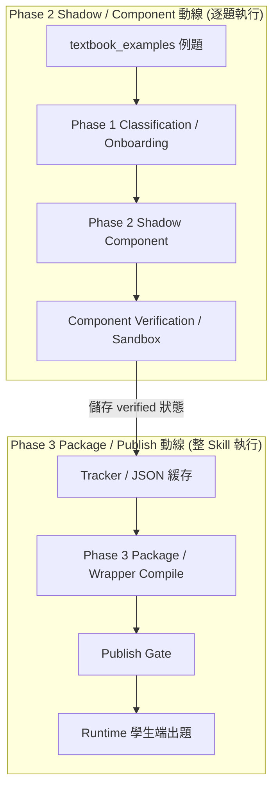

# Gencode × AgentSkillV3 Pipeline 系統流程與狀態轉移說明

> **文件版本**：v1.11  
> **文件定位**：本文件為 Gencode × AgentSkillV3 **唯一流程權威**（流程、時序、狀態轉移、階段責任、錯誤分流、正常路徑與 repair 路徑、package/publish/runtime 邊界）。具體欄位 schema 與規格規則見 [SOP_Gencode_AgentSkillV3_Specification.md](./SOP_Gencode_AgentSkillV3_Specification.md)（唯一規範權威）。

---

## 0. 錯誤快速索引

| 關鍵字／錯誤 | 查詢章節 |
| --- | --- |
| Phase 1 unresolved | 3. Phase 1 流程與 Onboarding |
| taxonomy missing | 3. Phase 1 流程與 Onboarding |
| DOMAIN_FUNCTION_MISSING | 4. Phase 2 流程與 Component 驗證 |
| DOMAIN_CAPABILITY_UNRESOLVED | 3. Phase 1 流程與 Onboarding |
| SHADOW_BRIDGE_NOT_EXECUTED | 4. Phase 2 流程與 Component 驗證 |
| component failed | 8. Component 狀態轉移 |
| PACKAGING_FAILED | 5. Phase 3 流程與 Package/Publish |
| partial publish | 5. Phase 3 流程與 Package/Publish |
| runtime generation | 6. Runtime 邊界與出題 |

---

## 1. AI / Agent 執行規則

1. 遇到錯誤先查 SOP 錯誤索引，再讀對應章節。
2. 流程、時序、狀態與分流以 PipelineFlow 為準。
3. 欄位、契約、checker、UI 與 Gate 以 Specification 為準。
4. 修改前先確認 production code 的真實行為。
5. SOP 的 `[Current]` 定義應有行為；production code 表示目前實作。
6. 若兩者不一致，先回報差異，再依 `[Current]` 規則最小修改。
7. `[Planned]` 不得宣稱已實作，也不得直接當成必填 contract。
8. `[Deprecated]` 不得用於產生或修改程式。
9. 一個任務只修改一個責任層，原則上限 1～2 個函式。
10. 缺乏直接證據時標記 `[Unknown]`，不得自行猜測。
11. 不得依 skill_id 或 example_id 新增個別數學補丁。
12. 修改後必須執行局部離線驗證並回報是否符合 SOP。

---

## 2. Current 端到端主流程

系統實施時 Phase 2 與 Phase 3 是兩個獨立的異步動線。



### 2.1 Phase 2 Shadow (Current)
`run_gencode_phase2_v3_shadow_bridge` $\rightarrow$ `build_v3_component_draft_from_skill` $\rightarrow$ `write_v3_component_to_disk` $\rightarrow$ sandbox (沙盒極簡校驗)

### 2.2 Phase 3 Package (Current)
`execute_phase_3` $\rightarrow$ `run_gencode_phase3_package_raw` $\rightarrow$ `build_generator_specs_for_phase3` $\rightarrow$ `build_phase3_skill_module_code` $\rightarrow$ `drafts/{skill_id}.py`

---

## 3. Phase 1 流程與 Onboarding

### 3.1 核心流程 (Current)
讀取教材庫 `textbook_examples.skill_id` (為唯讀權威) $\rightarrow$ 透過 `resolve_domain_for_skill` 查詢固定 Domain 關係 $\rightarrow$ 找不到時拋出異常並捕獲，將 `taxonomy_entry` 設為空字典 $\rightarrow$ 執行 `_infer_generic_capabilities_from_text` $\rightarrow$ 若 capabilities 非空則映射為 resolved 進入 Phase 2，若為空或為絕對值等非內置學科，則判定為 `SKILL_ONBOARDING_NEEDS_REVIEW` 並寫入 needs_human_review，引導至人工登錄。

### 3.2 阻斷與 Onboarding (Current)
未登錄 skill 的主要責任層是 Phase 1 onboarding，而不是 Phase 3 封裝編譯器。系統整機絕不在預檢期自動寫入 production taxonomy_registry。

---

## 4. Phase 2 流程與 Component 驗證

### 4.1 物理隔離與單題發布 (Current)
每道 textbook example 建立一個獨立的 `components/src_{textbook_example_id}/` 子目錄，包含 `generate.py`、`metadata.py` 及 `get_hint.py`。
單題失敗（failed 狀態）應被阻斷在 Phase 3 usable 篩選器之外，但不影響同單元其他 `verified` 組件的 `Partial Publish`。

### 4.2 Capability 路由與動態擴充 (Current)
* **已有 verified 且 operation 就緒**：正常執行 Phase 2 shadow 生成。
* **已有 verified 且缺 operation/function**：觸發 Domain Function Extension，調用 `extend_domain_function_for_capability()`，但不可修改或覆寫正式的 production 共享代碼。
* **沒有 verified 且無法解析**：進入 Onboarding 流程。
* **狀態標示**：
  * `[Current]`：未 ready capability 會進入自動擴充呼叫路徑。
  * `[Planned]`：production 寫入保護與隔離機制待實現。

### 4.3 Extension、Bootstrap 與 Healer 詳細分工 (Current)
* **Domain Function Extension**：當 `fixed_domain_key` 存在但缺失具體 `operation` 或 `function` 時觸發，針對該 domain 新增/寫入 function 並跑通單元測試，完成後更新 `allowed_operations` 重新執行 Phase 2。
* **Automated Domain Bootstrap**：當無任何 `verified` provider 可以滿足 capability 需求時觸發，進入獨立 `draft` 隔離區自動建立 candidate domain。
* **Domain Healer**：僅用於修補 `candidate` 狀態的 domain (最多進行 N 輪測試與語意修復)，不得用於修改 `production` 或已發布的 `verified` 共享代碼。
* **Phase 3 Exception Repair**：當且僅當 `execute_phase_3` 包裝時發生編譯/代碼結構崩潰，觸發封裝期自癒，此時僅涉及 `generator_draft_spec.json` 的參數復原，與 `Domain Healer` 物理隔離。

---

## 5. Phase 3 流程與 Package/Publish

### 5.1 封裝與自癒 (Current)
Phase 3 的封裝（`build_phase3_skill_module_code`）是確定性的程式碼模板拼接過程，0 LLM 調用。當且僅當 execute_phase_3 捕捉到編譯或執行崩潰異常時，才會進入 `Phase 3 Exception Repair` 自癒路徑。

```python
# build_phase3_skill_module_code (core/gencode/phase3_skill_codegen.py) 核心片段
def build_phase3_skill_module_code(skill_id: str, generator_specs: list[dict[str, Any]], generator_keys: list[str]) -> str:
    ...
    return (
        "from __future__ import annotations\n\n"
        "from core.gencode.runtime_skill_wrapper import check_answer, generate_for_skill\n\n"
        f"SKILL_ID = {skill_id!r}\n"
        f"GENERATOR_SPECS = {generator_specs!r}\n\n"
        "def generate(level: int = 1, seed: int | None = None, difficulty: int | str | None = None, **kwargs) -> dict[str, Any]:\n"
        "    return generate_for_skill(SKILL_ID, GENERATOR_SPECS, level=level, seed=seed, difficulty=difficulty)\n"
    )
```

---

## 6. Runtime 邊界與出題

### 6.1 職責隔離 (Current)
* **Phase 3 package** 僅做靜態規格合約完整性校驗 (`validate_phase3_generator_spec_integrity`)。
* **Runtime parameter sampling**：題目參數抽樣、變數範圍二元約束過濾、隨機 seed 映射均在執行期（`generate_for_skill` 執行時）動態完成。
* **Answer grading**：批改與正規化流程由 `check_answer` 執行分發。
  * **合約分派**：runtime 依 `answer_contract` 與 `answer_type` 進行分派。五種 Answer Type 均有正式的 grading 處理路徑，不得由 `presentation_mode` 取代 `answer_type`，亦不得跨套餐進行 silent fallback。
  * **異常處理**：所有 checker failure／system error 均需經 try-catch 結構妥善轉換為系統錯誤回傳，**絕不得**記為學生答錯。
  * **Grading Dispatch 拓撲**：
    ```text
    answer_type
      ├─ short_answer → checker_key dispatch (數值/方程/短文字)
      ├─ single_choice → semantic choice grading (選項反查)
      ├─ multi_part → per-part grading (all-parts-correct)
      ├─ table_fill → per-cell grading (all-cells-correct)
      └─ drawing → AI drawing grading (AI 圖像評估)
    ```
  * **drawing 狀態邊界閉環**：
    drawing 成功後必須保持 processing lock，直到下一題完成渲染及 UI contract 套用後才解除；AI 判錯或 system error 則保留 Canvas、解除鎖定並允許學生重試。
* **AI 限制**：學生端出題與驗證期，**嚴禁**使用 LLM 生成或動態計算數學內容。

---

## 7. Lifecycle 分層與狀態轉移 (Current)

### 7.1 Domain 狀態機 (Domain Lifecycle)
```text
draft (隔離區，不可發布)
  → candidate (自動測試通過，可教師端預覽，非正式 provider)
  → verified (人工/管理員確認，進入正式路由 resolver)
```

### 7.2 Component 狀態機 (Component Lifecycle)
```text
discovered (發現題目)
  → classified (完成 induced spec)
  → draft_written (寫入 sandbox)
  → compile_passed (通過沙盒編譯)
  → smoke_passed (通過單題 smoke 測試)
  → verified (通過八項指標驗證)
  → packaged (打包入 manifest)
  → published (正式發布)
```

---

## 8. 錯誤分流索引

| 錯誤碼 | 階段 | 下一步行為 |
| --- | --- | --- |
| `SKILL_ONBOARDING_NEEDS_REVIEW` | Phase 1 | 記錄 needs_human_review，掛起待人工註冊 |
| `DOMAIN_FUNCTION_MISSING` | Phase 2 | 進入 Domain Function Extension 自動擴充 |
| `GENERATOR_SPEC_MISSING_FIELD` | Phase 3 | 封裝前 Gate 攔截，排除此組件且不干擾其他題 |
| `SAMPLING_EXHAUSTED` | Runtime | 抽樣超限拋出，拋棄該 seed 並記錄異常 |

---

## 9. Alignment Roadmap

- **M1**：Planned
  * 目標：GeneratorSpec 完整性 Gate，建立強型別 spec Pydantic / Dataclass 模型，並在封裝前進行非破壞性攔截。
- **M2**：Completed
  * 目標：Answer Contract 統一與五種 Answer Type 收斂。
  * 結果：`answer_contract` 為 runtime grading 唯一權威；五套餐 UI、checker dispatch、錯誤分流及題型切換已完成 production 驗收。
- **M3**：Planned
  * 目標：Runtime 變數取樣引擎，實現 declarative 二元約束驗證器。

---

## 10. Deprecated
* **全域 Generic Domain Fallback** (已廢除，禁止跨 Domain fallback 或 Nearest Template 映射)
* **一題一獨立 Domain Function** (已廢除，禁止為單一題目新增專屬 domain，能力必須收斂)

---

## 11. Change Log

| 版本 | 核心變更 |
| --- | --- |
| v1.11 | M2 正式封板，補充五套餐 runtime dispatch、drawing 狀態閉環與 answer_contract Current 權威 |
| v1.10 | 新增 Automated Domain Bootstrap 與 Healer 流程，Phase 1 導入 capability-first 解析 |
| v1.9 | 強制判定 `answer_type` 且保留 `ui_contract` 欄位 |
| v1.8 | 移除全域 Fallback，新增 Domain Function Extension 與一題一 component 定義 |
