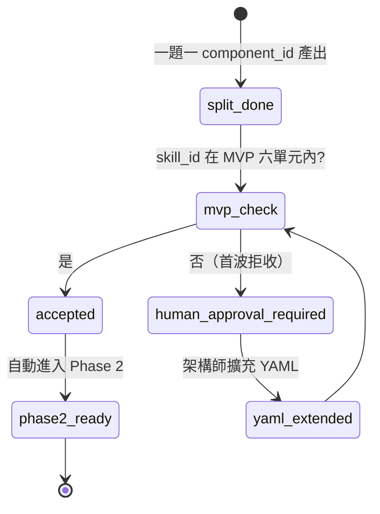
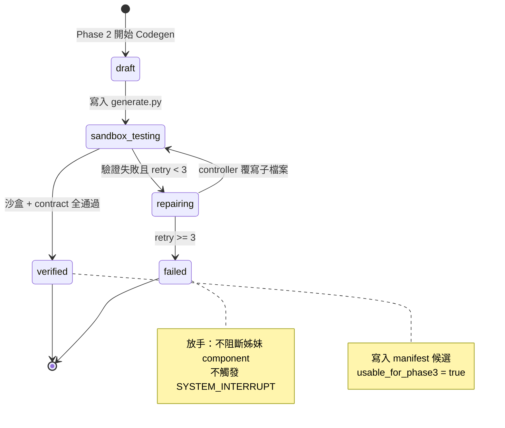
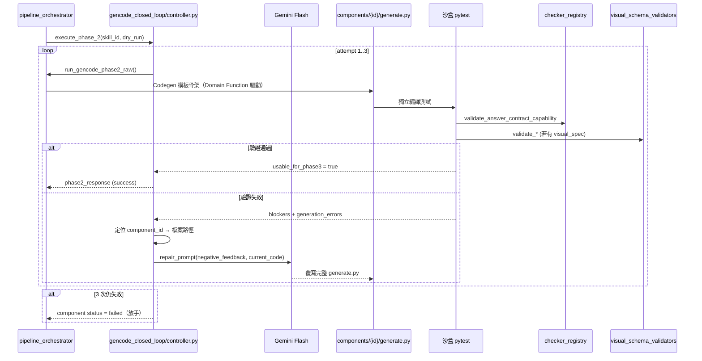
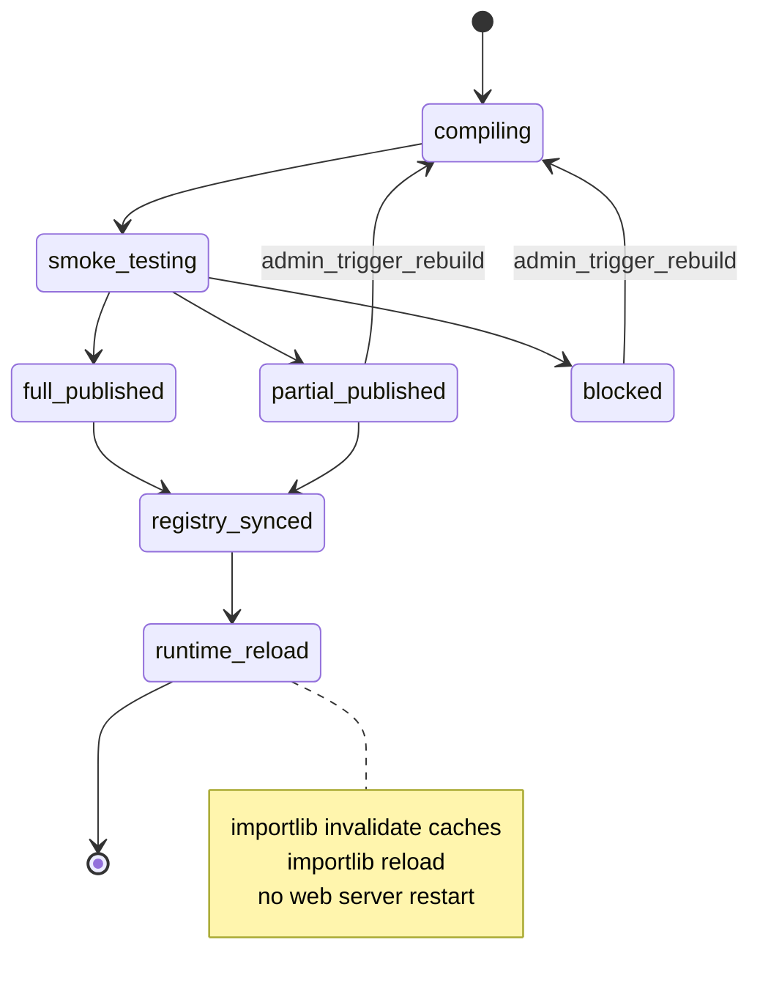
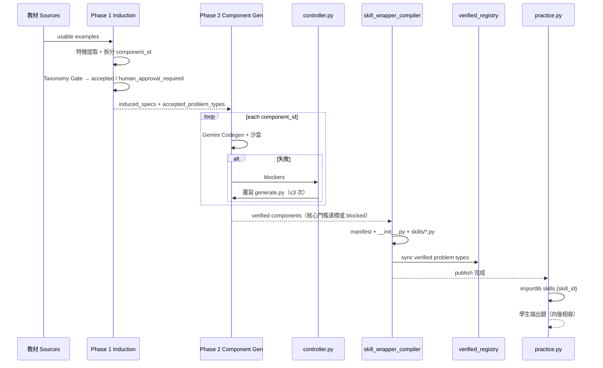
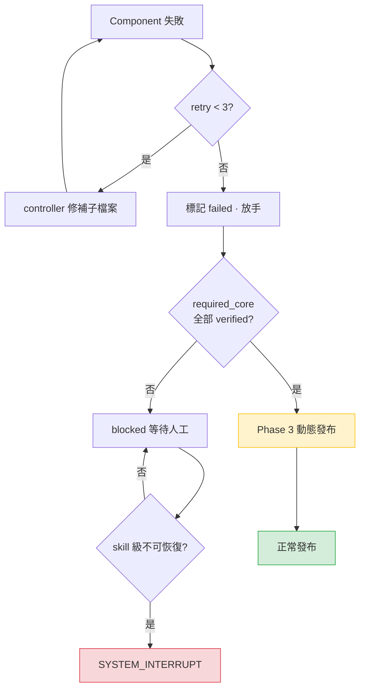

# Gencode × AgentSkillV3 Pipeline 系統流程圖與狀態轉移說明

> **文件版本**：v1.4（Domain 層架構規劃增補 · 僅 SOP，待實作）  
> **配套規範**：[SOP_Gencode_AgentSkillV3_Specification.md](./SOP_Gencode_AgentSkillV3_Specification.md)  
> **實體錨點目錄**：`docs/系統SOP/Gencode_AgentSkillV3整合/`  
> **實作狀態**：`core/domain/`、`taxonomy_registry` 條目為架構規劃，尚未落地程式。

### v1.4 Domain 層架構規劃摘要（待實作）

| # | 條款 | Pipeline 影響 |
|---|------|---------------|
| 1 | 數學核心收斂 `core/domain/` | Phase 2 Codegen 呼叫 `build_*_matrix`，非 component 內 SymPy |
| 2 | `generate.py` 搬運工化 | Phase 2.5 斷言無 `import sympy`、無 distractors 自算 |
| 3 | Registry 中繼 `skill_id` → Domain | Phase 2 啟動前經 `taxonomy_registry` 解析入口 |
| 4 | Full Matrix Dict 六大欄位 | Phase 2.5 沙盒驗證 `matrix` 結構完整性 |
| 5 | P0 直線方程式垂直切片 | 首波驗收取 `build_line_equation_matrix` 為標竿 |
| 6 | 教材例題 DB 維運欄位 | `textbook_examples` 增量設計（§4.5） |
| 7 | 後台熱拔插 | `admin_trigger_rebuild` → Reload Compiler → `importlib.reload`（§4.6） |

### v1.3 務實落地摘要（保留）

| # | 條款 | Pipeline 影響 |
|---|------|---------------|
| 1 | 廢除概念聚類；一題一 `generate.py` | Phase 1 Layer 3 改為物理拆分器 + 天然權重排序 |
| 2 | 同構題僅換數值 | Gemini Flash 單題模板填空；數學由 Domain Function 算子盾牌 |
| 3 | `ex_*` / `quiz_*` / `test_*` 天然難度 | `metadata.py` 自動注入 `ORDER_WEIGHT` / `DIFFICULTY_LEVEL` |
| 4 | 核心例題 verified → Partial Publish | `quiz_*` / `test_*` 失敗剔除，不觸發 `SYSTEM_INTERRUPT` |
| 5 | 保留 v1.2 防禦 | AST 掃描、Full Matrix Dict、P0 Checker、Taxonomy MVP 六單元 |

### v1.2 實戰修訂摘要（保留）

| # | 防禦條款 | Pipeline 影響 |
|---|----------|---------------|
| 1 | Taxonomy 首波僅 6 核心單元 | Phase 1 Taxonomy Gate 查詢 `mvp_scope: v1` |
| 2 | AST 精準左值比對 + 敏感區白名單 | Phase 2.5 驗證鏈更新（§2.4 Step 3） |
| 3 | Full Matrix Dictionary 回傳契約 | Phase 2 斷言 `matrix["answer"]` 可追溯 |
| 4 | `required_core_components` 禁止 AI/管線寫入 | Step 5 / Phase 3 僅讀取 Taxonomy 靜態條目 |
| 5 | P0 Checker 垂直切片 | smoke 回歸含 `vh_數學B1_PointSlopeForm` 等價案例 |

### v1.1 修訂摘要（保留 · 部分條款 v1.3 已簡化）

- Phase 1 Taxonomy Gate：v1.3 簡化為 MVP 六單元 `accepted` / `human_approval_required` 二態（廢除 `review_required` 與 `taxonomy_path` 子欄位比對）
- Phase 2 定位 AI 為 **Component 模板工程師**；數學正確性由 Domain Function + Validator 接管
- Phase 2.5 新增 **Visual Validator** 與 **語意 Checker** Fail-Fast 鏈
- 發布門檻改為 `skill.json` 的 `required_core_components` 動態判定（廢除寫死 `verified >= 2`）
- **嚴禁**修改 DB Schema、`practice.py` 與學生調度入口

---

## 0. 總覽

本文件以 Mermaid 圖與逐步文字說明 Gencode V3 三階段 Pipeline：

| Phase | 名稱 | 核心產物 |
|-------|------|----------|
| Phase 1 | 案源一題一物理拆分 | `ex_*` / `quiz_*` / `test_*` component + induced spec |
| Phase 2 | 原子組件隔離生成與修補閉環 | `components/{component_id}/generate.py`（verified / failed） |
| Phase 3 | 微元件自動黏合與發布 | `component_manifest.json` + `__init__.py` + `skills/{skill_id}.py` + verified registry |

**實體模組對照**：

- Phase 1 編排：`core/gencode/pipeline_orchestrator.py`、`problem_type_induction.py`、`spec_phase1_merge.py`
- Taxonomy 白名單：`configs/gencode_taxonomy/k12_component_taxonomy.yaml`
- **Domain 邏輯層（v1.4 目標）**：`core/domain/coordinate_geometry/line_equation_domain.py` 等（見 Specification §2.5）
- **Domain 註冊中繼（v1.4 目標）**：`core/registry/taxonomy_registry.py`（見 Specification §2.7）
- Phase 2 閉環：`gencode_closed_loop/controller.py` → `run_gencode_phase2_raw()`
- Phase 2.5 驗證：`core/gencode/visual_schema_validators.py`、Domain Function AST 掃描、`checker_registry`
- Phase 3 編譯：`core/gencode/skill_wrapper_compiler.py`（目標名；現行 `phase3_skill_codegen.build_phase3_skill_module_code`）
- 執行期：`core/gencode/runtime_skill_wrapper.py`、`slot_generators.SLOT_REGISTRY`
- 發布閘門：`scripts/gencode_pipeline_phase3_publish_gate.py`
- Registry：`configs/generated_registry/*_verified_registry.v*.yaml`

---

## 1. Phase 1：案源一題一物理拆分流程

### 1.1 總流程圖

```mermaid
graph TD
    subgraph L1["Layer 1 — Source Normalization（物理隔離）"]
        S[Sources 輸入<br/>Word / DB examples / OCR]
        N[Normalize &amp; skill_id 唯讀校驗<br/>pipeline_orchestrator]
        S --> N
    end

    subgraph L2["Layer 2 — Source Audit（物理隔離）"]
        A[Source Audit<br/>usable / rejected / enrichment]
        SALV[Non-Destructive Salvage<br/>FORCE_ALLOWED_FOR_INDUCTION]
        N --> A
        A --> SALV
    end

    subgraph L3["Layer 3 — Induction &amp; Clustering（一題一對一隔離）"]
        E[教材 Sources 輸入<br/>例題 / 隨堂 / 自我評量]

        subgraph STREAM["Deterministic One-to-One Splitter"]
            SPLIT[依實體題號/ID 物理切割]
            SPLIT -->|例題| M_EX[生成 ex_* 元件<br/>ORDER_WEIGHT = 10 / Easy]
            SPLIT -->|隨堂| M_QZ[生成 quiz_* 元件<br/>ORDER_WEIGHT = 20 / Easy]
            SPLIT -->|自我評量| M_TS[生成 test_* 元件<br/>ORDER_WEIGHT = 30 / Hard]
        end

        GEM[Gemini Flash<br/>單題同構模板填空]

        E --> SPLIT
        SALV --> E
        M_EX --> GEM
        M_QZ --> GEM
        M_TS --> GEM
        GEM --> TAX_GATE[Taxonomy Gate 自動核准]
    end

    subgraph TG["Taxonomy Gate（MVP v1 行政閘門）"]
        TAX[讀取 k12_component_taxonomy.yaml<br/>僅 mvp_scope: v1 六單元]
        MVP{skill_id 在<br/>首波 6 單元內?}
        ACC[status: accepted<br/>自動晉級 Phase 2]
        HUM[status: human_approval_required<br/>阻擋 Phase 2]
        TAX_GATE --> TAX --> MVP
        MVP -->|是| ACC
        MVP -->|否| HUM
    end

    subgraph OUT["Phase 1 產出"]
        P1J[phase1_summary.json]
        IND[induced_specs/{skill_id}.json<br/>每題一 component_id]
        ACC --> P1J
        HUM --> P1J
        ACC --> IND
    end

    style L1 fill:#f0f4ff,stroke:#4a6fa5
    style L2 fill:#fff8f0,stroke:#c49a6c
    style L3 fill:#f0fff4,stroke:#4a9a6c
    style TG fill:#e8f4fd,stroke:#2980b9
    style OUT fill:#f5f5f5,stroke:#666
```

### 1.1b Taxonomy Gate 狀態機（v1.3 簡化）



### 1.2 一題一物理拆分子流程

```mermaid
graph TD
    EX[單一 Source Example<br/>例題 / 隨堂 / 自我評量] --> F1{教材類型?}
    F1 -->|例題| C1[component_id: ex_{n}<br/>ORDER_WEIGHT=10 · easy]
    F1 -->|隨堂練習| C2[component_id: quiz_{n}<br/>ORDER_WEIGHT=20 · easy]
    F1 -->|自我評量| C3[component_id: test_{n}<br/>ORDER_WEIGHT=30 · hard]
    C1 --> META[metadata.py 骨架<br/>+ 單一 generate.py 目錄]
    C2 --> META
    C3 --> META
    META --> GEM[Gemini Flash<br/>同構模板填空 · 僅換數值]
```

> **廢除**：舊版 §1.2 水平線 / 鉛直線概念聚類子流程；極端數學邊界改由 Domain Function 算子盾牌處理（Specification §2.3）。

### 1.3 文字步驟說明

**Step 1 — Sources 輸入與標準化**

1. 管線自 DB `SkillExample`、Word 匯入或 `reports/gencode_closed_loop/` 讀取原始題目。
2. `pipeline_orchestrator._load_examples()` 完成題幹清理、LaTeX 保留、答案擷取。
3. **剛性校驗** `skill_id` 符合 `vh_數學...` 矩陣；違規標記 `skill_id_format_violation`，沒收寫入權。

**Step 2 — 來源品質審核（不阻擋整 skill）**

1. 逐題標記 `source_item_status`：`usable` / `rejected` / `enrichment` / `source_bank_only`。
2. 對 `missing_answer` / `broken_latex` 的 core 題執行 **Non-Destructive Salvage**，標記 `FORCE_ALLOWED_FOR_INDUCTION`。
3. **Anchor Shield**：禁止 AI 改寫 `skill_id` 或將題目剔出本單元。

**Step 3 — 單題特徵提取（不聚類）**

對每筆 usable Source **獨立**抽取（一題一 spec，不合併）：

| 特徵 | 來源 | 用途 |
|------|------|------|
| `component_id` | 教材題號前綴（`ex_*` / `quiz_*` / `test_*`） | 物理隔離鍵（§1.5） |
| `ORDER_WEIGHT` / `DIFFICULTY_LEVEL` | 題號前綴規則 | 天然出題順序 |
| `target_task` | rule + AI 分類 → `final_classification` | 對接 `TASK_FAMILY_TO_SLOT` |
| `answer_format_hint` | `core/gencode/answer_format_hint.py` | 決定 `presentation_mode` |
| `answer_contract` 草案 | `spec_to_answer_contract_proposal()` | 預綁 checker |
| `story_tokens` | 該題情境詞 | 單題 `SCENARIO_POOL` 候選 |

**Step 4 — 單題三層解構（同構模板用）**

1. **Story Layer**：該題敘事元素，寫入**該 component** 的 `SCENARIO_POOL` 候選。
2. **Math Core Layer**：保留 `givens`、`unknowns`、`constraints`；數值變異由 Domain Function 算子盾牌負責。
3. **Presentation Layer**：映射至穩定外觀 Key（`integer` / `single_choice` / `interval_set` 等）。

**Step 5 — 一題一 component_id 命名（禁止合併）**

1. 每道原題 → 一個 `components/{component_id}/` + 單一 `generate.py`。
2. 命名：`ex_{題號}`、`quiz_{題號}`、`test_{題號}`；有 `source_id` 時可正規化為穩定 ID。
3. **禁止**：多題合一、AI 融合、依 `target_task` 取代題號作為 `component_id`。
4. 管線自動寫入 `metadata.py` 的 `ORDER_WEIGHT` / `DIFFICULTY_LEVEL` / `SOURCE_REF`。

**Step 6 — Taxonomy Gate（MVP v1 行政閘門）**

1. 載入 `configs/gencode_taxonomy/k12_component_taxonomy.yaml`，**僅查詢** `mvp_scope: v1`。
2. `skill_id` 在首波六單元內 → 該 skill 下所有 `ex_*` / `quiz_*` / `test_*` 一律 `accepted`。
3. 不在 MVP 內 → `human_approval_required`，阻擋 Phase 2。
4. **不再**執行 `taxonomy_path` 子欄位比對或 `review_required` 三態分流（v1.3 簡化）。

**Step 7 — Phase 1 產出**

1. 寫入 `reports/gencode_closed_loop/{skill_id}_phase1_summary.json`（含 `taxonomy_gate_results`、每題 `component_id`）。
2. 寫入 `reports/gencode_closed_loop/induced_specs/{skill_id}.json`（**每題一** ProblemTypeSpec 草案）。
3. **不產出**可執行 `generate.py`；`accepted` 狀態者自動進 Phase 2。

---

## 2. Phase 2：原子組件隔離生成與修補閉環

### 2.1 總流程圖

```mermaid
graph TD
    subgraph P2IN["Phase 2 輸入"]
        PT[accepted_problem_types<br/>來自 Phase 1]
        SPEC[ProblemTypeSpec 草案]
    end

    subgraph ISOLATE["組件隔離生成（每 component 獨立）"]
        LOOP{{"FOR EACH component_id"}}
        REG[taxonomy_registry<br/>skill_id → Domain 入口]
        DOM[core/domain/*<br/>build_*_matrix → Full Matrix Dict]
        GEM[Gemini Flash<br/>單題模板填空 · 搬運工]
        WRITE[寫入 components/{id}/generate.py<br/>get_hint.py / metadata.py]
        SBX[獨立沙盒 pytest<br/>不 import 姊妹 component]
        VAL[Phase 2.5 Fail-Fast 驗證鏈<br/>見 §2.4]
        LOOP --> REG --> DOM --> GEM --> WRITE --> SBX --> VAL
    end

    PT --> LOOP
    SPEC --> GEM

    VAL -->|通過| OK[status = verified<br/>usable_for_phase3 = true]
    VAL -->|失敗| RETRY{retry &lt; 3?}

    subgraph REPAIR["修補閉環 — gencode_closed_loop/controller.py"]
        RETRY -->|是| CTRL[controller.execute_phase_2<br/>鎖定單一子檔案]
        NF[Negative Feedback<br/>blockers + generation_errors]
        AI[Gemini Flash Repair<br/>僅覆寫 generate.py]
        CTRL --> NF --> AI --> WRITE
    end

    RETRY -->|否| FAIL[status = failed<br/>放手 · 剔除該題]
    FAIL --> DEG{required_core_components<br/>（ex_* 例題）全部 verified?}
    OK --> DEG
    DEG -->|是| PARTIAL[Partial Publish<br/>僅編譯 verified 題目]
    DEG -->|否| BLOCK[publish_status: blocked<br/>不觸發 SYSTEM_INTERRUPT]

    RETRY -->|controller 無修補目標<br/>或 skill 級基礎設施損壞| SI[SYSTEM_INTERRUPT<br/>僅 skill 級災難]

    style ISOLATE fill:#f0f4ff,stroke:#4a6fa5
    style REPAIR fill:#fff0f0,stroke:#c44
    style OK fill:#d4edda,stroke:#28a745
    style FAIL fill:#f8d7da,stroke:#dc3545
```

### 2.2 單一 Component 狀態機



### 2.3 Controller 修補閉環詳圖



### 2.4 文字步驟說明

**Step 1 — Phase 2 啟動**

1. 輸入：`skill_id`、`accepted_problem_types`（來自 Phase 1 核准清單）。
2. `run_gencode_phase2_raw()` 載入 induced spec，逐 `component_id` 建立目錄骨架。

**Step 2 — Gemini Flash 原子生成（搬運工 + Domain 委派）**

1. 經 `taxonomy_registry` 解析 `skill_id` → Domain 入口（`build_line_equation_matrix` 等）；**禁止**在 `generate.py` 硬編碼 skill 分支。
2. 提示詞注入：八維度 `metadata.py` 範本、`curriculum_profile` / `difficulty_profile`、`answer_contract`。
3. **Codegen 鐵律**（§2.3.1、§2.6）：`generate.py` 僅呼叫 `core/domain/` 並搬運 **Full Matrix Dictionary**；禁止 SymPy、distractors 自算、visual 坐標重算。
4. 應用題強制產出該題專屬 `SCENARIO_POOL`（§3.4）；禁止執行期 LLM 改寫題幹。
5. 產出三檔：`metadata.py`、`generate.py`、`get_hint.py`。
6. 每個 component 在**獨立行程**跑沙盒，避免交叉 import 污染。
7. **禁止**在此階段建立或修改 `skill.json` 的 `required_core_components`（§4.3.1.1）。

**Step 3 — Phase 2.5 沙盒驗證鏈（數學語意閉環）**

執行順序（fail-fast）：

```
compile(metadata.py)
  → import generate.py
  → AST 精準掃描（§2.3.1 v1.2）:
      禁止 matplotlib / PIL import
      放行敏感區：level+1, seed+17, range(n+1), x_range=[-8,8], min(1.0, base+0.1) 等
      僅當四則運算左值指向 answer/choices/distractors/visual_spec 坐標
        且同 Code Block 無 DOMAIN_LIBRARY 呼叫 → ai_math_operation_forbidden
  → 斷言 Domain 回傳 Full Matrix Dict 六大欄位齊全
      givens / answer / distractors / explanation_steps / validation_facts / visual_spec
  → 斷言 generate.py 無 import sympy
  → 斷言 matrix["answer"] 可追溯至 payload["correct_answer"]（未手算改寫）
  → 斷言 SCENARIO_POOL 存在（應用題）
  → generate(seed=0) × 5
  → validate_generator_payload(payload)
  → validate_generated_question_format(payload)
  → b4_validators.validate_problem_payload_contract(payload)  # B4 題
  → visual_schema_validators（若有 visual_spec）:
      validate_coordinate_points_in_range
      validate_line_passes_through_points
      validate_horizontal_line_y / validate_vertical_line_x
      validate_tree_diagram_branch_counts / validate_statistics_chart_data
  → validate_answer_contract_capability(metadata)
  → P0 semantic checker 回歸（首波切片）:
      linear_equation_equivalent_checker: y=2x+1 ≡ 2x-y+1=0
      rational_or_decimal_checker: 1/2 ≡ 0.5
  → check(correct, correct) == True
  → get_hint(1..3) 皆非空
  → handwriting：斷言 payload 含 text_input_disabled=True
```

**Step 4 — 失敗修補（精確鎖定子檔案）**

1. `controller.py` 彙整 `blockers` 與 `diversity_sampling.generation_errors`。
2. 透過 `GENERATOR_REPAIR_CATALOG` 或 V3 路徑映射，解析 `module_path` → `agent_skills_v3/{skill_id}/components/{component_id}/generate.py`。
3. Gemini 僅回傳修正後**完整 Python 檔**；`write_text` 覆寫。
4. `MAX_RETRY = 3`（與現行 controller 一致）。

**Step 5 — 放手降級與 Partial Publish（v1.3）**

1. 單一 `quiz_*` / `test_*` 第 3 次仍失敗 → `GENERATOR_READINESS = "failed"`，從發布清單**剔除**。
2. **不**因單題失敗呼叫 `raise RuntimeError("SYSTEM_INTERRUPT")`。
3. `required_core_components`（通常 `ex_*` 核心例題）全部 `verified` → `can_continue = true`，Partial Publish 其餘 verified 題。
4. 任一核心例題未 verified → `publish_status = blocked`（仍不觸發 `SYSTEM_INTERRUPT`）。
5. `required_core_components` 僅能來自 Taxonomy / 架構師預置（§4.3.1.1）。

**Step 6 — Phase 2 產出**

- `reports/gencode_closed_loop/{skill_id}_phase2_generator_summary.json`
- 各 component 目錄內實體 `.py` 檔
- 每列 `usable_for_phase3` / `status` 標記

---

## 3. Phase 3：微元件自動黏合與發布流程

### 3.1 總流程圖

```mermaid
graph TD
    subgraph P3IN["Phase 3 輸入"]
        V[verified components 清單<br/>usable_for_phase3 = true]
        P2SUM[phase2_generator_summary.json]
    end

    subgraph COMPILE["skill_wrapper_compiler.py（編譯器）"]
        SCAN[掃描 agent_skills_v3/{skill_id}/components/]
        TAX[讀取 Taxonomy 靜態<br/>required_core_components]
        SKILL[讀取 skill.json<br/>僅讀不寫 · 架構師預置]
        MAN[生成 component_manifest.json<br/>verified / failed 全記錄]
        GATE[動態發布門檻判定<br/>§4.3 · 禁止 AI 改 core]
        SPECS[編譯 GENERATOR_SPECS<br/>依 ORDER_WEIGHT 排序]
        INIT[生成 __init__.py<br/>component dispatch 路由器]
        FACADE[生成 skills/{skill_id}.py<br/>Thin Facade]
        SCAN --> TAX --> SKILL --> MAN --> GATE --> SPECS --> INIT --> FACADE
    end

    V --> SCAN
    P2SUM --> MAN

    subgraph GATE["發布閘門"]
        SMOKE[runtime_smoke<br/>每 verified component 抽樣]
        INT[validate_phase3_generator_spec_integrity]
        PUB[phase3_publish_gate]
        FACADE --> SMOKE --> INT --> PUB
    end

    subgraph REG["Registry 同步"]
        YAML[configs/generated_registry/<br/>*_verified_registry.v*.yaml]
        BK[backups/gencode_skill_publish/<br/>{skill_id}.{timestamp}.py]
        PUB --> YAML
        PUB --> BK
    end

    subgraph RUNTIME["執行期就緒"]
        WEB[practice.py importlib<br/>skills.{skill_id}]
        WRAP[runtime_skill_wrapper<br/>generate_for_skill / check_answer]
        SLOT[slot_generators.SLOT_REGISTRY<br/>visual_spec → image_base64]
        YAML --> WEB --> WRAP --> SLOT
    end

    style COMPILE fill:#f0f4ff,stroke:#4a6fa5
    style GATE fill:#fff8f0,stroke:#c49a6c
    style REG fill:#f0fff4,stroke:#4a9a6c
```

### 3.2 發布狀態轉移



**務實落地說明（v1.3 / v1.4）**：

1. **發布門檻**：核心 `ex_*` 例題全數 `verified` 即可觸發 `partial_published` 或 `full_published`；`quiz_*` / `test_*` 失敗可剔除，不阻斷前台（§4.3）。
2. **定點重構迴圈**：當處於 `blocked` 或 `partial_published` 時，允許經由後台管理員點擊「⚡重構出題程式」（`admin_trigger_rebuild`），將特定失敗題型重新定點送回 `compiling` 鏈結，重跑單題沙盒與 Reload Compiler（§4.6）。
3. **零重啟熱拔插**：發布流程進入 `runtime_reload` 節點時，系統必須動態執行 `importlib.invalidate_caches()` 清除目錄快取，並對路由調度模組（`__init__.py` / component `generate`）執行 `importlib.reload()`，確保新生成的單題 `generate.py` 即刻無縫上架；**剛性禁止**重啟 Web 伺服器作為發布手段（§4.6.4）。

### 3.3 編譯器內部資料流

```mermaid
flowchart LR
    subgraph Components
        C1[component A<br/>verified]
        C2[component B<br/>verified]
        C3[component C<br/>failed]
    end

    MAN[component_manifest.json]
    C1 --> MAN
    C2 --> MAN
    C3 --> MAN

    MAN --> GS[GENERATOR_SPECS 矩陣]
    MAN --> GK[GENERATOR_KEYS 清單]
    GS --> INIT[__init__.py<br/>_COMPONENT_DISPATCH]
    GK --> FACADE[skills/{skill_id}.py]
    INIT --> FACADE

    FACADE --> REG[verified_registry.yaml]
```

### 3.4 文字步驟說明

**Step 1 — 編譯器掃描**

`skill_wrapper_compiler.py`（現行等價：`phase3_skill_codegen.build_generator_specs_for_phase3` + `build_phase3_skill_module_code`）：

1. 遍歷 `agent_skills_v3/{skill_id}/components/*/metadata.py`。
2. 讀取 `GENERATOR_READINESS`；僅 `verified` 進入編譯白名單。
3. `failed` 組件寫入 manifest 供審計，**不**進入 `GENERATOR_SPECS`。

**Step 2 — 生成 component_manifest.json**

```json
{
  "skill_id": "vh_數學B1_LinearFunction",
  "publish_status": "partial_published",
  "verified_count": 2,
  "failed_count": 1,
  "components": [ "..." ]
}
```

**Step 3 — 生成 `__init__.py` 調度路由器**

1. 為每個 verified `component_id` 生成 `_COMPONENT_DISPATCH` 表項。
2. `generate()` 邏輯：抽題 → 查表 → **動態載入** component `generate()`（見 Step 7）；fallback 至 `runtime_skill_wrapper.generate_for_skill()`。
3. `check()` **統一**委派 `runtime_skill_wrapper.check_answer()`（checker 鏈不改）。
4. 熱拔插場景下，路由器須實作 `importlib.import_module` + `importlib.reload`（§4.6.4）。

**Step 4 — 生成 Thin Facade `skills/{skill_id}.py`**

與 V2 完全同構：

```python
from core.gencode.runtime_skill_wrapper import check_answer, generate_for_skill

SKILL_ID = "vh_數學B1_LinearFunction"
GENERATOR_KEYS = [...]   # 編譯器寫入
GENERATOR_SPECS = [...]    # 編譯器寫入

def generate(level=1, seed=None, **kwargs):
    return generate_for_skill(SKILL_ID, GENERATOR_SPECS, level=level, seed=seed, **kwargs)

def check(user_answer, correct_answer, question_payload=None):
    return check_answer(user_answer, correct_answer, payload=question_payload)
```

前台 `practice.py` **無需改動**。

**Step 5 — runtime_smoke 與 integrity gate**

1. `core/gencode/runtime_smoke.py` 對每個 `GENERATOR_SPECS` 列執行抽樣生成 + 批改。
2. **P0 等價 Checker 垂直切片回歸**（首波必跑）：
   - `vh_數學B1_PointSlopeForm`：`y=2x+1` vs `2x-y+1=0` 互判正確
   - 分數小數：`1/2` vs `0.5` 互判正確
3. `packaging_policy.validate_phase3_generator_spec_integrity()` 檢查 `checker_key` / `presentation_mode` 一致性。
4. `scripts/gencode_pipeline_phase3_publish_gate.py` 判定 `full_published` / `partial_published` / `blocked`。

**Step 6 — 同步 verified registry**

1. 更新 `configs/generated_registry/b1_section_1_1_verified_registry.v0.1.yaml`（或對應 scope 檔）。
2. 寫入 `backups/gencode_skill_publish/{skill_id}.{timestamp}.py`。
3. 報告輸出至 `reports/gencode_closed_loop/{skill_id}_publish_summary.json`。

**Step 7 — 執行期路徑（學生請求 · 含動態熱拔插）**

```
HTTP /api/practice/next
  → practice.py: importlib.import_module("skills.{skill_id}")   # 對外入口不變
  → skills.{skill_id}.generate()
  → runtime_skill_wrapper.generate_for_skill()
      ├─ manifest 白名單命中 component_id
      │     → 【動態解析】importlib.import_module(
      │           "agent_skills_v3.{skill_id}.components.{component_id}.generate")
      │     → 若已載入：importlib.reload(module)   # 熱拔插：後台重構後即刻生效
      │     → 直接呼叫該 component 最新 generate(level, seed, ...)
      │           └─ Domain Function 搬運 + SCENARIO_POOL 模板填空
      └─ 否則 → slot_generators.generate_from_problem_type_spec()
  → visual_spec → visual_schema_validators（審核層重算）→ image_base64（若有）
  → handwriting payload → 前台 textbox disabled（既有欄位驅動）
  → payload 返回前台（practice.py 路由不變 · 零重啟）
```

**動態加載要點**：

1. 學生請求路徑**不經** Web 伺服器重啟；依賴 `importlib.reload` 載入後台剛編譯之 `generate.py`。
2. `component_manifest.json` 為執行期白名單；僅 `verified` 之 `component_id` 參與 dispatch。
3. 熱拔插由 `admin_trigger_rebuild`（§4.6）觸發：DB `induced_spec_payload` 修正 → 單題沙盒 → Reload Compiler → 下一筆請求生效。

---

## 4. 端到端時序（三 Phase 串接）



---

## 5. SYSTEM_INTERRUPT 觸發邊界（v1.3 嚴格限定）

| 場景 | 是否觸發 `SYSTEM_INTERRUPT` |
|------|----------------------------|
| 單一 `quiz_*` / `test_*` 沙盒 3 次失敗 | **否** → `status=failed`，從發布清單剔除 |
| 核心 `ex_*` 全 verified，部分隨堂/評量 failed | **否** → `partial_published`（前台僅載入 verified 題） |
| 任一 `required_core_components` 未 verified | **否** → `blocked`（人工審核） |
| controller 無法定位可修補檔案，或 skill 級基礎設施損壞 | **是** |
| `phase1_alignment_blocked` 且無 induced spec | **是**（沿用現行 controller） |



---

## 6. 報告產物清單（審計用）

| 階段 | 檔案路徑 |
|------|----------|
| Domain 層（v1.4 目標） | `core/domain/coordinate_geometry/line_equation_domain.py` |
| Domain 層（v1.4 目標） | `core/domain/counting/permutation_combination_domain.py` |
| Domain 層（v1.4 目標） | `core/registry/taxonomy_registry.py` |
| Phase 1 | `configs/gencode_taxonomy/k12_component_taxonomy.yaml` |
| Phase 1 | `reports/gencode_closed_loop/{skill_id}_phase1_summary.json` |
| Phase 1 | `reports/gencode_closed_loop/induced_specs/{skill_id}.json` |
| Phase 2 | `reports/gencode_closed_loop/{skill_id}_phase2_generator_summary.json` |
| Phase 3 | `agent_skills_v3/{skill_id}/component_manifest.json` |
| Phase 3 | `reports/gencode_closed_loop/{skill_id}_publish_summary.json` |
| 備份 | `backups/gencode_skill_publish/{skill_id}.*.py` |
| Registry | `configs/generated_registry/*_verified_registry.v*.yaml` |

---

## 7. 人工審核檢查點

| 檢查點 | 通過條件 |
|--------|----------|
| Phase 1 結束 | 每道原題對應獨立 `ex_*` / `quiz_*` / `test_*`；`skill_id` 在 MVP 六單元內且 `accepted` |
| Phase 2 結束 | 核心例題（`ex_*`）全 verified；`generate.py` 無 SymPy / 無 distractors 自算 |
| Phase 2.5 | Full Matrix Dict 六大欄位齊全；P0 `build_line_equation_matrix` 回歸通過 |
| Phase 3 結束 | smoke 通過；`GENERATOR_SPECS` 依 `ORDER_WEIGHT` 排序；manifest 僅含 verified 題 |
| 發布 | 核心例題 verified 即可 `partial_published`；單題失敗不觸發 `SYSTEM_INTERRUPT` |
| 維運熱拔插 | 後台 `admin_trigger_rebuild` 可從 `blocked` / `partial_published` 重回 `compiling`；`importlib.reload` 零重啟生效（§4.6） |

---

*本文件為 Pipeline 流程審查規格書 v1.4（Domain 層架構規劃增補 · 待實作），與 [SOP_Gencode_AgentSkillV3_Specification.md](./SOP_Gencode_AgentSkillV3_Specification.md) 配套使用。*
